WHO Bacterial Priority Pathogens List, 2024

Bacterial pathogens of public health importance to guide research, development and strategies to prevent and control antimicrobial resistance

## WHO Bacterial Priority Pathogens List, 2024

Bacterial pathogens of public health importance to guide research, development and strategies to prevent and control antimicrobial resistance

WHO Bacterial Priority Pathogens List, 2024: bacterial pathogens of public health importance to guide research, development and strategies to prevent and control antimicrobial resistance

ISBN 978-92-4-009346-1 (electronic version)

ISBN 978-92-4-009347-8 (print version)

## © World Health Organization 2024

Some rights reserved. This work is available under the Creative Commons Attribution-NonCommercial-ShareAlike 3.0 IGO licence (CC BY-NC-SA 3.0 IGO; https://creativecommons.org/licenses/by-nc-sa/3.0/ igo).

Under the terms of this licence, you may copy, redistribute and adapt the work for non-commercial purposes, provided the work is appropriately cited, as indicated below. In any use of this work, there should be no suggestion that WHO endorses any specific organization, products or services. The use of the WHO logo is not permitted. If you adapt the work, then you must license your work under the same or equivalent Creative Commons licence. If you create a translation of this work, you should add the following disclaimer along with the suggested citation: “This translation was not created by the World Health Organization (WHO). WHO is not responsible for the content or accuracy of this translation. The original English edition shall be the binding and authentic edition”.

Any mediation relating to disputes arising under the licence shall be conducted in accordance with the mediation rules of the World Intellectual Property Organization (http://www.wipo.int/amc/en/mediation/ rules/).

Suggested citation. WHO Bacterial Priority Pathogens List, 2024: bacterial pathogens of public health importance to guide research, development and strategies to prevent and control antimicrobial resistance. Geneva: World Health Organization; 2024. Licence: CC BY-NC-SA 3.0 IGO.

Cataloguing-in-Publication (CIP) data. CIP data are available at https://iris.who.int/.

Sales, rights and licensing. To purchase WHO publications, see https://www.who.int/publications/bookorders. To submit requests for commercial use and queries on rights and licensing, see https://www.who. int/copyright.

Third-party materials. If you wish to reuse material from this work that is attributed to a third party, such as tables, figures or images, it is your responsibility to determine whether permission is needed for that reuse and to obtain permission from the copyright holder. The risk of claims resulting from infringement of any third-party-owned component in the work rests solely with the user.

General disclaimers. The designations employed and the presentation of the material in this publication do not imply the expression of any opinion whatsoever on the part of WHO concerning the legal status of any country, territory, city or area or of its authorities, or concerning the delimitation of its frontiers or boundaries. Dotted and dashed lines on maps represent approximate border lines for which there may not yet be full agreement.

The mention of specific companies or of certain manufacturers’ products does not imply that they are endorsed or recommended by WHO in preference to others of a similar nature that are not mentioned. Errors and omissions excepted, the names of proprietary products are distinguished by initial capital letters.

All reasonable precautions have been taken by WHO to verify the information contained in this publication. However, the published material is being distributed without warranty of any kind, either expressed or implied. The responsibility for the interpretation and use of the material lies with the reader. In no event shall WHO be liable for damages arising from its use.

Design and layout by 400 Communications Ltd.

## Contents

Acknowledgements vi   
Evaluation and management of potential conflicts of interest viii   
Abbreviations ix   
Executive summary x   
Introduction 1   
Background 1   
Rationale for the update 1   
Aim and scope 2   
Target readership 2   
Methods 2   
Determination of the preliminary list of pathogens to be prioritized 6   
Determination of criteria weights: 2023 global PAPRIKA survey 6   
Independent assessment of RR-TB 9   
Application of MCDA to RR-TB 9   
Results: WHO Bacterial Priority Pathogen List, 2024 10   
Outcomes 12   
Gram-negative bacterial pathogens: a continued critical priority 12   
RR-TB: a critical AMR pathogen 12   
Methicillin-resistant Staphylococcus aureus (MRSA) remains a high priority 13   
Other community pathogens of high priority 13   
Other priority pathogens 14   
Limitations 15   
Implementation and policy considerations 16   
Addressing bacterial priority pathogens through innovation and R&D of new drugs 16   
Addressing bacterial priority pathogens through public health action 17   
References 19   
Annex 1. Methods used to update the WHO bacterial priority pathogens list 23   
The pathogens for the 2024 update were selected in two stages 24   
Annex 2. Criteria used in assessing antibiotic-resistant bacterial pathogens in the WHO   
Bacterial Priority Pathogens List, 2024 28   
A2.1. Quantitative criteria 29   
A2.2. Qualitative criteria 33   
References for Annexes 1–2 41   
Annex 3. Multiple Criteria Decision Analysis (MCDA) scoring matrix:   
summary results of bacterial pathogens assessments against the selected criteria 42   
Annex 4. Independent analyses of Mycobacterium tuberculosis, rifampicin-resistant 44   
Background 45   
Methods 45   
Criteria 46   
Mortality 46   
Non-fatal health burden 46   
Transmissibility 47   
Incidence 48   
Trends of resistance 48   
Preventability in the community 48   
Diagnosis 49   
Treatability 50   
The pipeline for new medicines and diagnostics 50   
New medicines 50   
New diagnostics 52   
References for Annex 4 54   
Table 1. Steps in the Multi-Criteria Decision Analysis (MCDA) prioritization process (steps are overlapping   
and non-sequential) 3   
Table 2. Prioritization criteria, definitions and levels 4   
Table 2. Prioritization criteria, definitions and levels (continued) 5   
Table A2.1. Resistant pathogens by level of resistance 29   
Table A2.2. Resistant pathogens by number of cases per million population 30   
Table A2.3. Resistant pathogens by YLD per 1 million population 31   
Table A2.4. Resistant pathogens by trend in resistance 33   
Table A2.5. Summary of data for the outbreak capability and transmission pathways scores 34   
Table A2.6. Transmission levels of resistant pathogens 35   
Table A2.7. Resistant pathogens according to level of transmissibility 35   
Table A2.8. Definitions of levels of preventability 37   
Table A2.9. Resistant pathogens rated according to preventability level 37   
Table A2.10. Rating of resistant pathogens according to treatability 39   
Table A2.11. Pathogens rated according to level of treatability 40   
Table A2.12. Resistant pathogens rated according to likelihood of potential future treatment availability 41   
Table A3.1. Summary results of bacterial pathogens assessments using Multiple Criteria Decision   
Analysis (MCDA) 43   
Table A4.1. The global clinical development pipeline for new anti-TB drugs and drug regimens   
to treat TB disease, September 2022 51   
Table A4.2. RR-TB Prioritization criteria, definitions (criteria used for the independent assessment   
of RR-TB) 53   
Box 1. Operational definitions of priority categories in the 2024 WHO BPPL 10

## List of figures

Fig. 1. WHO Bacterial Priority Pathogens List, 2024 update xi   
Fig. 2. Pathogens prioritized in the 2024 BPPL update as compared with the 2017 BPPL 7   
Fig. 3. Pooled criteria weights (results from the Global PAPRIKAa survey) 8   
Fig 4. WHO Bacterial Priority Pathogens List, 2024 11   
Fig. A1.1. WHO BPPL assessment criteria in 2017 and in 2024 25   
Fig. A1.2. Sample from the global PAPRIKA survey questions 26   
Fig. A1.3. Pathogen–antibiotic combinations: streamlining according to family and order of   
bacteria after ranking 27   
Fig. A4.1: Total global DALYs due to increased rates of disability and mortality attributable   
to incident RR-TB in 2020, stratified by TB disease and post-TB period (thousands) 47

## Acknowledgements

This report was developed by World Health Organization (WHO). The development of the report was led by the WHO Antimicrobial Resistance Division (AMR) in collaboration with the WHO Global Tuberculosis Programme. The WHO would like to thank the many individuals who contributed to the development of this document:

This document was prepared by (technical concept, evidence review or synthesis, Multiple Criteria Decision Analyses (MCDA) study protocol design, data collection or analysis and results presentation): Hatim Sati (project lead), with contributions to all aspects from Valeria Gigante and Alexandra Megan Cameron, under the general direction of Haileyesus Getahun (Global Coordination Department, WHO AMR Division).

The segments concerning rifampicin-resistant tuberculosis (RR-TB) were compiled by the following colleagues from the WHO Global Tuberculosis Programme: Matteo Zignol, Fuad Mirzayev, Linh Nhat Nguyen, and Samuel Schumacher. Their contributions encompassed technical conceptualization, review and synthesis of evidence, data collection or analysis, and the ultimate preparation of the RR-TB independent assessment section (Annex 4), along with other RR-TB sections, analyses and outputs featured in the report.

The following were involved in development of this research project and report. Their dedicated efforts were instrumental in ensuring the technical aspects of this WHO work, and WHO thanks them for their valuable contributions:

• Technical support for the 2024 WHO Bacterial Priority Pathogens List Multiple Criteria Decision Analyses (MCDA) study to rank the bacterial pathogens (major contribution to all aspects, including technical concept, evidence review or synthesis, MCDA study protocol development and design, data collection or analysis, and review of final report): Evelina Tacconelli, Elena Carrara, Alessia Savoldi (University of Verona, Italy). The data extraction and analysis team included Simone Boccia, Enrica Campagnaro, Juan Antonio Polo Del Castillo, Jacopo Garlasco and Eugenia Magrini (University of Verona, Italy). Support for the global survey design and other methodological aspects including statistical analyses was provided by Paul Hansen, (University of Otago, New Zealand).

• Technical support for the independent analyses for RR-TB (contribution to various aspects related to RR-TB assessment, including technical concept development, evidence review or synthesis, data collection or analysis, as well as writing or review of Annex 4): Emily LH MacLean, H. Manisha, Greg J. Fox (Faculty of Medicine and Health, University of Sydney, Australia); Nicolas A. Menzies (Harvard T.H. Chan School of Public Health, Boston (MA), United States of America (USA); Peter J. Dodd (Shefield Centre for Health and Related Research, University of Shefield, Shefield, United Kingdom); and Anna Dean, Fuad Mirzayev, Linh N. Nguyen, Matteo Zignol and Samuel G. Schumacher (WHO Global Tuberculosis Programme, World Health Organization, Geneva, Switzerland).

• The WHO Advisory Group on the BPPL-2024 provided invaluable advice and contributions to this project and the report. The members, listed in alphabetical order, were: Aaron Aboderin (Obafemi Awolowo University, Nigeria), Majed Alghoribi (King Abdullah International Medical Research Centre, Saudi Arabia), Jameela Alsalman (Arabian Gulf University, Bahrain), Afreenish Amir (National Institute of Health, Pakistan), Anucha Apisarnthanarak (Thammasat University Hospital, Thailand), Martin Blaser (Rutgers University, USA, Amany El-Sharif (Faculty of Pharmacy, Al-Azhar University, Egypt), Sabiha Essack (Antimicrobial Research Unit, University of KwaZulu-Natal, South Africa), Stephan Harbarth (Geneva University Hospitals, Switzerland), Xun Huang (Department of Infection Control, Xiangya Hospital, China), Geetanjali Kapoor (One Health Trust India), Gwenan Knight (London School of Tropical Medicine and Hygiene, United Kingdom), Dominique Monnet (AMR and Healthcare-associated Infections Section, European Centre for Disease Prevention and Control, Sweden), Jeremiah Chakaya Muhwa (Liverpool School of Tropical Medicine, Kenya), Timothée Ouassa (University Felix Houphouët-Boigny, Côte d’Ivoire), Benjamin Park (International Infection Prevention and Control, Centers for Disease Control and Prevention, and The Global Fund to Fight HIV/AIDS, Tuberculosis and Malaria, USA), Rosa Sacsaquispe (National Institute of Health, Lima, Peru), Juliëtte Severin (Department of Medical Microbiology and Infectious Diseases, Erasmus University Medical Centre, Netherlands [Kingdom of the]), Motoyuki Sugai (AMR Research Center, National Institute of Infectious Diseases, Japan), Neelam Taneja (Postgraduate Institute of Medical Education and Research, Chandigarh, India) and Alaine Umubyeyi Nyaruhirira (National Laboratory

Services, Rwanda). The WHO Advisory Group on the BPPL-2024 played a key role by offering technical review and guidance during the advisory group's technical meetings and calls. Additionally, the group participated in the survey to select the preliminary list of pathogens to be prioritized and reviewed technical concepts, results, and the final report.

• WHO also thanks a number of partners, external experts and observers: Alessandro Cassini (Public Health Department, Canton of Vaud, and Lausanne University Hospital, Switzerland), Alejandro Dorado García (Food and Agriculture Organization of the United Nations), Erin Duffy (CARB-X, USA), Elisabeth Erlacher-Vindel (World Organisation for Animal Health), Christian Lienhardt (Université de Montpellier, France), Pilar Garcia-Vello (Doctors Without Borders, Beirut, Lebanon). Special thanks to Mohsen Naghavi and Eve Wool (Institute for Health Metrics and Evaluation, Department of Global Health, University of Washington USA for providing invaluable data on the global burden of antibacterial resistance.

• WHO staff who participated were: Ali Ahmed Yahaya (WHO Regional Ofice for Africa), Elizabeth Tayler (WHO Regional Ofice for the Eastern Mediterranean), Pilar Ramon Pardo (WHO Regional Ofice for the Americas), Saskia Andrea Nahrgang (WHO Regional Ofice for Europe), Stephan Jost (WHO Regional Ofice for South-East Asia), and Takeshi Nishijima (WHO Regional Ofice for the Western Pacific). Contributing WHO staff at headquarters were Benedikt Huttner, Daniel Marcano Zamora, Sergey Eremin and Sarah Paulin-Deschenaux (WHO HQ, AMR Division), and Joao Toledo (WHO HQ, Department of Health Systems Development).

Financial support: Funding for preparation of this report was kindly provided by the Government of Austria, the Government of Germany, the Government of Saudi Arabia and the European Commission’s Health Emergency Preparedness and Response Authority.

## Evaluation and management of potential conflicts of interest

Evaluation and management of potential conflicts of interest were priorities throughout the deliberations of the BPPL Advisory Group, in accordance with the organization’s guidelines for WHO advisory groups. Before assuming their roles in the BPPL Advisory Group, all members and other involved experts were requested to complete declarations of interest, confidentiality agreements, and submit their curricula vitae for review. PubMed and Google search results were used to identify potential conflicts of interests not stated by a member. All statements were reviewed by WHO, and consensus was achieved on whether any could be considered a conflict of interests for participation. After analysing each declaration, WHO concluded that no member had a financial, commercial or intellectual interest related to the BPPL and that none had a significant financial, commercial or intellectual conflict of interests that would exclude them from full participation in the Group. Regular 6-month assessments revealed no conflict for the majority of members. One member submitted an incomplete declaration and, after additional attempts to obtain complete information, was excluded from further communication and work on the project.

## Abbreviations

<table><tr><td>ABR</td><td>antibiotic resistance, antibiotic-resistant</td></tr><tr><td>AMR</td><td>antimicrobial resistance</td></tr><tr><td>BPPL</td><td>Bacterial Priority Pathogens List</td></tr><tr><td>CRAB</td><td>carbapenem-resistant Acinetobacter baumannii</td></tr><tr><td>CRE</td><td>carbapenem-resistant Enterobacterales</td></tr><tr><td>CRPA</td><td>carbapenem-resistant Pseudomonas aeruginosa</td></tr><tr><td>DALY</td><td>disability-adjusted life year</td></tr><tr><td>DR</td><td>drug-resistant</td></tr><tr><td>DS</td><td>drug-susceptible</td></tr><tr><td>3GCRE</td><td>third-generation cephalosporin-resistant Enterobacterales</td></tr><tr><td>GLASS</td><td>Global Antimicrobial Resistance and Use Surveillance System</td></tr><tr><td>IPC</td><td>infection prevention and control</td></tr><tr><td>LMIC</td><td>low- and middle-income countries</td></tr><tr><td>MCDA</td><td>multi-criteria decision analysis</td></tr><tr><td>MDR</td><td>multidrug-resistant</td></tr><tr><td>MG</td><td>Mycoplasma genitalium</td></tr><tr><td>MRSA</td><td>methicillin-resistant Staphylococcus aureus</td></tr><tr><td>NGS</td><td>next-generation sequencing</td></tr><tr><td>OC</td><td>outbreak capability score</td></tr><tr><td>PAPRIKA</td><td>potentially all-pairwise rankings of all possible alternatives</td></tr><tr><td>R&amp;D</td><td>research and development</td></tr><tr><td>RR-TB</td><td>rifampicin-resistant tuberculosis</td></tr><tr><td>TB</td><td>tuberculosis</td></tr><tr><td>TP</td><td>transmission pathways score</td></tr><tr><td>U1</td><td>uncertainty interval</td></tr><tr><td>YLD</td><td>years lived with disability</td></tr></table>

## Executive summary

Antibacterial resistance is a major global public health challenge, associated with an estimated 4.95 million deaths in 2019, disproportionately in low- and middle-income countries (LMIC).

Tackling antimicrobial resistance (AMR) in the human health sector necessitates global efforts focused on several key areas: robust infection prevention and control (IPC) measures, ensuring equitable access to diagnostics and treatment, vigilant surveillance to detect emerging trends in AMR, and substantial investment in research and development (R&D) for the creation of new medicines, diagnostics, and prevention tools.

Since its publication in 2017, the WHO Bacterial Priority Pathogens List (BPPL) has guided investment in R&D and formed the basis for activities related to surveillance and control of antibacterial resistance. Despite current work, the global antibiotic pipeline is marked by limited innovation and limited global access to both new and existing treatments. The 2024 BPPL builds on the 2017 list to address current challenges and provide essential guidance for policymakers, national health authorities and others involved in decisions about R&D and investment.

The 2024 BPPL includes 15 families of antibiotic resistant (ABR) pathogens, grouped into critical, high and medium categories of priority for R&D and for public health measures.

In this update, Gram-negative bacteria that are resistant to last-resort antibiotics, such as Acinetobacter baumannii and various pathogens in the Enterobacterales order, as well as rifampicin-resistant (RR) Mycobacterium tuberculosis, are listed as of critical priority because of their ability to transfer resistance genes, the severity of the infections and disease they cause and/or their significant global burden, particularly in LMIC. The inclusion of Salmonella and Shigella as of high priority reflects their increasing resistance to existing treatments and the high burden of infection associated with these pathogens, particularly in LMIC.

Other high-priority pathogens in the 2024 BPPL are antibiotic-resistant Pseudomonas aeruginosa and Staphylococcus aureus, due to their global threat, especially in health-care settings. Also included in the high-priority category are pathogens that present distinct public health challenges, such as Neisseria gonorrhoeae, of which multidrug-resistant (MDR) strains have emerged, limiting treatment options. Another pathogen of public health importance is antibiotic resistant Enterococcus faecium, a bacterium that is particularly important due to its ability to transmit resistance elements across the One Health spectrum.

The 2024 BPPL includes Group A and B Streptococci, Streptococcus pneumoniae and Haemophilus influenzae in the medium-priority category, indicating an urgent need to address their public health impacts, particularly in vulnerable populations in resource-limited settings.

The BPPL is a compass for AMR R&D priorities and investment and for public health action. While this updated BPPL is a global tool, its application requires adaptation and contextualization to account for regional differences in the distribution and ecology of bacterial pathogens, as well as variations in the vulnerable groups and the burden of AMR. Regionally tailored strategies and interventions are necessary for effective control of AMR in diverse geographical settings (Fig. 1).

## Fig. 1. WHO Bacterial Priority Pathogens List, 2024 update

## Critical group

Acinetobacter baumannii carbapenem-resistant

Enterobacterales third-generation cephalosporin-resistant

Enterobacterales carbapenem-resistant

Mycobacterium tuberculosis, rifampicin-resistanta

aRR-TB was included after an independent analysis with parallel criteria and subsequent application of an adapted MCDA matrix.

## High group

Salmonella Typhi fluoroquinolone-resistant

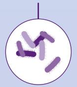

Shigella spp. fluoroquinolone-resistant

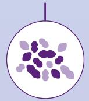

Enterococcus faecium vancomycin-resistant

Pseudomonas aeruginosa carbapenem-resistant

Non-typhoidal Salmonella fluoroquinolone-resistant

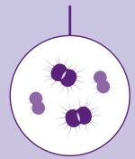

Neisseria gonorrhoeae third-generation cephalosporin, and/or fluoroquinolone-resistant

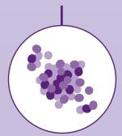

Staphylococcus aureus methicillin-resistant

## Medium group

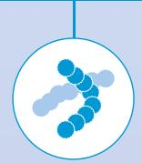

Group A Streptococci macrolide-resistant

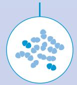

Streptococcus pneumoniae macrolide-resistant

Haemophilus influenzae ampicillin-resistant

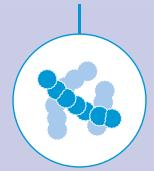

Group B Streptococci penicillin-resistant

## Introduction

## Background

AMR is a threat to public health and modern medicine and to achievement of the Sustainable Development Goals. Infections due to ABR pathogens result in a significant global disease burden. In 2019, an estimated 1.27 million deaths (95% confidence interval = 0.911; 1.71) were attributable to antibiotic-resistant bacteria, with an additional estimated 5 million associated deaths (95% confidence interval = 3.62; 6.57) (1). ABR also poses a persistent challenge to ending the global TB epidemic (2).

In 2017, WHO developed the first BPPL to guide investment into the R&D of new antibacterials (3). Twenty-five ABR phenotypes were initially prioritized, but the final list was streamlined to include 13 bacterial pathogens (phenotypes). These were further grouped into three tiers according to their priority: critical, high and medium. MDR-TB, a WHO public health priority, was also included in the report (3).

Since its launch, the BPPL has been used to analyse antibacterials in the pipeline, and the results have been published in annual WHO reports (4). Findings from the analyses indicate that the WHO BPPL has been instrumental in guiding investment in the R&D of antibacterials and anti-TB drugs (5). During the past 7 years, the antibiotic development pipeline brought to the market nine new antibiotics with in-vitro or invivo activity against the 2017 BPPL “critical” priority pathogens, although resistant strains have since been described for almost all of them (5,6). Additionally, a new anti-TB compound, pretomanid, came onto the market and was recommended by WHO in 2022 for administration as part of a novel 6-month all-oral regimen to treat MDR-TB and RR-TB (4,7).

The list has been shown to be a valuable public health tool for guiding AMR surveillance, prevention and control (e.g. the WHO Global antimicrobial resistance and use surveillance system (GLASS)) (8). Furthermore, it has played a critical role in shaping guidance on IPC in specific areas, such as the WHO guidelines for the prevention and control of carbapenem-resistant Gram-negative bacteria in health care facilities (9).

Nevertheless, the world continues to grapple with a crisis in the antibacterials R&D pipeline, primarily due to insuficient funding for the development of new antibiotics and limited global access to novel and existing antibiotics (10).

## Rationale for the update

AMR is an evolving threat that challenges the effectiveness of existing treatments. R&D of new antibacterial agents have not kept pace with the rapid evolution of resistance, leaving a substantial gap in the ability to properly address the unmet needs of patients (5,11). Quantifying the global burden of ABR is complex due to the limited availability of high-quality data, and continuous assessment is necessary as knowledge and evidence evolve (1). Global data gaps were acknowledged as limitations in the 2017 WHO BPPL, which emphasized the need for further research and data to better understand the extent of ABR in specific contexts (3).

The 2017 prioritization exercise partially addressed aspects such as specific resistance patterns, coresistance, and the level of innovation within the antibacterial medicines in the R&D pipeline. (12). The aim of this update is to address some of those limitations and to incorporate lessons from experience with the first BPPL exercise. The update takes advantage of recent advances in surveillance platforms, which have resulted in better surveillance data, including from resource-limited settings (8,13). In 2022, the first peer-reviewed estimates of the global burden of ABR infections were published, which included deaths and disability-adjusted life years (DALYs) due to multiple pathogens and pathogen–drug combinations in various countries and territories in 2019 (1). The study, and other new data sources, allow a more comprehensive understanding of the evolving landscape of ABR. Data on levels of RR-TB collected by WHO over the past decades were also used for this update (14).

By including such new evidence, the BPPL update addresses the evolution of AMR and the impact of recent global events, such as coronavirus disease 2019 (COVID-19), on AMR. It includes rectification of limitations in the initial exercise, identifies gaps and proposes actions to expedite the global response to drug-resistant (DR) bacteria.

## Aim and scope

The purpose of the BPPL 2024 is to guide resource allocation, guide and promote R&D of novel antibacterial agents and support development of effective strategies to prevent, control and treat infections caused by priority pathogens. This update addresses only ABR bacterial phenotypes for which there is the greatest unmet need and that result in the highest, most significant public health burden.

The aim of the update is to maintain the relevance of the WHO BPPL by adding new evidence and experience, ensuring that it continues to:

• guide R&D for new, effective antibiotic therapies, aligning investment with clinical and public health needs;

• facilitate international coordination to drive R&D towards the development of innovative, effective antibacterial agents and other prevention and control tools, aligning investment with clinical and public health needs;

• drive the development of alternative non-pharmaceutical and public health interventions to target key ABR pathogens; and

• inform AMR surveillance and other interventions such as stewardship and IPC programmes.

This updated version focuses on bacterial pathogens that cause acute infections that are resistant to antibiotics and represent high risks for mortality and morbidity, as well as RR-TB.

## Target readership

The intended readership of this document includes:

• developers of antibacterial medicines, including pharmaceutical companies, small- and medium-sized biotechnology companies and academic and public research institutions;

• research funders and public–private partnerships that invest in the R&D of new antimicrobial medicines, vaccines, diagnostics and other AMR prevention and control interventions;

• national and regional policy-makers responsible for developing, adapting, implementing and monitoring AMR and IPC action plans, policies and standards in the human health sector, including those who oversee national TB control programmes;

• researchers in infectious diseases, AMR and bacteriology; and

• global decision-makers, health providers, patient advocates and the public.

## Methods

The 2017 WHO BPPL was developed with the multi-criteria decision analysis (MCDA) method (15). MCDA is a decision-making scientific method that mounts and evaluates alternatives based on multiple criteria, facilitating systematic and transparent decision-making in complex options (16,17). It is widely applied across various fields to prioritize alternatives, considering diverse objectives and stakeholder preferences. One benefit of MCDA is its ability to identify alternatives and evaluation criteria through structured and defined protocols. Additionally, this method integrates empirical evidence from literature with expert insights, ensuring a comprehensive evaluation process by providing succinct and detailed communication for each alternative, including rankings, categorization, and preference selection (16,17,18). This is crucial when data are limited, inconsistent or ambiguous. Experts bring valuable insights, and MCDA provides a means for systematic integration of nuanced subjective judgements into decision-making (16,17).

Another strength of this method is its ability to provide a stable ranking of pathogens, which allows regular updating when new evidence or resistance threats are identified (3). Table 1 lists the steps in the MCDA process. For the 2024 BPPL updates, a similar MCDA study protocol to the one utilized in 2017 was employed. This protocol assessed pathogens selected for prioritization against eight criteria, informed by evidence from the literature (3). Table 2 lists the prioritization criteria for the MCDA and their definitions and levels. More details of the method used are provided in Annexes 1 and 2.

In line with the 2024 BPPL study protocol, RR-TB was initially assessed independently through an approach and criteria specifically designed to accommodate the unique characteristics of TB disease, including its chronic course, its transmission dynamics, and the typical requirement for treatment with four or more drugs for at least 6 months. Table A4.2 outlines the criteria used for independent assessments of RR-TB and their definitions. More details of the method and the results of this assessment are provided in Annex section.

Later in the study, the BPPL Advisory Group requested the application of the MCDA method and criteria used for assessing other pathogens to further evaluate and prioritize RR-TB. This post-hoc analysis was undertaken even though RR-TB was not included in the global PAPRIKA1 survey and recognizing the potential challenges of applying criteria designed for acute bacterial infections to assessment of RR-TB. The results and limitations of the RR-TB MCDA assessment were discussed by the Advisory Group, and, while there was a general alignment that the outcome could be used to support RR-TB’s placement on BPPL, there was not unanimous support for the assessment approach or resulting level assignment for certain evaluation criteria. Therefore, the grouping of RR-TB reflects the collective body of evidence obtained, which includes both the initial independent assessment defined in the study protocol, and the MCDA.

PAPRIKA (Potentiall All Pairwise RanKings of all possible Alternatives) is a robust decision-making approach for systematic evaluation and ranking of all conceivable pairwise alternatives to ensure comprehensive decision analysis. The method is a structured, thorough means of comparing and prioritizing diverse alternatives in making complex decisions.

Table 1. Steps in the Multi-Criteria Decision Analysis (MCDA) prioritization process (steps are overlapping and non-sequential)

Conceptualization of the study: Develop the study protocol, and form the WHO bacterial priority pathogens list Advisory Group (BPPL AG)a.

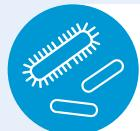

Selection of antibiotic-resistant bacterial pathogens: Identify the bacterial pathogens to be prioritized.

Refinement and definition of assessment criteria (attributes): Define and refine the criteria for assessment.

Review of evidence: Establish criteria levels and describe each pathogen against each criterion, based on available evidence.

Identification of experts: Identify experts to participate in the PAPRIKAb global survey.

Conduct PAPRIKA global survey to determine criteria weights: Design and conduct a global survey according to the PAPRIKA method to determine the weight of each criterion.

Assessment of pathogens against criteria: Assess the performance of each pathogen against each criterion within the MCDA matrix.

Final scoring, ranking and evaluation: Conduct final scoring and ranking and perform sensitivity analysis.

Final list: Compile the final list.

a The formation of the BPPL AG followed an open call for applications, with 120 applications received and reviewed. Experts were then selected to ensure geographic, disciplinary, and gender balance across all 6 WHO regions, resulting in the selection of 23 experts.

PAPRIKA (Potentiall All Pairwise RanKings of all possible Alternatives) is a robust decision-making approach for systematic evaluation and ranking of all conceivable pairwise alternatives to ensure comprehensive decision analysis. The method is a structured, thorough means of comparing and prioritizing diverse alternatives in making complex decisions.

Table 2. Prioritization criteria, definitions and levels
<table><tr><td colspan="2" rowspan="1">Criterion</td><td colspan="4" rowspan="1">Definition</td><td colspan="2" rowspan="1">Scoring system</td><td colspan="1" rowspan="1">Survey score*</td></tr><tr><td colspan="2" rowspan="5">Mortality</td><td colspan="4" rowspan="1">Case Fatality Ratio (Pooled</td><td colspan="2" rowspan="1">&gt;30%</td><td colspan="1" rowspan="1">High</td></tr><tr><td colspan="4" rowspan="4">prevalence of all-causemortality (%) amongpatients with infectionscaused by antibiotic-resistant pathogens)</td><td colspan="2" rowspan="1">21-30%</td><td colspan="1" rowspan="1">Medium-High</td></tr><tr><td colspan="1" rowspan="1"></td><td colspan="2" rowspan="1">11-20%</td><td colspan="1" rowspan="1">Medium</td></tr><tr><td colspan="2" rowspan="1">5-10%</td><td colspan="1" rowspan="1">Medium-Low</td></tr><tr><td colspan="2" rowspan="1">&lt; 5%</td><td colspan="1" rowspan="1">Low</td></tr><tr><td colspan="2" rowspan="5">Incidence</td><td colspan="4" rowspan="5">Global incidence of casesper 1 million population (allages, all sexes, associate toresistance)</td><td colspan="2" rowspan="1">&gt; 10.000 cases per 1 mln population</td><td colspan="1" rowspan="1">High</td></tr><tr><td colspan="2" rowspan="1">5001-10.000 cases per 1 mln population</td><td colspan="1" rowspan="1">Medium-High</td></tr><tr><td colspan="2" rowspan="1">1001-5000 cases per 1 mln population</td><td colspan="1" rowspan="1">Medium</td></tr><tr><td colspan="2" rowspan="1">100-1000 cases per 1 mln population</td><td colspan="1" rowspan="1">Medium-Low</td></tr><tr><td colspan="2" rowspan="1">&lt; 100 cases per 1 mln population</td><td colspan="1" rowspan="1">Low</td></tr><tr><td colspan="2" rowspan="5">Non-fatalhealth burden</td><td colspan="4" rowspan="5">Years Lived with Disability(YLDs) per millioninhabitants, includingall ages and all sexes,attributable to infectionsby each resistant pathogen</td><td colspan="2" rowspan="1">&gt; 1.5 YLD per 1 mln population</td><td colspan="1" rowspan="1">High</td></tr><tr><td colspan="2" rowspan="1">1.1-1.5 YLD per 1 mln population</td><td colspan="1" rowspan="1">Medium-High</td></tr><tr><td colspan="3" rowspan="1">sexes,</td><td colspan="1" rowspan="1"></td><td colspan="2" rowspan="1">0.51-1 YLD per 1 mln population</td><td colspan="1" rowspan="1">Medium</td></tr><tr><td colspan="2" rowspan="1">0.11-0.5 YLD per 1 mln population</td><td colspan="1" rowspan="1">Medium-Low</td></tr><tr><td colspan="2" rowspan="1">&lt; 0.1 YLD per 1 mln population</td><td colspan="1" rowspan="1">Low</td></tr><tr><td colspan="2" rowspan="5">Trend ofresistance</td><td colspan="4" rowspan="5">10-year trend of resistancerate data, where resistantrate is defined aspercentage of resistantisolates out of the totalnumber of isolates tested</td><td colspan="2" rowspan="1">Increasing trend in ≥ 3 WHO regions(or in most regions with data)</td><td colspan="1" rowspan="1">Level 5</td></tr><tr><td colspan="2" rowspan="1">Increasing trend in 2 WHO regions</td><td colspan="1" rowspan="1">Level 4</td></tr><tr><td colspan="2" rowspan="1">Increasing trend in one WHO region</td><td colspan="1" rowspan="1">Level 3</td></tr><tr><td colspan="2" rowspan="1">Stable trend in all WHO regions</td><td colspan="1" rowspan="1">Level 2</td></tr><tr><td colspan="2" rowspan="1">Significantly decreasing trend in at least one WHOregion, with no increase in any of the other regions</td><td colspan="1" rowspan="1">Level 1</td></tr><tr><td colspan="2" rowspan="9">Trans-missibility</td><td colspan="4" rowspan="5">Evidence of transmissionof the AMR pathogenamong different pathways.Two distinct domainsconsidered:Human-to-humantransmission: outbreak</td><td colspan="2" rowspan="1">Well documented (OC)      and  High (TP)</td><td colspan="1" rowspan="1">High</td></tr><tr><td colspan="2" rowspan="1">Well documented (OC)      and  Moderate (TP)</td><td colspan="1" rowspan="2">Medium-High</td></tr><tr><td colspan="2" rowspan="1">Moderately documented (OC) and  High (TP)</td></tr><tr><td colspan="2" rowspan="1">Poorly documented (OC)    and  High (TP)</td><td colspan="1" rowspan="3">Medium</td></tr><tr><td colspan="2" rowspan="1">Well documented (OC)      and  Low (TP)</td></tr><tr><td colspan="4" rowspan="2">capability in healthcare/community settingsTransmission between</td><td colspan="2" rowspan="1">Moderately documented (OC)) and  Moderate (TP)</td></tr><tr><td colspan="2" rowspan="1">Moderately documented (OC)) and  Low (TP)</td><td colspan="1" rowspan="2">Medium-Low</td></tr><tr><td colspan="4" rowspan="2">humans and animal,food, and environmentcompartments</td><td colspan="2" rowspan="1">Poorly documented (OC)    and  Moderate (TP)</td></tr><tr><td colspan="2" rowspan="1">Poorly documented (OC)    and  Low (TP)</td><td colspan="1" rowspan="1">Low</td></tr><tr><td colspan="2" rowspan="1">Preventability</td><td colspan="4" rowspan="1">The existence andeffectiveness of preventivemeasures in containingthe transmission of thetarget AMR pathogen andreducing disease burden.</td><td colspan="1" rowspan="1">IPC Measures:• Effective and sufficient• Recommended, existing, andeffectiveNot universally recommended dueto limited efficacy/feasibility</td><td colspan="1" rowspan="1">２10</td><td colspan="1" rowspan="1">&gt; 5 points: High</td></tr><tr><td colspan="2" rowspan="5">in health caresetting andcommunity</td><td colspan="4" rowspan="2">two distinct aspects ofpreventability:1. Individual-basedinfectious preventive andcontrol (IPC) measures,</td><td colspan="1" rowspan="2">Decolonization/Chemoprophylaxis:• Existing and effective• Existing and partly effective orrestricted to high-risk population• Not existing or non-effective</td><td colspan="1" rowspan="2">２10</td><td colspan="1" rowspan="1">5 points: Medium-High</td></tr><tr><td colspan="1" rowspan="1">4 points: Medium</td></tr><tr><td colspan="4" rowspan="3">including hand hygiene andstandard and transmission-based precautions (suchas contact, isolation, andbarrier precautions).2. Community-basedIPC measures, includingvaccination, watersanitation, access to healthservices, and food safety.</td><td colspan="1" rowspan="3">Public Health Interventions inCommunity:• Existing and effective OR notneeded• Existing and partly effective• Not existing or non-effective</td><td colspan="1" rowspan="3">210</td><td colspan="1" rowspan="1">3 points: Medium-Low</td></tr><tr><td colspan="1" rowspan="1"></td><td colspan="2" rowspan="1">n), and</td><td></td></tr><tr><td colspan="1" rowspan="1">&lt; 3 points: Low</td></tr><tr><td colspan="1" rowspan="1">Criterion</td><td colspan="5" rowspan="1">Definition</td><td colspan="2" rowspan="1">Scoring system</td><td colspan="5" rowspan="1">Survey score</td></tr><tr><td colspan="1" rowspan="9">Treatability</td><td colspan="5" rowspan="1">Composite criterion which</td><td colspan="1" rowspan="5">Number of 1st line option(s)recommended by evidence-basedguidelines:• One antibiotic class• Two or more antibiotic classes</td><td colspan="1" rowspan="5">22 for eachoption</td><td colspan="5" rowspan="5">&gt; 12 points: High</td></tr><tr><td colspan="9" rowspan="2">encompasses: number ofmolecule(s) listed in the</td></tr><tr><td colspan="4" rowspan="1">molecule(s)</td></tr><tr><td colspan="2" rowspan="1">guidelines, thei</td><td colspan="2" rowspan="1">r efficacy</td><td colspan="5"></td></tr><tr><td colspan="5" rowspan="1">ranking (1st or lower linesof treatment versus last</td><td colspan="4" rowspan="1"></td></tr><tr><td colspan="5" rowspan="4">resort), safety profile,availability of oral/OPATformulatión, presénceof pediatric formulation,concomitant resistance,and cost.</td><td colspan="1" rowspan="1">Concomitant resistance reportedfor 1st line option(s):• Greater than 20%• 20% or less</td><td colspan="1" rowspan="1">-1 for eachoption0</td><td colspan="5" rowspan="1">10-11 points:Medium-High</td></tr><tr><td colspan="1" rowspan="1">Availability of alternative option(s) forthe most typical infectious syndrome:• No option available OR option(s)available but with a poor toxicityprofile AND/OR recommendedONLY in combinationOption(s) available with a fairtoxicity profile AND recommendedin monotherapy BUT co-resistance&gt; 20%At least one alternative availablewith a fair toxicity profile ANDrecommended also in monotherapyAND co-resistance ≤ 20%</td><td colspan="1" rowspan="1">-10</td><td colspan="5" rowspan="1">8-9 points: Medium</td></tr><tr><td colspan="1" rowspan="1">Formulations:• Availability of oral option(s):Availability of OPAT option(s):Available option(s) approved ortested for pediatric population</td><td colspan="1" rowspan="1">111</td><td colspan="5" rowspan="1">6-7 points:Medium-Low</td></tr><tr><td colspan="1" rowspan="1">Accessibility (cost)• High costa Low costb</td><td colspan="1" rowspan="1">10</td><td colspan="5" rowspan="1">&lt; 5 points: Low</td></tr><tr><td colspan="1" rowspan="21">Pipeline</td><td colspan="5" rowspan="1">The criterion assesses</td><td colspan="2" rowspan="6">Unlikely:The pathogen has no, or very limited number ofpotential active candidates in phase X according toWHO clinical pipeline analyses from 2017-2021.Pathogen has no, or very limited number, of candidateswith ongoing market authorization application (MAA)and/or new drug application (NDA).No, or very limited number, newly approved antibioticsfrom July 2017 to 2022.</td><td colspan="5" rowspan="6">&lt; 34 points: Unlikely</td></tr><tr><td colspan="9" rowspan="1">the extent to which theantibacterial pipeline, bothcurrently and over the next5-7 years, can effectively</td></tr><tr><td colspan="9" rowspan="1">meet clinical needs for</td></tr><tr><td colspan="9" rowspan="1">treating each resistant</td></tr><tr><td colspan="9" rowspan="1">bacterial pathogen.</td></tr><tr><td colspan="9" rowspan="1">The criterion considers the</td></tr><tr><td colspan="5" rowspan="1">number of newly approved</td><td colspan="2" rowspan="8">Possible:The pathogen has one or more potential activecandidates in phase X according to WHO clinicalpipeline analyses from 2017-2021.Pathogen has one or more candidates with ongoingmarket authorization application (MAA) and/or newdrug application (NDA).One or more newly approved antibiotics from July2017 to 2022.</td><td colspan="5" rowspan="8">47-34 points:Possible</td></tr><tr><td colspan="9" rowspan="1">antibiotics in the last5-7 years, as well as the</td></tr><tr><td colspan="9" rowspan="1">number of candidates in</td></tr><tr><td colspan="9" rowspan="1">the clinical developmental</td></tr><tr><td colspan="9" rowspan="1">pipeline that meet WHO</td></tr><tr><td colspan="9" rowspan="1">innovation criteria, such</td></tr><tr><td colspan="9" rowspan="1">as new chemical classes,</td></tr><tr><td colspan="9" rowspan="1">novel targets, and absence</td></tr><tr><td colspan="5" rowspan="1">of cross-resistance.</td><td colspan="2" rowspan="7">Likely:The pathogen has a robust pipeline with multiplepotential active candidates in phase X according toWHO clinical pipeline analyses from 2017-2021.Pathogen has multiple candidates with ongoing marketauthorization application (MAA) and/or new drugapplication (NDA).Several newly approved antibiotics from July 2017 to2022.Note: A scoring matrix was created for this criterion,and it is presented in the annex for reference.</td><td colspan="5" rowspan="7">47 points: Likely</td></tr><tr><td colspan="9" rowspan="1">Additionally, it evaluates</td></tr><tr><td colspan="9" rowspan="1">the availability of oral</td></tr><tr><td colspan="9" rowspan="1">formulations for both the</td></tr><tr><td colspan="9" rowspan="1">new candidates and those</td></tr><tr><td colspan="3" rowspan="1">under development</td><td></td><td colspan="5" rowspan="1"></td></tr><tr><td colspan="9" rowspan="1"></td></tr></table>

IPC: infection prevention and control; OC: Outbreak capability; OPAT: Outpatient Parenteral Antibiotic; TP: Transmission Potential (between humans and animals, food, and environmental compartments); YLDs: Years Lived with Disability.  
High-cost antibiotics were defined as antibiotic agents characterized by reported scarcity or shortages, and newly introduced formulations entering the market since 2017.  
b Low-cost antibiotics refer to generic antimicrobial medications that do not fulfil the aforementioned criteria.  
Note: for pathogens not included in the WHO clinical pipeline analyses from 2017–2021, data available in the literature were used.  
If no data are available in public domains or in the WHO analyses report, the pathogen is scored as having zero products in phase.

## Determination of the preliminary list of pathogens to be prioritized

In this update, five pathogens–antibiotic combinations that were included in the 2017 version were removed based on evidence and expert consensus: clarithromycin-resistant Helicobacter pylori, fluoroquinolone-resistant Campylobacter spp., penicillin-non-susceptible Streptococcus pneumoniae, third-generation cephalosporin-resistant Providencia spp. and vancomycin-intermediate and -resistant S. aureus.

Four new combinations were added: macrolide-resistant Group A Streptococci, penicillin-resistant Group B Streptococci, macrolide-resistant Streptococcus pneumoniae, and RR-TB. Finally, 23 antibiotic– bacteria phenotypes combinations were included in BPPL-2024. Fig 2. compares the ranking of priority pathogens in the 2017 and 2024 BPPLs. Following the finalization of the ranking, the combinations were arranged by family and order, resulting in 15 “drug–bug” combinations presented in the final list (see Annex 2).

## Determination of criteria weights: 2023 global PAPRIKA survey

Pathogen–antibiotic combinations were described and assessed against eight defined criteria (attributes), based on current evidence (see Table 2 for prioritization criteria, definitions, and levels). The weights of the assessment criteria were determined according to the PAPRIKA method, in a participatory blinded survey designed with 1000minds® software (19). A total of 79 experts from all six WHO regions participated in the survey, representing an 80% response rate from the initial invitation to 100 experts. Participants were selected to ensure diverse geography, gender and expertise. The participants responded subjectively to a series of simple questions based on their expert knowledge. They focused on two criteria or attributes of two pathogens at a time, involving a trade-off while keeping other criteria constant. Blinding techniques were applied to reduce bias and enhance reliability. (Note: As RR-TB was evaluated independently, it was not included in the global survey). The results of the global PAPRIKA survey were the basis for assigning criteria weights. There was a strong consensus among participants, as indicated by a Spearman rank correlation coeficient2 of 0.9, and Kendall’s coeficient of concordance (W)3 of 0.9 (see Fig. 3).

The criteria of treatability and the fatal burden of ABR infections, weighted highest by the experts, indicate the importance of effective treatment in addressing these infections. This is particularly important in view of the few effective options for antibiotic treatment for high-burden DR pathogens such as MDR Gram-negative bacteria.

The weighting also highlights the necessity for a focused approach in development of and targeted investment in new drugs against high-burden, resistant pathogens. The criterion of trends in AMR was also strongly weighted, reflecting the experts’ recognition of the critical role of surveillance in monitoring AMR transmission patterns and burden. Robust AMR surveillance systems are vital for monitoring priority DR pathogens and for understanding the factors that influence the development of AMR.

The experts assigned equal importance to the criteria of incidence, burden of non-fatal disease, transmissibility, and preventability, emphasizing their crucial role in decisions on R&D for new antibiotics. Understanding the interconnectedness of these attributes is vital, as certain pathogens may necessitate investment in both new antibiotics and public health interventions. The comparable weighting of these criteria underscores their collective importance in guiding R&D decision-making processes.

The pipeline criterion, although assigned a lower weight than other criteria, was given greater emphasis in the MCDA than in 2017. Experts highlighted the significance of investing in new antibiotic development as part of a comprehensive strategy, acknowledging the limited progress in addressing priority pathogens and the imperative for innovation. WHO’s most recent pipeline assessment described the antibacterials pipeline as insuficient, underlining the urgent necessity for increased investment in R&D (4). Assessment of each pathogen–antibiotic combination against the eight criteria is shown in Annexes 2 and 3.

Fig. 2. Pathogens prioritized in the 2024 BPPL update as compared with the 2017 BPPL WHO BPPL 2017 WHO BPPL 2024  
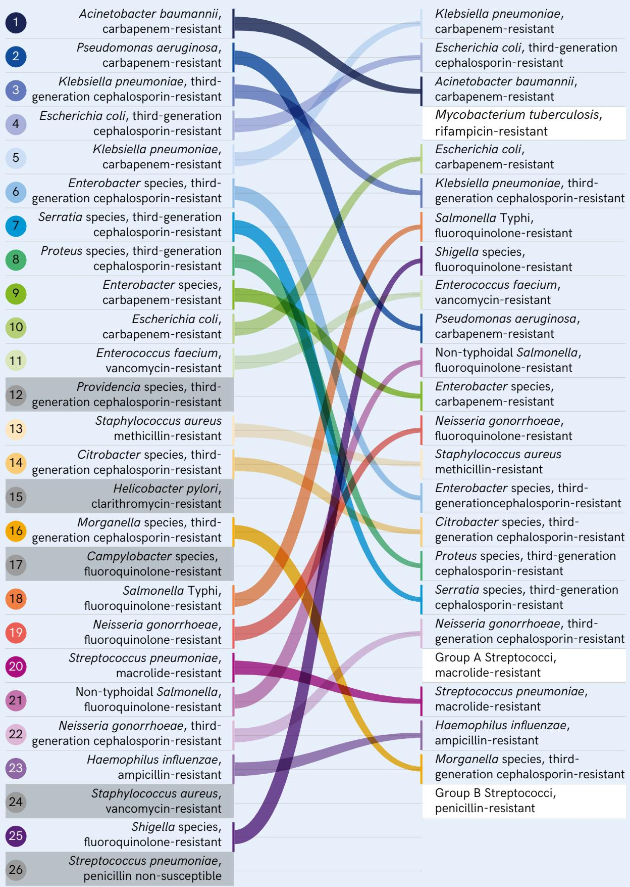

Fig. 3. Pooled criteria weights (results from the Global PAPRIKAa survey)  
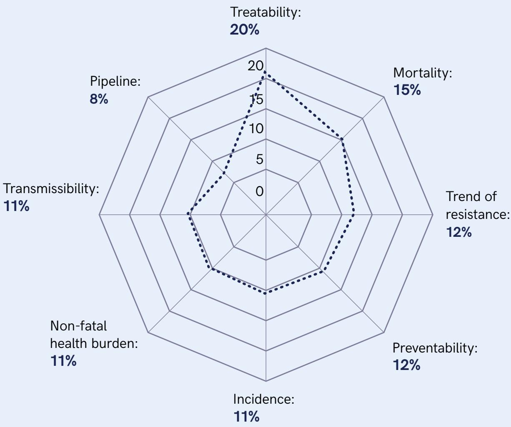  
Spearman rank correlation = 0.9  
Kendall’s W = 0.871  
PAPRIKA (Potentially All Pairwise RanKings of all possible Alternatives) is a robust decision-making approach for systematic evaluation and ranking of all conceivable pairwise alternatives to ensure comprehensive decision analysis. The method is a structured, thorough means of comparing and prioritizing diverse alternatives in making complex decisions.

Furthermore, while the antibiotic pipeline criterion was assigned a relatively lower weight compared to other criteria, it was given higher weight than in 2017. This highlights the experts’ acknowledgment of the importance of investing in the development of new antibiotics as part of a comprehensive approach. This shift may suggest an increased recognition among experts of the limited progress in developing new drugs to combat priority pathogens. In 2023, a WHO co-authored report described the status of the pipeline as stagnant and lacking innovation (10). This underscores the pressing need for investment in R&D to address this critical gap and ensure access to new and effective therapies.

A summary of the outcome, and the approach used in assessing pathogens against criteria are outlined in Annexes 2, 3.

## Independent assessment of RR-TB

RR-TB was assessed independently in a tailored approach. All the criteria used were customized for RR-TB in recognition of the impact of access to airborne transmission, access to diagnostics, treatability and non-fatal health burden. DR M. tuberculosis is highly communicable and can be transmitted in exhaled aerosols. Droplets may remain airborne for several hours and transmit the infection when inhaled by others. This mode of transmission can result in others becoming infected upon inhalation, which contributes to infection or carriage of latent TB of an estimated one-fourth of the world’s population. The burden of non-fatal TB is another crucial criterion. RR-TB was responsible for 6.93 million (95% uncertainty interval [UI]: 5.52;8.53) disability-adjusted life years (DALYs) in 2020, most of which (5.96 million DALYs, 95% UI: 4.63;7.42) were experienced in the 30 countries with the highest burden of MDR- and RR-TB. While most DALYs can be attributed to morbidity and mortality during treatment, TB often results in long-term morbidity among survivors. A criterion for diagnostics was included in the assessment, as there is a significant gap in diagnosis of RR-TB globally. In 2021, bacteriological confirmation was provided for only 63% of people with diagnosed pulmonary TB, and, of these cases, only 70% were tested for resistance to rifampicin.

A detailed description of the independent assessment for RR-TB and the outcome are provided in Annex 4.

## Application of MCDA to RR-TB

Later in the study, the BPPL Advisory Group requested the application of MCDA criteria used for assessing other pathogens to evaluate and prioritize RR-TB, acknowledging the limitations. While most of the attributes of MCDA could be applied directly to assessment of RR-TB, some adaptations were required to account for the chronic nature of RR-TB, its transmission through the air in communities and the fact that the disease is treated with a combination of four or more drugs for at least 6 months. Most of the data on the RR-TB disease burden and trends were provided by WHO from its surveillance projects, and reports rather than a systematic literature review were used (14,20).

The pipeline scoring for RR-TB was also adapted to include factors such as use of combination therapies containing at least three or four drugs and the fact that oral combinations are already part of standard care in the management of RR-TB.

The treatability criterion for RR-TB was evaluated against published WHO treatment guidance and recommendations endorsed by WHO during the defined time in the protocol (21). While WHO recommends a single multidrug regimen as first-line treatment of RR-TB, it is recognized that alternative combinations are available and recommended for use in specific circumstances.

Overall, adaptation of the MCDA to RR-TB was dificult because of the unique characteristics of TB disease and the fact that the criteria were designed for assessing acute bacterial infections.

A summary of the approach used in assessing pathogens against the MCDA criteria and the outcomes are outlined in Annexes 2 and 3.

# Results: WHO Bacterial Priority Pathogen List, 2024

With the approach described above, 24 bacterial pathogen-drug combinations were identified, assessed and ranked according to the outcome of the assessment. The bacterial pathogens were then stratified into three priority groups (see Table A4.2, which includes the scores attributed to the pathogens). Box 1 provides operational definitions of priority categories in the 2024 BPPL.

Box 1. Operational definitions of priority categories in the 2024 WHO BPPL  
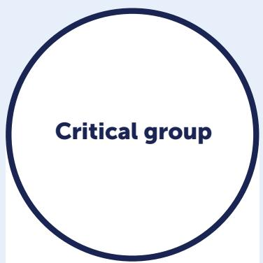

ABR bacterial pathogens that pose the highest threat to public health due to limited treatment options, high disease burden (mortality and morbidity) and increasing trends in ABR, with few or no promising candidates in the pipeline. Infections with pathogens in the critical category may also be uniquely dificult to prevent and are highly transmissible; the pathogens may have global mechanisms of resistance and/ or MDR strains in certain populations or geographical areas.

ABR bacterial pathogens that are significantly dificult to treat, cause a substantial disease burden (mortality and morbidity), show increasing trends in resistance, are uniquely dificult to prevent, are highly transmissible and for which there are few potential treatments in the development pipeline. Although they may not be critical globally, pathogens in this category could be critical for some populations and in specific geographical areas.

ABR bacterial pathogens that are associated with moderate dificulty for treatment, a moderate disease burden (mortality and morbidity) and moderate trends in resistance, with unique issues for preventability or transmissibility and relatively more candidates for treatment in the pipeline. Similarly, while they may not be critical globally, pathogens in this category could be critical for some populations and in specific geographical areas.

Fig 4. WHO Bacterial Priority Pathogens List, 2024  
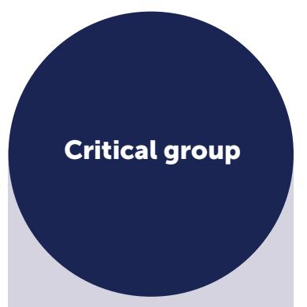

Mycobacterium   
tuberculosis,   
rifampicin  
resistanta   
aRR-TB was included after an independent analysis with parallel criteria and subsequent application of an adapted MCDA matrix.

Salmonella Typhi fluoroquinolone-resistant

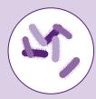

Shigella spp. fluoroquinolone-resistant

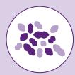

Enterococcus faecium vancomycin-resistant

Pseudomonas aeruginosa carbapenem-resistant

Non-typhoidal Salmonella fluoroquinolone-resistant

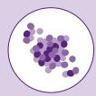

Neisseria gonorrhoeae third-generation cephalosporin,and/or fluoroquinolone-resistant

  
Staphylococcus aureus methicillin-resistant

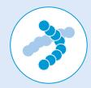

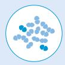

Streptococcus pneumoniae macrolide-resistant

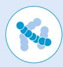

Haemophilus influenzae ampicillin-resistant

Group B Streptococci penicillin-resistant

## Outcomes

## Gram-negative bacterial pathogens: a continued critical priority

In this updated BPPL, Gram-negative bacterial pathogens maintain their critical status. Carbapenemresistant Acinetobacter baumannii (CRAB), carbapenem-resistant Enterobacterales (CRE) and thirdgeneration cephalosporin-resistant Enterobacterales (3GCRE) received the highest scores, confirming their inclusion in the critical priority category in BPPL-2024.

The emergence and persistence of CRAB pose a formidable global challenge, because of its virulence, resistance, and limited treatment options, leading to severe nosocomial infections, especially among intensive care patients, and alarmingly high mortality rates (1,22). CRAB is one of the five top pathogens worldwide in terms of attributable mortality caused by antibiotic-resistant infections and is estimated to be the leading pathogen in South-East Asia, East Asia and Oceania for mortality attributable to ABR (1,23,24). Despite the urgency, antibiotic development has been lagging in addressing this challenge. Since the classification of CRAB as critical pathogens in the 2017 BPPL, no new drug effective against metallo-β-lactamase-producing CRAB strains has been introduced, emphasizing the persistent challenge and the crucial need for ongoing investment in R&D (4,5).

CRE and 3GCRE continue to be at the top of the BPPL ranking in terms of the need for R&D of new antibiotics. These pathogens pose the highest estimated burden among all MDR Gram-negative bacteria due to their widespread prevalence and resistance (1,23,24).

CRE bacteria cause various infection syndromes, including bloodstream, respiratory tract, intraabdominal and urinary tract infections. These infections impose a significant burden globally, with limited treatment options, due mainly to the high ABR rates (1,25). CRE outbreaks are complex, resulting in a substantial economic burden, further highlighting the urgent need for prevention and control, including innovative treatment options, to address the burden of infections caused by these pathogens (26,27,28).

This update introduces a distinct categorisation for 3GCRE, to highlight the need for targeted policies and interventions to address this emerging threat. The high estimated burden of extended-spectrum β-lactamase-producing Enterobacterales, especially in LMIC and among vulnerable populations, leads to high rates of treatment failure and increased health-care costs (1,26,27). The inclusion of bloodstream infections associated with 3GCRE (E Coli) as part of the first United Nations Sustainable Development Goals (AMR indicator 3.d.2) underscores its significant burden (29). The situation is particularly concerning for the paediatric population, in whom DR Enterobacterales infections, such as extendedspectrum β-lactamase-producing Klebsiella pneumoniae, complicate first-line antibiotic treatment. The rise in the prevalence of third-generation cephalosporin-resistant organisms in cases of neonatal sepsis is associated with increased morbidity and mortality rates, particularly in LMIC (30). Limited access to affordable antibiotics, resource constraints, inadequate infection control and high antimicrobial usage contribute to the global burden of 3GCRE and CRE, resulting in increased morbidity, mortality and costs (1).

Carbapenem-resistant Pseudomonas aeruginosa (CRPA) has been moved from "critical" to "high" priority in the 2024 update. This change is partly informed by our findings suggesting a potential global decrease in resistance, identified in at least one WHO region. Both the apparent decreasing resistance trends in one WHO region and the relatively lower transmission capability compared to other carbapenem-resistant strains were factors contributing to the adjustment in ranking. This finding is in agreement with estimates from the AMR Global Burden of Disease study (1). Despite this transition, investment in R&D for CRPA remains crucial, given its significant burden in high-income countries and certain regions such as central and eastern Europe and Central Asia (1,23,24). Importantly, the high fatal burden of CRPA among immunocompromised individuals and in health-care settings indicate a continued need for innovative R&D approach to address the impact of CRPA on health care.

## RR-TB: a critical AMR pathogen

In this update, RR-TB was included as a critical priority. RR-TB poses significant additional challenges to those of drug-susceptible (DS)-TB in terms of diagnosis, treatment, clinical management and overall public health response. Capacity to detect resistance to rifampicin and to most anti-TB medicines remains severely limited worldwide (14). Treatment regimens for RR-TB are orders of magnitude more expensive and toxic than those used for DS-TB, leading to high rates of patient loss to follow-up before treatment completion and low cure rates. While novel and recently recommended regimens may improve the situation, resistance to new core drugs like bedaquiline is already emerging, and treatment options for bedaquiline-resistant TB are also severely limited. Additionally, the financial impact of people with RR-TB is tremendous, with 82% of affected households facing catastrophic total costs4 (14).

## Methicillin-resistant Staphylococcus aureus (MRSA) remains a high priority

MRSA maintains its position in the BPPL high-priority pathogen category, in line with its high estimated burden (1). This can be attributed to various factors, including regional variations in MRSA burden and investments in R&D programmes and targeted infection prevention and control (IPC) measures, including in high-income countries, where it is one of the most prevalent DR pathogens. MRSA continues to pose a significant global burden. It has been identified as one of the leading causes of health-careassociated and community-acquired infections worldwide (24,25). The Global Burden of Disease study reported that, in high-income countries, approximately 50% of the fatal burden attributed to AMR is linked to two pathogens: S. aureus and E. coli (1). The morbidity, mortality and health-care costs due to MRSA cannot be underestimated, and it remains a major concern due to its persistent prevalence and potentially severe infections. To address the challenges posed by MRSA, a comprehensive approach is necessary that combines continued investment in R&D, enhanced infection prevention and control, stewardship programmes and global surveillance (31).

## Other community pathogens of high priority

The updated WHO BPPL ranking reflects a notable increase in recognition of “community” pathogens, indicating their growing resistance to treatments and the substantial burden they pose, particularly in LMIC. The increase in the priority of community pathogens has important implications for public health and R&D and reflects growing concern about these pathogens and their resistance to antibiotics.

For example, fluoroquinolone-resistant Salmonella Typhi, a significant community pathogen that poses a substantial burden in LMIC, is placed very high among the community pathogens, and, in this update, it is categorized as a high-priority pathogen. Salmonella Typhi is the leading cause of typhoid fever, a major global public health issue. Each year, an estimated 10 million cases and approximately 116,800 deaths are attributed to typhoid fever (32). The emergence of AMR presents a critical challenge to its treatment. Older treatment options like ampicillin, chloramphenicol and trimethoprim–sulfamethoxazole have been largely replaced by fluoroquinolones (and third-generation cephalosporins) due to resistance and severe side-effects (33). Concern has arisen, however, about the effectiveness of fluoroquinolones, as recent reports indicate increasing resistance and reduced susceptibility in many regions (34). Genetic mutations in genes such as gyrA, gyrB, parC and parE and plasmid-mediated quinolone resistance genes contribute to fluoroquinolone resistance in Salmonella Typhi (35,36). The genetic diversity of Salmonella Typhi strains in various regions influences resistance patterns and can further complicate empiric treatment (37). Moreover, MDR and extensively DR strains of Salmonella Typhi are increasingly prevalent worldwide (37). The rise of resistance to newer antibiotics, such as azithromycin, and the occurrence of extensively DR Salmonella Typhi outbreaks in high prevalence regions like Asia, with potential regional spread, are additional causes for concern (38). Typhoid fever predominantly affects impoverished communities with limited access to adequate water, sanitation and hygiene infrastructure (38). High population density, suboptimal healthcare infrastructure, and widespread antimicrobial use, coupled with indiscriminate usage and weak stewardship, contribute to the emergence of resistance (38).

Fluoroquinolone-resistant non-typhoidal Salmonella was also moved up in the overall ranking and is included in the high-priority category. Non-typhoidal Salmonella causes gastroenteritis and is one of the leading causes of foodborne bacterial diarrhoea globally, unlike typhoid fever which remains endemic, mostly in low resource settings (39). While distinct from Salmonella Typhi in terms of clinical presentation and burden of disease, fluoroquinolone-resistant non-typhoidal Salmonella is a major global concern because of its resistance (40). Fluoroquinolone-resistant non-typhoidal Salmonella indirectly increases resistance in typhoidal Salmonella by contributing to the prevalence of resistance genes. Shared genes increase the risk of resistance transfer, compromising the effectiveness of fluoroquinolone in treating typhoid fever. ABR in non-typhoidal Salmonella results primarily from use of antibiotics in animal husbandry. Surveillance and prevention and control of infections are vital to limit the spread of resistance among these related pathogens (41).

Fluoroquinolone-resistant Shigella spp. are other notable community pathogens that were ranked higher overall in the BPPL 2024 update, moving from “medium” to “high” priority. Shigellosis is the second most common cause of diarrhoeal mortality in all age groups and is associated with a high burden of diarrhoea in all age groups (42). Shigella flexneri and S. sonnei are the two most common spp. that are responsible for gastrointestinal infections. Both are transmitted mainly through the faecal–oral route, and both have increasing ABR, including resistance to fluoroquinolones (43,44). S. flexneri is prevalent in developing countries with inadequate sanitation, causing severe disease, primarily in children, while S. sonnei is more common in developed countries, affecting older individuals and with milder symptoms (43). Both spp. include documented MDR strains, including some resistant to fluoroquinolones (42,43). Numerous studies and reports document a notable rise in outbreaks due to MDR Shigella strains among Men Who Have Sex with Men, primarily in urban areas and specific community contexts (45,46). These concerning reports suggest a shift in AMR trends.

MDR N. gonorrhoeae (including fluoroquinolone-resistant and third-generation cephalosporin-resistant strains) has also remained in the high priority category. N. gonorrhoeae, the causative agent of gonorrhoea, poses a particular threat because of its high burden, transmissibility, asymptomatic disease and associated stigmatization and other structural barriers to care (47,48). While N. gonorrhoeae infection is typically not fatal, its impact on morbidity is substantial, leading to sequelae such as pelvic inflammatory disease, infertility, chronic pelvic pain and ectopic pregnancies in women, and epididymitis in men (46). Moreover, increased rates of N. gonorrhoeae are linked to higher risks of acquiring and transmitting other sexually transmitted infections, including HIV (47,49). As the effectiveness of previously recommended antibiotics is decreasing, the emergence of MDR strains worldwide poses a serious challenge to the current recommended combination therapy (50,51).

Also included in the high-risk category is DR Enterococcus faecium, a bacterium commonly inhabiting the gastrointestinal tract of both humans and animals. Though typically benign as a commensal, it presents a spectrum of severe opportunistic infections, such as endocarditis, bacteremia, and urinary tract infections, particularly in immunocompromised or medically vulnerable individuals. Notably, Enterococcus faecium exhibits a concerning propensity for developing resistance to antibiotics, notably vancomycin, posing significant challenges within healthcare facilities. Plasmid-mediated VanA and VanB gene complexes are responsible for conferring high-level vancomycin resistance. The surge in vancomycin-resistant E. faecium, attributed to the emergence of clonal cluster 17 (CC17) genogroup, underscores its burgeoning status as a problematic nosocomial pathogen linked with resistant infections in healthcare settings. Comprehensive understanding of its epidemiology, virulence factors, resistance mechanisms, and cross-species transmission dynamics is imperative for devising effective management and infection control strategies against this pathogen (52).

## Other priority pathogens

The updated list of antibiotics–pathogen combinations also include three other notable additions: macrolide-resistant Group A Streptococci, penicillin-resistant Group B Streptococci and macrolideresistant Streptococcus pneumoniae. These pathogens are of particular concern as they are associated with a high burden of disease, especially in vulnerable populations and in LMIC. The emergence of resistance in these organisms and others on the list poses significant challenges to effective treatment and control of infections, necessitating ongoing surveillance, research, and targeted interventions. For example, pneumonia presents a substantial global challenge, resulting in over 3 million deaths each year, with Streptococcus pneumoniae as a leading cause (53). Vulnerable populations, including children and the elderly, bear the brunt of this burden. It’s estimated that more than 300,000 children under 5 die annually due to pneumococcal pneumonia infections, with most of these deaths occurring in developing countries (54). The emergence of antibiotic resistance, to Streptococcus pneumoniae, complicates treatment strategies, further heightening the challenge of combating pneumonia’s impact (55,56). Despite the availability effective vaccines against S pneumoniae for decades, coverage remains variable regionally and substantial regional disparities exist (e.g., 83% of children in WHO European Region are covered compared to only 23% in the WHO Western Pacific Region). Globally WHO estimates that 40% of children under 5 years are not covered (57).

## Limitations

This prioritization study has some limitations due in part to the complexity of antibacterial resistance and the diverse range of pathogens considered. Data gaps, especially in regions lacking robust surveillance systems, affected the evaluation of pathogens against mortality, incidence, non-fatal burden, and resistance trends criteria. For example, for almost all pathogens, fatal burden assessments suffered from dependence on pooled data from systematic reviews, inherently subjected to publication, ‘geographic’ and language bias (only English publications were considered). Furthermore, updated systematic reviews were unavailable to inform the assessment for most of the community-acquired pathogens such as Salmonella Typhi, non-typhoidal Salmonella, Shigella, Group A Streptococci, Streptococcus pneumoniae, and Neisseria gonorrhoeae, necessitating reliance on mortality estimates from sources such as the 2017-BPPL data, and the 2019-GBD AMR study. Similar limitations may have impacted the assessment of AMR trend analysis due to reliance on publicly available surveillance data, mostly including invasive isolates only and potentially overlooking recent developments or regional variations in data availability.

The criteria analysis for treatability, preventability, transmissibility, and the pipeline were based on a qualitative assessment of existing evidence. Despite the ability of the MCDA methodology of accounting for both qualitative and quantitative data, and the effort made to mitigate those inherent weaknesses through expert discussion and consultation, some confirmation bias may still have influenced the assessment of some pathogens against these qualitative criteria. For all pathogens, the treatability criterion mainly relied on WHO and other published guidelines. For RR-TB, the evaluation of treatability relied solely on WHO guidelines and did not allow for consideration of alternative treatments for RR-TB reflected in national treatment guidelines. This narrow focus might have biased the assessment outcomes by overlooking alternative treatments for RR-TB. The transmissibility assessment overlooked important nuances in transmission routes, particularly important for airborne pathogens like M. tuberculosis and for community transmitted pathogens like Shigella and Salmonella. The assessment of pathogens against the preventability criterion did not include the feasibility of applying prevention measures, particularly enhanced IPC at the national/local level. Instead, it focused solely on the presence and eficacy of these measures based on literature data. Finally, in evaluating pipeline adequacy, consideration of combination therapy, particularly relevant in treating RR-TB, was not included. Although a correction factor was applied for RR-TB in the MCDA assessment to address this issue, the absence of similar adjustments for other pathogens requiring multidrug regimens may have impacted pipeline scoring for these pathogens.

## Implementation and policy considerations

The WHO BPPL is a global tool for identifying priority bacterial pathogens of international concern due to AMR. It is, however, important to recognize that there are substantial regional and local differences in the distribution, ecology, and AMR of bacterial pathogens. Regional and local contexts shape the burden of bacterial infectious diseases and the dynamics of AMR. Burdens of disease specific to resistant bacterial pathogens can be addressed effectively only by stratifying and tailoring the list to an individual region. This approach also helps to prevent misinterpretation of the global significance of the list.

Importantly, this updated BPPL is not exhaustive, and, while the update includes several emerging ABR pathogens, not all pathogens were covered. Non-listing of these pathogens does not diminish their significance, and some may require prioritization, depending on their regional or national context and epidemiology. For instance, Mycoplasma genitalium (MG), a sexually transmitted pathogen with increasing resistance to conventional treatments, is not included in the 2024 BPPL. Of particular concern is its increasing resistance to macrolides, making combination therapy necessary to manage infections effectively and to mitigate emergence of further resistance. The challenge is compounded by limited diagnostic access and capability, which result in syndromic (empiric) patient management in many settings (58,59).

Additionally, while we considered variations in resistance mechanisms in our analysis, they are not directly reflected in the final list, although they have significant implications for R&D and prioritization in public health. For example, there are notable differences in the epidemiology and eficacy of treatment for various resistance mechanisms among CRE. Metallo-β-lactamase-producing Enterobacterales is particularly dificult to treat because of limited treatment options and greater dificulty and cost in patient management, whereas relatively more effective and affordable treatment options are available for others, such as extended-spectrum β-lactamases (60,61). Despite these distinctions, all resistance mechanisms are included under the umbrella of CRE. These warrant attention in future editions of the List.

## Addressing bacterial priority pathogens through innovation and R&D of new drugs

To combat infections that are dificult to treat because of ABR, adequate investment in R&D is crucial, with a targeted approach to address the most pressing clinical needs, while maintaining a balance between broad and narrow spectrum novel treatments, as both approaches have value in addressing ABR. For some pathogens on the list, R&D may be directed towards novel drugs that specifically address the most challenging mechanisms of resistance. For instance, in the case of CRAB, which is often resistant because of the production of oxa-type β-lactamases, R&D should be focused on developing novel small molecules that target this enzyme, allowing carbapenems to regain their eficacy. Similarly, for CRPA and CRE, which frequently acquire resistance through metallo-β-lactamases and oxacillinase-type β-lactamases, respectively, novel drugs that target these resistance mechanisms should be explored. This is also the case for RR-TB. While novel 6-month regimens represent a substantial advance over previous treatments for RR-TB, resistance to some of the component drugs is already emerging, and options for patients not eligible for the new 6-month regimens are very limited (7). It is therefore critical to develop novel compounds that have mechanisms of action different from those of existing drugs. Development of new drugs that are effective against RR-TB is, however, dificult, owing to the unique characteristics of  TB. As effective TB management requires long courses of treatment with several medicines, typically with at least four drugs, development of a novel drug does not automatically result in a new treatment. Furthermore, in some patients, the long treatment makes emergence of side-effects and loss to follow-up or imperfect adherence more likely, which can lead to the development of new resistance during therapy. Patients must be followed up after completion of treatment for 12–18 months to ensure that any novel regimen does not lead to relapse. The combination of all these factors raises special challenges in the design of new TB treatments and long, costly randomized controlled trials. In 2023, WHO published target regimen profiles for TB treatment to guide priorities and to describe the trade-offs when designing new TB treatment regimens (62).

A disease-focused approach (also known as syndromic approach) to R&D could work well for some highburden community pathogens like Salmonella, Shigella, and N. gonorrhoeae. Instead of targeting one resistant strain at a time, this approach focuses on the clinical diseases they cause (such as diarrhea, urethritis, etc.). By adopting this approach, various strains (including both resistant and wild-type variants) contributing to a specific syndrome can be targeted simultaneously, rather than focusing solely on individual bacterial strains. This strategy fosters the development of innovative broad-spectrum treatments and preventive measures that address broader challenges posed by these pathogens, offering potential benefits in terms of eficacy and adaptability across different settings. These approaches are not mutually exclusive and may largely overlap, as a syndromic approach can also address specific resistance mechanisms.

The financial and technical challenges of antibacterial drug development require a comprehensive response involving both the public and the private sectors. For example, only US\$ 0.9 billion are spent each year on R&D for new TB diagnostics, drugs and vaccines against TB, which is less than half of the established global target (14). The situation is even more challenging for other pathogens, as there is currently a notable lack of global public funding for investments in R&D for new treatments and vaccines. Although some private funds and public-private partnerships are contributing, their investments are limited and fall short of addressing the emerging antimicrobial threats posed by priority bacterial pathogens on the List.

Innovative solutions and robust political commitment are necessary to secure increased, sustained funding, including “push-and-pull” incentives, well funded public–private partnerships and collaborative platforms for conducting clinical trials and post-approval monitoring.

## Addressing bacterial priority pathogens through public health action

Ensuring equitable global access to both innovative and existing quality-assured antibiotics is crucial for combatting bacterial infections, including those caused by resistant bacterial pathogens. This requires a comprehensive approach to both supply- and demand-side barriers to access. Optimizing antibiotic production, strengthening the global supply chain, ensuring stringent and eficient regulatory pathways, implementing robust and effective procurement schemes, and establishing eficient and resilient distribution channels are key considerations. Ensuring patient education and awareness, optimizing drug portfolios, and translating them into policy and practice are also important. The specific challenges faced by LMIC should be addressed, including access to antibiotics as part of universal health coverage and improving health-care systems. Substandard and falsified antibiotics are pervasive in many settings and are also an impediment to accessing high-quality medicines.

In addition to ensuring equitable access, the development and availability of new antibiotics must be accompanied by robust stewardship, which is critical to ensuring their appropriate use. Investment in the development of rapid, accurate diagnostic tools is essential. Building capacity for diagnostics, including point-of-care tests and antimicrobial susceptibility testing, is essential for targeted therapy and for curbing unnecessary prescription of antibiotics. Furthermore, decision-makers’  awareness, commitment and coordination between sectors across the One Health spectrum, are crucial for the successful stewardship and long-term sustainability of interventions aimed at combating ABR. For example, ABR in non-typhoidal Salmonella primarily results from antibiotic usage in animal husbandry, therefore, control of injudicious use of fluroquinolones both in humans and animals is key in directly mitigating ABR non-typhoidal Salmonella.

The development and availability of new antibiotics will not sufice in controlling ABR. IPC measures and robust stewardship programmes are necessary to ensure the long-term effectiveness of new antibiotics and to minimize the emergence and spread of ABR. Strengthening IPC capacity, infrastructure and governance in both health-care settings and the community is vital. This will require adequate resources, comprehensive education and training programmes and robust regulatory frameworks to support and enforce IPC practices.

For some of the priority bacterial pathogens, vaccines can be important in reducing the burden of ABR infections, thereby alleviating pressure on antibiotics and contributing to mitigation of AMR. Vaccines would be important against M. tuberculosis, Salmonella Typhi (e.g. typhoid conjugate vaccines), Streptococcus pneumoniae (e.g. pneumococcal conjugate vaccines) and Shigella (e.g. Shigella vaccine candidates in development) (63). Coverage and uptake of existing vaccines needs to be supported by global policies and interventions to improve access and affordability, particularly in low-resource settings where the burden of infectious diseases is highest. Research goals include reducing the manufacturing costs for vaccines, facilitation of local production, improving serotype coverage based on local epidemiology, and developing new methods for protein conjugation and vaccine manufacturing.

For nosocomial pathogens like CRE, CRAB, and CRPA, the current landscape presents significant hurdles for vaccine development, rendering it an impractical investment. Instead, directing resources towards research and development of antibiotics featuring novel mechanisms of action, optimizing their usage, and implementing hospital-based infection prevention and control (IPC) strategies appears to be a more feasible and essential approach (9).

Surveillance is essential for addressing ABR, e.g. to shape research priorities, inform antimicrobial stewardship and guide policy decisions through comprehensive, timely systems. Despite recent progress, there are still significant gaps in data on global pathogen trends, disease burden, clinical surveillance and antibiotic consumption. To address these gaps, investments should be made in strengthening surveillance infrastructure, improving data collection and analysis and promoting collaboration between national and international agencies. The WHO BPPL has been important in guiding global surveillance by focusing work on the most critical threats. By leveraging surveillance systems, including those in the WHO GLASS, emerging resistance patterns can be identified, and the effectiveness of interventions evaluated (8). Sharing surveillance data and using harmonized protocols will enhance global work to combat ABR. Collaboration between initiatives such as WHO GLASS, the WHO Global Gonococcal Antimicrobial Surveillance Programme and the WHO Global Project on TB drug resistance surveillance should result in knowledge-sharing to inform R&D and develop effective strategies.

Research should be conducted to understand the relations between climate change and AMR in priority bacterial pathogens. The evolving ecological dynamics of climate variations can significantly affect the prevalence and the resistance mechanisms of these pathogens (64). Investment in research on this intersection will not only increase comprehension of the environmental drivers of bacterial infections and AMR but also contribute to the development of targeted strategies to mitigate the consequences.

In defining the attributes of pathogens, the 2024 WHO BPPL prioritization process considered the principles of One Health, which recognizes the interconnectedness of human, animal and environmental health. Transmissibility across the One Health spectrum was one of the criteria used to assess pathogens with the potential for outbreaks or transmission of resistance among these sectors (see “transmissibility criterion” in Annex 3). Integration of the BPPL into One Health AMR policy frameworks could provide guidance for surveillance, research and interventions by facilitating a holistic One Health approach to mitigate the threat of ABR. More basic research is necessary to enhance understanding of the dynamics of transmission across the One Health spectrum (65), particularly in view of the limited funding and gaps in evidence for qualitative criteria such as preventability and transmissibility across various One Health compartments.

## References

1. Murray CJ, Ikuta KS, Sharara F, Swetschinski L, Aguilar GR, Gray A, Han C, Bisignano C, Rao P, Wool E, Johnson SC. Global burden of bacterial antimicrobial resistance in 2019: a systematic analysis. The lancet. 2022 Feb 12;399(10325):629-55. DOI: https://doi.org/10.1016/S0140-6736(21)02724-0.

2. The End TB Strategy. Geneva: World Health Organization, Global Tuberculosis Programme; 2015. Available from: https://www.who.int/teams/global-tuberculosis-programme/the-end-tb-strategy [Accessed April 8, 2024].

3. Prioritization of pathogens to guide discovery, research and development of new antibiotics for drug-resistant bacterial infections, including tuberculosis. Geneva: World Health Organization; 2017. Available from: https:// www.who.int/publications/i/item/WHO-EMP-IAU-2017.12 (Last accessed 09/04/2024).

4. Antibacterial agents in clinical and preclinical development: an overview and analysis. Geneva: World Health Organization; 2021. Available from: https://www.who.int/publications/i/item/9789240021303 [Accessed April 8, 2024].

5. Butler MS, Gigante V, Sati H, Paulin S, Al-Sulaiman L, Rex JH, Fernandes P, Arias CA, Paul M, Thwaites GE, Czaplewski L, Alm RA, Lienhardt C, Spigelman M, Silver LL, Ohmagari N, Kozlov R, Harbarth S, Beyer P. Analysis of the Clinical Pipeline of Treatments for Drug-Resistant Bacterial Infections: Despite Progress, More Action Is Needed. Antimicrob Agents Chemother. 2022 Mar 15;66(3):e0199121. Doi: 10.1128/AAC.01991-21. Epub 2022 Jan 10. PMID: 35007139; PMCID: PMC8923189.

6. Di Bella S, Giacobbe DR, Maraolo AE, Viaggi V, Luzzati R, Bassetti M et al. Resistance to ceftazidime/avibactam in infections and colonisations by KPC-producing Enterobacterales: a systematic review of observational clinical studies. J Glob Antimicrob Resist. 2021;25:268–81. https://doi.org/10.1016/j.jgar.2021.04.001.

7. WHO consolidated guidelines on tuberculosis. Module 4: treatment – drug-resistant tuberculosis treatment, 2022 update. Geneva: World Health Organization; 2022. Available from: https://www.who.int/publications/i/ item/9789240063129 [Accessed April 8, 2024].

8. Global antimicrobial resistance and use surveillance system (GLASS) report: 2022. Geneva: World Health Organization; 2022. Available from: https://www.who.int/publications/i/item/9789240062702 [Accessed April 8, 2024].

9. Guidelines for the prevention and control of carbapenem-resistant Enterobacteriaceae, Acinetobacter baumannii and Pseudomonas aeruginosa in health care facilities. Geneva: World Health Organization; 2017. Available from: https://www.who.int/publications/i/item/9789241550178 [Accessed April 8, 2024].

10. Incentivising the development of new antibacterial treatments 2023. Progress report by the Global AMR R&D Hub & WHO. Geneva: World Health Organization; 2023. Available from: https://cdn.who.int/media/docs/defaultsource/antimicrobial-resistance/amr-gcp-irc/incentivising-development-of-new-antibacterial-treatments-2023---progress-report.pdf?sfvrsn=72e4f738\_3 [Accessed April 8, 2024].

11. MacLean RC, San Millan A. The evolution of antibiotic resistance. Science. 2019;365(6458):1082–3. Doi:10.1126/ science.aax3879.

12. Tacconelli E, Carrara E, Savoldi A, Harbarth S, Mendelson M, Monnet DL, Pulcini C, Kahlmeter G, Kluytmans J, Carmeli Y, Ouellette M. Discovery, research, and development of new antibiotics: the WHO priority list of antibiotic-resistant bacteria and tuberculosis. The Lancet infectious diseases. 2018 Mar 1;18(3):318-27. The Lancet infectious diseases. 2018 Mar 1;18(3):318-27. DOI: 10.1016/S1473-3099(17)30753-3.

13. Pezzani MD, Mazzaferri F, Compri M, Galia L, Mutters NT, Kahlmeter G, Zaoutis TE, Schwaber MJ, Rodríguez-Baño J, Harbarth S, Tacconelli E. Linking antimicrobial resistance surveillance to antibiotic policy in healthcare settings: the COMBACTE-Magnet EPI-Net COACH project. Journal of Antimicrobial Chemotherapy. 2020 Dec;75(Supplement\_2):ii2-19. DOI: 10.1093/jac/dkaa425

14. Global tuberculosis report 2022. Geneva: World Health Organization; 2022. Available from: https://www.who. int/teams/global-tuberculosis-programme/tb-reports/global-tuberculosis-report-2022 [Accessed April 8, 2024].

15. Keeney RL, Raiffa H. Decisions with multiple objectives: preferences and value trade-offs. Cambridge: Cambridge University Press; 1993. Available from: https://www.cambridge.org/core/books/decisions-with-multipleobjectives/DEF338459C327778C3F8C4C4A682032F [Accessed April 8, 2024].

16. Cinelli M. The art of supporting decision-making. Exchanges: The Interdisciplinary Research Journal. 2017 Apr 30;4(2):298-308. DOI: https://doi.org/10.31273/eirj.v4i2.166.

17. Tsoukiàs A. On the concept of decision aiding process: an operational perspective. Annals of Operations Research. 2007 Oct;154(1):3-27.

18. Cinelli M, Kadziński M, Miebs G, Gonzalez M, Słowiński R. Recommending multiple criteria decision analysis methods with a new taxonomy-based decision support system. European Journal of Operational Research. 2022 Oct 16;302(2):633-51. Doi: https://doi.org/10.1016/j.ejor.2022.01.011.

19. Hansen P, Ombler F. A new method for scoring additive multi-attribute value models using pairwise rankings of alternatives. Journal of Multi-Criteria Decision Analysis. 2008 May;15(3-4):87-107. https://doi.org/10.1002/ mcda.428.

20. Dean AS, Auguet OT, Glaziou P, Zignol M, Ismail N, Kasaeva T et al. 25 years of surveillance of drug-resistant tuberculosis: achievements, challenges, and way forward. Lancet Infect Dis. 2022;22(7):e191–6. Doi:10.1016/ s1473-3099(21)00808-2.

21. WHO consolidated guidelines on tuberculosis. Module 4: treatment – drug-resistant tuberculosis treatment, 2022 update. Geneva: World Health Organization; 2022 Available from: https://www.who.int/publications/i/ item/9789240063129 [Accessed April 8, 2024].

22. Jiang Y, Ding Y, Wei Y, Jian C, Liu J, Zeng Z. Carbapenem-resistant Acinetobacter baumannii: A challenge in the intensive care unit. Frontiers in microbiology. 2022 Nov 10;13:1045206. https://doi.org/10.3389/ fmicb.2022.1045206.

23. Aguilar GR, Swetschinski LR, Weaver ND, Ikuta KS, Mestrovic T, Gray AP, Chung E, Wool EE, Han C, Hayoon AG, Araki DT. The burden of antimicrobial resistance in the Americas in 2019: a cross-country systematic analysis. The Lancet Regional Health–Americas. 2023 Sep 1;25. https://doi.org/10.1016/j.lana.2023.100561.

24. Mestrovic T, Aguilar GR, Swetschinski LR, Ikuta KS, Gray AP, Weaver ND, Han C, Wool EE, Hayoon AG, Hay SI, Dolecek C. The burden of bacterial antimicrobial resistance in the WHO European region in 2019: a crosscountry systematic analysis. The Lancet Public Health. 2022 Nov 1;7(11):e897-913. https://doi.org/10.1016/ S2468-2667(22)00225-0.

25. Jean SS, Harnod D, Hsueh PR. Global threat of carbapenem-resistant Gram-negative bacteria. Frontiers in cellular and infection microbiology. 2022 Mar 15;12:823684. https://doi.org/10.3389/fcimb.2022.823684.

26. Poudel AN, Zhu S, Cooper N, Little P, Tarrant C, Hickman M, Yao G. The economic burden of antibiotic resistance: A systematic review and meta-analysis. PLoS One. 2023 May 8;18(5):e0285170. PMID: 37155660; PMCID: PMC10166566; DOI: 10.1371/journal.pone.0285170.

27. Zhen X, Lundborg CS, Sun X, Hu X, Dong H. Economic burden of antibiotic resistance in ESKAPE organisms: a systematic review. Antimicrobial Resistance & Infection Control. 2019 Dec;8:1-23. DOI: 10.1186/s13756-019- 0590-7.

28. Bartsch SM, McKinnell JA, Mueller LE, Miller LG, Gohil SK, Huang SS, Lee BY. Potential economic burden of carbapenem-resistant Enterobacteriaceae (CRE) in the United States. Clinical Microbiology and Infection. 2017 Jan 1;23(1):48-e9. https://doi.org/10.1016/j.cmi.2016.09.003.

29. Department of Economic and Social Affairs. The sustainable development goals. Goal 3. Ensure healthy lives and promote well-being for all at all ages. Available from: https://sdgs.un.org/goals/goal3 [Accessed April 8, 20 24].

30. Russell NJ, Stöhr W, Plakkal N, Cook A, Berkley JA, Adhisivam B, Agarwal R, Ahmed NU, Balasegaram M, Ballot D, Bekker A. Patterns of antibiotic use, pathogens, and prediction of mortality in hospitalized neonates and young infants with sepsis: A global neonatal sepsis observational cohort study (NeoOBS). PLoS Medicine. 2023 Jun 8;20(6):e1004179. https://doi.org/10.1371/journal.pmed.1004179.

31. Lee AS, Huttner BD, Catho G, Harbarth S. Methicillin-resistant Staphylococcus aureus: an update on prevention and control in acute care settings. Infectious Disease Clinics. 2021 Dec 1;35(4):931-52. Doi 10.1016/j. idc.2021.07.001.

32. GBD 2017 Typhoid and Paratyphoid Collaborators. The global burden of typhoid and paratyphoid fevers: a systematic analysis for the Global Burden of Disease Study 2017. Lancet Infect Dis. 2019;19(4):369–81. Doi:10.1016/S1473-3099(18)30685-6.

33. Marchello CS, Carr SD, Crump JA. A systematic review on antimicrobial resistance among Salmonella Typhi worldwide. Am J Trop Med Hyg. 2020;103(6):2518. Doi:10.4269/ajtmh.20-0258.

34. Qamar FN, Yousafzai MT, Dehraj IF, Shakoor S, Irfan S, Hotwani A, Hunzai MJ, Thobani RS, Rahman N, Mehmood J, Hemlock C. Antimicrobial resistance in typhoidal Salmonella: surveillance for enteric fever in Asia project, 2016–2019. Clinical Infectious Diseases. 2020 Nov 1;71(Supplement\_3):S276-84. https://doi.org/10.1093/ cid/ciaa1323.

35. Britto CD, Dyson ZA, Mathias S, Bosco A, Dougan G, Jose S, Nagaraj S, Holt KE, Pollard AJ. Persistent circulation of a fluoroquinolone-resistant Salmonella enterica Typhi clone in the Indian subcontinent. Journal of Antimicrobial Chemotherapy. 2020 Feb 1;75(2):337-41. https://doi.org/10.1093/jac/dkz435.

36. Kumar, A., Kumar, A. Antibiotic resistome of Salmonella Typhi: molecular determinants for the emergence of drug resistance. Front. Med. 15, 693–703 (2021). https://doi.org/10.1007/s11684-020-0777-6.

37. Saha S, Sajib MSI, Garrett D, Qamar FN. Antimicrobial Resistance in Typhoidal Salmonella: Around the World in 3 Days. Clin Infect Dis. 2020 Jul 29;71(Suppl 2):S91-S95. Doi: 10.1093/cid/ciaa366. PMID: 32725234; PMCID: PMC7388716.

38. Walker J, Chaguza C, Grubaugh ND, Carey M, Baker S, Khan K, Bogoch II, Pitzer VE. Assessing the global risk of typhoid outbreaks caused by extensively drug resistant Salmonella Typhi. Nature communications. 2023 Oct 16;14(1):6502. Doi: https://www.nature.com/articles/s41467-023-42353-9

39. Majowicz SE, Musto J, Scallan E, Angulo FJ, Kirk M, O'Brien SJ, Jones TF, Fazil A, Hoekstra RM; International Collaboration on Enteric Disease 'Burden of Illness' Studies. The global burden of nontyphoidal Salmonella gastroenteritis. Clin Infect Dis. 2010 Mar 15;50(6):882-9. Doi: 10.1086/650733. PMID: 20158401.

40. Cuypers WL, Jacobs J, Wong V, Klemm EJ, Deborggraeve S, Van Puyvelde S. Fluoroquinolone resistance in Salmonella: insights by whole-genome sequencing. Microbial genomics. 2018 Jul;4(7):e000195. https://doi. org/10.1099/mgen.0.000195.

41. KONGSOI, Siriporn; NAKAJIMA, Chie; SUZUKI, Yasuhiko. Quinolone resistance in nontyphoidal salmonella. current topics in salmonella and salmonellosis. IntechOpen, 2017, S. 115-135. Doi: 10.5772/67154

42. Khalil IA, Troeger C, Blacker BF, Rao PC, Brown A, Atherly DE et al. Morbidity and mortality due to shigella and enterotoxigenic Escherichia coli diarrhoea: the Global Burden of Disease Study 1990–2016. Lancet infect Dis. 2018;18(11):1229–40. Doi:10.1016/S1473-3099(18)30475-4.

43. Ud-Din AIMS, Wahid SUH, Latif HA, Shahnaij M, Akter M, Azmi IJ et al. Changing trends in the prevalence of Shigella spp.: emergence of multi-drug resistant Shigella sonnei biotype g in Bangladesh. PloS One. 2013;8(12):e82601. Doi:10.1371/journal.pone.0082601.

44. Salleh MZ, Zuraina NMNN, Hajissa K, Ilias MI, Singh KKB, Deris ZZ. Prevalence of multidrug-resistant and extended-spectrum beta-lactamase-producing Shigella spp. in Asia: a systematic review and meta-analysis. Antibiotics (Basel). 2022;11(11):1653. Doi:10.3390/antibiotics11111653.

45. Thorley K, Charles H, Greig DR, Prochazka M, Mason LCE, Baker KS et al. Emergence of extensively drugresistant and multidrug-resistant Shigella flexneri serotype 2a associated with sexual transmission among gay, bisexual, and other men who have sex with men, in England: a descriptive epidemiological study. Lancet Infect Dis. 2023;23(6):732–9. Doi:10.1016/S1473-3099(22)00807-6.

46. O’Flanagan H, Siddiq M, Llewellyn C, Richardson D. Antimicrobial resistance in sexually transmitted Shigella in men who have sex with men: a systematic review. Int J STD AIDS. 2023;34(6):374–84. Doi:10.1177/09564624231154942.

47. Global health sector strategy on sexually transmitted infections. Geneva: World Health Organization; 2022. Available from: https://www.who.int/reproductivehealth/publications/rtis/ghss-stis/en/. [Accessed April 8, 2024].

48. Newman L, Rowley J, Vander Hoorn S, Wijesooriya NS, Unemo M, Low N, Stevens G, Gottlieb S, Kiarie J, Temmerman M. Global estimates of the prevalence and incidence of four curable sexually transmitted infections in 2012 based on systematic review and global reporting. PloS one. 2015 Dec 8;10(12):e0143304. Doi: https:// doi.org/10.1371/journal.pone.0143304

49. Kaveh Manavi, A review on infection with Chlamydia trachomatis, Best Practice & Research Clinical Obstetrics & Gynaecology, Volume 20, Issue 6, 2006, Pages 941-951, ISSN 1521-6934, https://doi. org/10.1016/j.bpobgyn.2006.06.003. Available from: https://www.sciencedirect.com/science/article/pii/ S1521693406000666 [Accessed April 8, 2024].

50. Unemo M, Del Rio C, Shafer WM. Antimicrobial resistance expressed by Neisseria gonorrhoeae: a major global public health problem in the 21st century. Microbiol Spectr 4: EI10-0009-2015. Available from: https://doi. org/10.1128/9781555819453.ch12 [Accessed April 8, 2024].

51. Unemo M, Golparian D, Eyre DW. Antimicrobial resistance in Neisseria gonorrhoeae and treatment of gonorrhea. Neisseria gonorrhoeae: methods and protocols. 2019:37-58. Doi: 10.1007/978-1-4939-9496-0\_3

52. Del Turco ER, Bartoletti M, Dahl A, Cervera C, Pericàs JM. How do I manage a patient with enterococcal bacteraemia?. Clinical Microbiology and Infection. 2021 Mar 1;27(3):364-71. https://doi.org/10.1016/j. cmi.2020.10.029.

53. Blasi F, Mantero M, Santus P, Tarsia P. Understanding the burden of pneumococcal disease in adults. Clinical Microbiology and Infection. 2012 Oct;18:7-14. https://doi.org/10.1111/j.1469-0691.2012.03937.

54. World Health Organization. Revised WHO classification and treatment of childhood pneumonia at health dacilities – evidence summaries. Geneva: WHO; 2014. Available from: https://www.who.int/publications/i/ item/9789241507813 [Accessed April 8, 2024].

55. Song JH, Jung SI, Ko KS, Kim NY, Son JS, Chang HH, Ki HK, Oh WS, Suh JY, Peck KR, Lee NY. High prevalence of antimicrobial resistance among clinical Streptococcus pneumoniae isolates in Asia (an ANSORP study). Antimicrobial agents and chemotherapy. 2004 Jun;48(6):2101-7. DOI: https://doi.org/10.1128/aac.48.6.2101- 2107.2004.

56. Aliberti S, Cook GS, Babu BL, Reyes LF, Rodriguez AH, Sanz F, Soni NJ, Anzueto A, Faverio P, Sadud RF, Muhammad I. International prevalence and risk factors evaluation for drug-resistant Streptococcus pneumoniae pneumonia. Journal of Infection. 2019 Oct 1;79(4):300-11. https://doi.org/10.1016/j.jinf.2019.07.004.

57. World Health Organization. (n.d.). Immunization coverage [Fact sheet]. Retrieved from https://www.who. int/news-room/fact-sheets/detail/immunization-coverage#:\~:text=Pneumococcal%20vaccine%20had%20 been%20introduced,the%20WHO%20Western%20Pacific%20Region. [Accessed April 8, 2024].

58. Machalek DA, Tao Y, Shilling H, Jensen JS, Unemo M, Murray G, Chow EP, Low N, Garland SM, Vodstrcil LA, Fairley CK. Prevalence of mutations associated with resistance to macrolides and fluoroquinolones in Mycoplasma genitalium: a systematic review and meta-analysis. The lancet infectious diseases. 2020 Nov 1;20(11):1302-14. DOI: https://doi.org/10.1016/S1473-3099(20)30154-7.

59. Gnanadurai R, Fifer H. Mycoplasma genitalium: a review. Microbiology. 2020 Jan;166(1):21-9. https://doi. org/10.1099/mic.0.000830.

60. Tamma PD, Aitken SL, Bonomo RA, Mathers AJ, van Duin D, Clancy CJ. Infectious Diseases Society of America 2023 guidance on the treatment of antimicrobial resistant gram-negative infections. Clinical Infectious Diseases. 2023 Jul 18:ciad428. https://doi.org/10.1093/cid/ciad428.

61. Falcone M, Daikos GL, Tiseo G, Bassoulis D, Giordano C, Galfo V, Leonildi A, Tagliaferri E, Barnini S, Sani S, Farcomeni A. Eficacy of ceftazidime-avibactam plus aztreonam in patients with bloodstream infections caused by metallo-β-lactamase–producing Enterobacterales. Clinical Infectious Diseases. 2021 Jun 1;72(11):1871-8. https://doi.org/10.1093/cid/ciaa586.

62. Target regimen profiles for tuberculosis treatment, 2023 update. Geneva: World Health Organization; 2023 Available from: https://www.who.int/publications/i/item/9789240081512 [Accessed April 8, 2024].

63. Bacterial vaccines in clinical and preclinical development 2021. An overview and analysis. Geneva: World Health Organization; 2022 Available from: https://www.who.int/publications/i/item/9789240052451 [Accessed April 8, 2024].

64. Turner B. Tackling antimicrobial resistance and climate change. Lancet. 2018;392(10163):2435–6. DOI: 10.1016/S0140-6736(18)32413-9 .

65. World Health Organization, Food and Agriculture Organization of the United Nations, United Nations Environment Programme, World Organisation for Animal Health. A one health priority research agenda for antimicrobial resistance. Geneva: World Health Organization; 2023 Available from: https://iris.who.int/bitstream/hand le/10665/370279/9789240075924-eng.pdf?sequence=1 [Accessed April 8, 2024].

Annex 1. Methods used to update the WHO bacterial priority pathogens list

## The pathogens for the 2024 update were selected in two stages

First, we conducted a review of published studies and priority pathogens lists related to AMR. We then used the GRAM study (1) and other relevant literature as a framework for selecting the antibiotic– bacteria combinations to be included.

Consensus among the experts in the WHO BPPL advisory group on a preliminary list of pathogens to be prioritized was achieved with a modified Delphi approach involving an electronic survey administered via Redcap© software after two rounds of discussion and evidence evaluation.

The overall structure of criteria, definitions and levels used in the 2017 exercise were maintained (Fig. A1.1). Two criteria were omitted; the other eight were used directly or slightly modified to better capture the public health importance of a pathogen.

Assignment of criteria weights: The pathogens were assessed and rated against the criteria with evidence from the literature. 1000minds® software was used for a blinded global survey (hereafter referred to as the “global survey”) among a representative sample of experts to determine the weight of each criterion, in which the Potentially All Pairwise Rankings of all possible Alternatives (PAPRIKA) method for MCDA. The question in the 2017 global survey to elicit preference (i.e. to determine criteria weights) was modified to include the public health aspect for informing the R&D agenda. RR-TB was not included in the assumptions used for weighting criteria in the PAPRIKA survey. Fig. A1.2 shows a sample survey question.

Ranking of pathogens: Once the preference values (criteria weights) were established, the 1000minds® software computed the final score or ranking of each pathogen. A sensitivity analysis was performed to ensure the stability of the ranks. Finally, the ranked pathogens were grouped into three tiers of priority for R&D: critical, high and medium.

To streamline the presentation of findings and align with R&D objectives, bacteria with multiple resistance patterns in the same spp. or order were consolidated into the highest rank (see Fig. A1.3). For instance, if various carbapenem-resistant Enterobacterales were ranked third, fifth and sixth, they were grouped and ranked as third.

The priority pathogen list was then divided into three tiers according to the ranking of each pathogen. Those that were scored above the 75th percentile was classified as critical, those that fell between the 75th and 25th percentiles as high and those below the 25th percentile as medium.

The final grouping of pathogens and the interpretation of results were decided in consultation with the WHO BPPL Advisory Group and relevant WHO programmes.

Fig. A1.1. WHO BPPL assessment criteria in 2017 and in 2024  
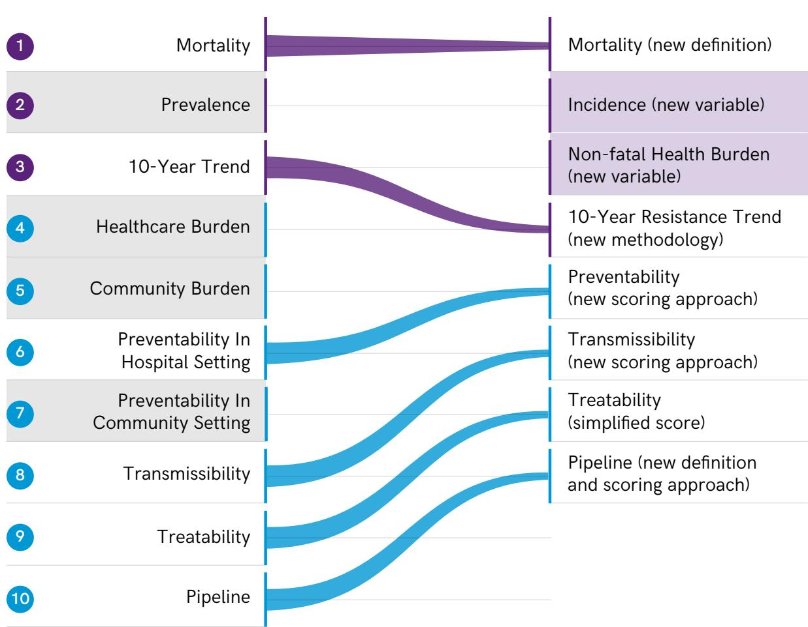

  
Quantitative criteria: numeric intervals

  
Removed criteria The PAPRIKA method (Potentially All Pairwise RanKings of all possible Alternatives) was utilized to systematically assign weights to the criteria

Qualitative criteria: expressed on a two or three-level ordinal scale

Fig. A1.2. Sample from the global PAPRIKA survey questions  
Which one of the following antibiotic-resistant bacteria should be prioritized for the R&D of new antibiotics?  
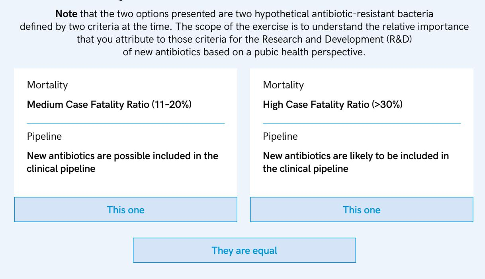

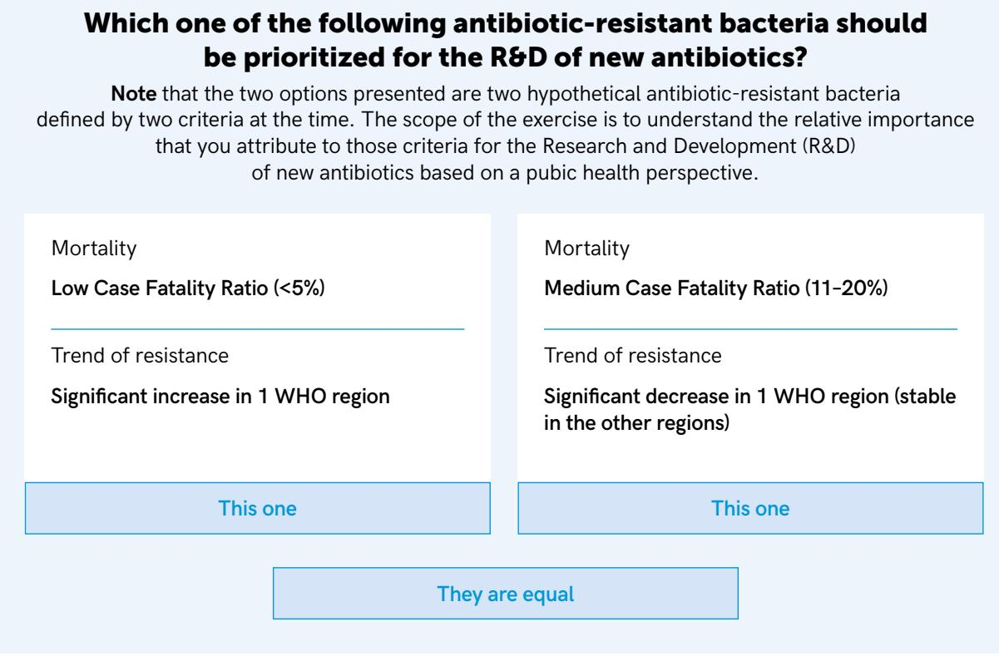  
PAPRIKA: Potentially All Pairwise RanKings of all possible Alternatives

Fig. A1.3. Pathogen–antibiotic combinations: streamlining according to family and order of bacteria after ranking  
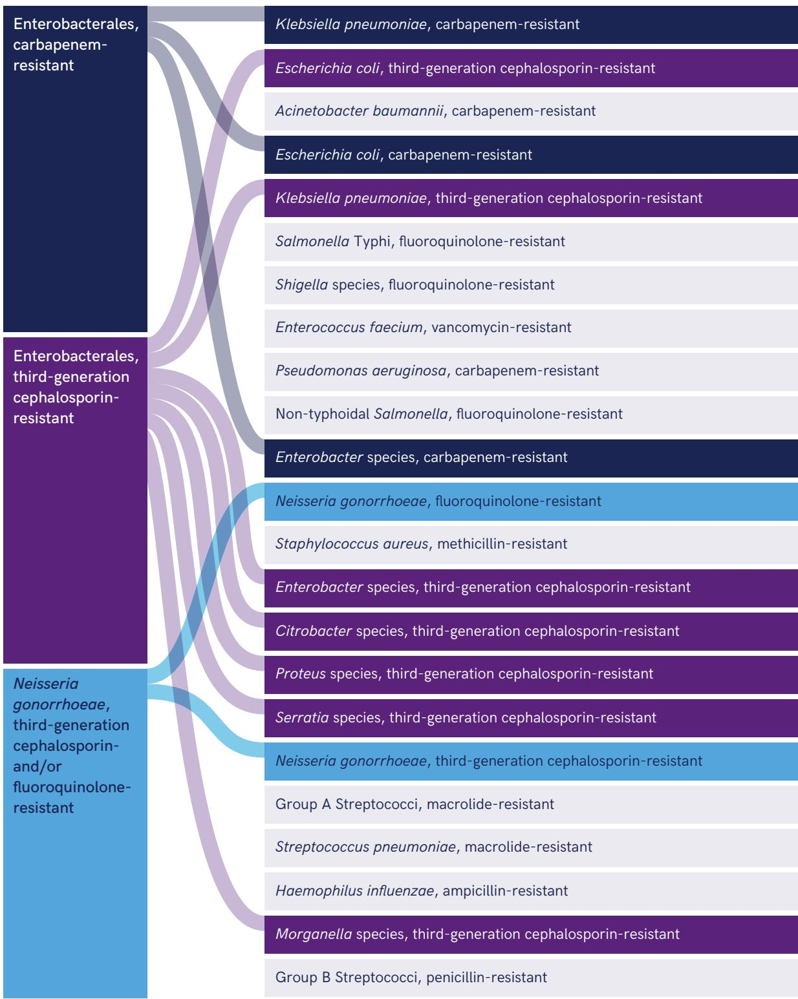  
FQR, fluoroquinolone-resistant; 3GCR, third-generation cephalosporin-resistant Enterobacterales; CR, carbapenem-resistant; Pen-R, penicillin-resistant; VR, vancomycin-resistant; Macro-R, macrolide resistant ; Ampi-R, ampicillin-resistant

Annex 2. Criteria used in assessing antibiotic-resistant bacterial   
pathogens in the WHO Bacterial Priority Pathogens List, 2024

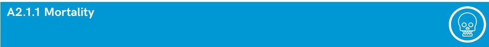

Definition: Case fatality ratio (CFR), expressed as the pooled prevalence of all-cause mortality (expressed in percentages) in patients with infections due to the targeted resistant pathogen

Data sources: Systematic review of the literature, pooled data from the 2017 BPPL analysis and the GBD-AMR study in 2019 (data provided by the Global Research on Antimicrobial Resistance (GRAM) Project (1). For RR-TB: one systematic review of 49 studies

Methods: A review was conducted of systematic reviews and meta-analyses published between January 2017 and December 2022 with data on 30-day and in-hospital mortality rates. The search was conducted in the MEDLINE database and was restricted to studies in English. If no data were retrieved for the selected timeframe, data from the 2017 WHO-BPPL study were used to categorize pathogens. To refine the categorization, incidence rates of severe and of non-severe infections from the 2019 GBD study were assessed to capture the potential severity of disease attributable to the AMR pathogen.

For RR-TB: Alemu A et al. (2) estimated the proportion, incidence and predictors of mortality in patients with DR-TB. The proportion was calculated by dividing the number of deaths by the total sample size. The incidence rate is expressed per 10 000 person days.

Results. The 92 systematic reviews retrieved in the search contained a mean of 20 studies each and a median of 1120 cases per resistant phenotype. No updated systematic reviews were found of studies on Salmonella Typhi, non-typhoidal Salmonella, Shigella, Group A Streptococci, Streptococcus pneumoniae or Neisseria gonorrhoeae. For those pathogens, the CFR was taken from the BPPL-2017 and from the 2019-GBD AMR study (3).

Data synthesis into levels. Five levels were defined for rating resistant pathogens:

• Low (< 5%);

• Low–medium (5–10%);

• Medium (11–20%),

• medium–high (21–30%); and

• High (> 30%).

Table A2.1 lists resistant pathogens by level.

Table A2.1. Resistant pathogens by level of resistance
<table><tr><td rowspan=1 colspan=1>Low(&lt; 5%)</td><td rowspan=1 colspan=1>Low-medium(5-10%)</td><td rowspan=1 colspan=1>Medium(11-20%)</td><td rowspan=1 colspan=1>Medium-high(21-30%)</td><td rowspan=1 colspan=1>High(&gt; 30%)</td></tr><tr><td rowspan=1 colspan=1>FQR nontyphoidal</td><td rowspan=1 colspan=1>FQR Shigella spp.</td><td rowspan=1 colspan=1>3GCR E. coli</td><td rowspan=2 colspan=2>CR E. coli              CR K. pneumoniae</td></tr><tr><td rowspan=1 colspan=1>Salmonella</td><td rowspan=1 colspan=1></td><td rowspan=1 colspan=1></td></tr><tr><td rowspan=1 colspan=1>FQR N. gonorrhoeae</td><td rowspan=1 colspan=1>3GCR Morganella spp.</td><td rowspan=1 colspan=1>FQR Salmonella Typhi</td><td rowspan=1 colspan=2>3GCR K. pneumoniae  CR A. baumannii</td></tr><tr><td rowspan=1 colspan=1>3GCR N. gonorrhoeae</td><td rowspan=2 colspan=1>Pen-R Group BStreptococci</td><td rowspan=1 colspan=1>3GCR Enterobacter</td><td rowspan=2 colspan=2>VR E. faecium          CR P. aeruginosa</td></tr><tr><td rowspan=1 colspan=1></td><td rowspan=1 colspan=1>spp.</td></tr><tr><td rowspan=1 colspan=1>Macro-R Group A</td><td rowspan=1 colspan=1></td><td rowspan=1 colspan=1>3GCR Citrobacter spp.</td><td rowspan=2 colspan=2>MR S. aureus</td></tr><tr><td rowspan=1 colspan=1>Streptococci</td><td rowspan=1 colspan=1></td><td></td></tr><tr><td rowspan=1 colspan=1></td><td rowspan=1 colspan=1></td><td rowspan=1 colspan=3>3GCR Proteus spp.</td></tr><tr><td rowspan=1 colspan=2></td><td rowspan=1 colspan=3>3GCR Serratia spp.</td></tr><tr><td rowspan=1 colspan=5>Macro-RS. pneumoniae</td></tr></table>

FQR, fluoroquinolone-resistant; 3GCR, third-generation cephalosporin-resistant; CR, carbapenem-resistant; Pen-R, penicillinresistant; VR, vancomycin-resistant; Macro-R, macrolide resistant; Ampi-R H.influenzae, ampicillin-resistant

Definition: Global incidence of cases per 1 million population (all ages, all sexes) associated with resistance

Sources: 2019 GBD-AMR study (data provided by the GRAM project) (2)

For RR-TB, data from the WHO Global TB Report 2022 (3)

Methods and summary of data: Estimates of the numbers of cases were modelled for the pathogens and infectious syndromes of interest from 19.7 million isolates.

Data synthesis into levels: Five levels were defined for rating resistant pathogens:

• Low (< 100 cases per 1 million population)

• Low–medium (100–1000 cases per 1 million population)

• Medium (1001–5000 cases per 1 million population),

• Medium–high (5001–10 000 cases per 1 million population)

• High (> 10 000 cases per 1million population)

Table A2.2 lists the resistant pathogens by level.

Table A2.2. Resistant pathogens by number of cases per million population
<table><tr><td rowspan=1 colspan=1>Low(&lt; 100 cases)</td><td rowspan=1 colspan=1>Low-medium(100-1000 cases)</td><td rowspan=1 colspan=1>Medium(1001-5000 cases)</td><td rowspan=1 colspan=1>Medium-high(5001-10 000)</td><td rowspan=1 colspan=1>High(&gt; 10.000 cases)</td></tr><tr><td rowspan=1 colspan=1>3GCR Morganella spp.</td><td rowspan=1 colspan=1>FQR Salmonella Typhi</td><td rowspan=1 colspan=1>CR K. pneumoniae</td><td rowspan=1 colspan=2>CR E. coli             3GCR E. coli</td></tr><tr><td rowspan=2 colspan=1>Pen-R Group BStreptococci</td><td rowspan=1 colspan=1>VR E. faecium</td><td rowspan=2 colspan=1>CR A. baumannii</td><td rowspan=2 colspan=2>3GCR K. pneumoniae  FQR nontyphoidalSalmonella</td></tr><tr><td rowspan=1 colspan=1></td></tr><tr><td rowspan=1 colspan=1>RR-TB</td><td rowspan=1 colspan=1>CR Enterobacter spp.</td><td rowspan=1 colspan=1>CR P. aeruginosa</td><td rowspan=1 colspan=1>FQR Shigella spp.</td><td rowspan=1 colspan=1>FQR N. gonorrhoeae</td></tr><tr><td rowspan=2 colspan=1></td><td rowspan=1 colspan=1>3GCR Citrobacter spp.</td><td rowspan=2 colspan=2>3GCR Enterobacterspp.                  S. pneumoniae</td><td rowspan=1 colspan=1></td></tr><tr><td rowspan=1 colspan=1></td><td></td></tr><tr><td rowspan=1 colspan=5>3GCR Proteus spp.                                                      Macro-R Group AStreptococci</td></tr><tr><td rowspan=1 colspan=5>3GCR Serratia spp.</td></tr><tr><td rowspan=1 colspan=5>3GCR N. gonorrhoeae</td></tr></table>

FQR, fluoroquinolone-resistant; 3GCR, third-generation cephalosporin-resistant Enterobacterales; CR, carbapenem-resistant; Pen-R, penicillin-resistant; VR, vancomycin-resistant; Macro-R, macrolide resistant; Ampi-R, ampicillin-resistant; RR-TB rifampicinresistant tuberculosis

Definition: Years lived with disability (YLD) per million inhabitants of all ages and all sexes due to infection by each resistant pathogen.

Source: 2019 GBD-AMR study (2)

For RR-TB: Menzies et al. (2023) (4,5)

Methods and summary of data: Prevalence of non-fatal resistance to each drug, resistance profile and relative length of hospital stay for each pathogen–drug combination were used to calculate the fraction of YLD attributable to resistance of each pathogen. For N. gonorrhoeae, the estimate was based on the excess duration of illness for a given antibiotic class.

Data synthesis into levels: Five levels were defined for rating resistant pathogens:

• Low (< 0.1 YLD per 1 million population)

• Low–medium (0.11–0.5 YLD per 1 million population)

• Medium (0.51–1 YLD per 1 million population)

• Medium–high (1.1–1.5 YLD per 1 million population)

• High (> 1.5 YLD per 1 million population)

Table A2.3 lists the resistant pathogens rated into levels.

Table A2.3. Resistant pathogens by YLD per 1 million population
<table><tr><td rowspan=1 colspan=1>Low(&lt; 0.1 YLD)</td><td rowspan=1 colspan=1>Low-medium(0.11-0.5 YLD)</td><td rowspan=1 colspan=1>Medium(0.51-1 YLD)</td><td rowspan=1 colspan=1>Medium-high(1.1-1.5 YLD)</td><td rowspan=1 colspan=1>High(&gt; 1.5 YLD)</td></tr><tr><td rowspan=1 colspan=1>Citrobacter spp.</td><td rowspan=1 colspan=2>VR E. faecium          CR K. pneumoniae</td><td rowspan=1 colspan=1>CR E. coli</td><td rowspan=1 colspan=1>3GCR E. coli</td></tr><tr><td rowspan=2 colspan=1>3GCR Serratia spp.</td><td rowspan=1 colspan=2>CR Enterobacter spp.   CR A. baumannii</td><td rowspan=1 colspan=1>FQR Shigella spp.</td><td rowspan=2 colspan=1>MR S. aureus</td></tr><tr><td rowspan=1 colspan=2></td><td rowspan=1 colspan=1></td></tr><tr><td rowspan=2 colspan=1>3GCR N. gonorrhoeae</td><td rowspan=2 colspan=2>3GCR Enterobacter    3GCR K. pneumoniaespp.</td><td rowspan=1 colspan=1>FQR nontyphoidal</td><td rowspan=1 colspan=1>Macro-R S.</td></tr><tr><td rowspan=1 colspan=1></td><td rowspan=1 colspan=1>Salmonella</td><td rowspan=1 colspan=1>pneumoniae</td></tr><tr><td rowspan=1 colspan=4>3GCR Morganella spp. 3GCR Proteus spp.     FQR Salmonella Typhi</td><td rowspan=1 colspan=1>RR-TB</td></tr><tr><td rowspan=1 colspan=5>Pen-R Group B         Ampi-R H. influenzae   CR P. aeruginosaStreptococci</td></tr><tr><td rowspan=1 colspan=5>FQR N. gonorrhoeae</td></tr><tr><td rowspan=1 colspan=5>Macro-R Group AStreptococci</td></tr></table>

FQR, fluoroquinolone-resistant; 3GCR, third-generation cephalosporin-resistant Enterobacterales; CR, carbapenem-resistant; Pen-R, penicillin-resistant; VR, vancomycin-resistant; Macro-R macrolide resistant; Ampi-R, ampicillin-resistant; RR-TB rifampicin resistant tuberculosis

Definition: 10-year trend of resistance rate, defined as the percentage of resistant isolates among the selected pathogens out of the total number of isolates tested.

For RR-TB: World Health Organization (WHO) TB drug resistance surveillances data.

Sources and data: Publicly available data on resistance from surveillance systems, repositories and websites from international stakeholders (updated search of the 2017 BPPL). A total of 23 surveillance systems were identified in the search. A total of 19 333 703 isolates were obtained from 137 countries: 25 (19%) countries in the WHO African Region; 22 (16%) in the Region of the Americas; 10 (7%) countries in the South-East Asia Region; 43 (31%) countries in the European Region; 19 (14%) countries in the Eastern Mediterranean Region; and 18 (13%) countries in the Western Pacific Region.

Data for RR-TB were provided by the WHO Global TB Program (MDR- and RR-TB, 2010–2022)

Methods, data summary: A comprehensive web-based review was conducted of publicly available annual reports from national and international surveillance systems on the prevalence of resistance (number of resistant isolates/tested isolates) between January 2017 and November 2022, with no language restrictions. Only clinically significant samples were considered (blood, cerebrospinal fluid, stools, swabs) according to the targeted pathogen, and resistance data were extracted in accordance with the validated breakpoint guidelines adopted by each surveillance system (European Committee on Antimicrobial Susceptibility Testing, Clinical and Laboratory Standards Institute). The trend was calculated for 10 years by setting time (years) as a covariate and the percentage of resistant isolates as the outcome. Computation was performed, when possible, with Bayesian multilevel models and, if this choice was not available, by meta-analytical pooling of prevalence data followed by weighted logistic regression. Only countries that provided at least three-time point prevalence in the past 10 years were included in the trend analysis. Pooled prevalence was expressed as a percentage of resistance, with a 95% confidence interval for each WHO region that provided data. The prevalence trend was assessed by linear regression, and the annual change was quantified from the beta coeficient of the regression line. Both positive and negative coeficients with a P value < 0.05 were considered to be statistically significant. A stable trend corresponded to P values > 0.10.

Data synthesis into levels: Five levels were defined to rate resistant pathogens:

• Level 1: significantly decreasing trend in at least one WHO region, with no increase in any of the other regions

• Level 2: stable trend in all WHO regions

• Level 3: increasing trend in one WHO region

• Level 4: increasing trend in two WHO regions

• Level 5: increasing trend in three or more WHO regions (or in most regions with data)

Table A2.4 lists the resistant pathogens according to trend in resistance.

Table A2.4. Resistant pathogens by trend in resistance
<table><tr><td rowspan=1 colspan=1>Level 1: significantlydecreasing trend inat least one WHOregion</td><td rowspan=1 colspan=1>Level 2: stable trendin all WHO regions</td><td rowspan=1 colspan=1>Level 3: increasingtrend in one WHOregion</td><td rowspan=1 colspan=1>Level 4: increasingtrend in two WHOregions</td><td rowspan=1 colspan=1>Level 5: increasingtrend in three ormore WHO regions</td></tr><tr><td rowspan=2 colspan=1>CR P. aeruginosa</td><td rowspan=1 colspan=2>3GCR Enterobacter    CR A. baumannii</td><td rowspan=2 colspan=2>CR Enterobacter spp.   CR K. pneumoniae</td></tr><tr><td rowspan=1 colspan=1>spp.</td><td rowspan=1 colspan=1></td></tr><tr><td rowspan=1 colspan=1>MR S. aureus</td><td rowspan=1 colspan=1>3GCR Citrobacter spp.</td><td rowspan=1 colspan=1>CR E. coli</td><td rowspan=1 colspan=2>FQR N. gonorrhoeae   3GCR E. coli</td></tr><tr><td rowspan=1 colspan=1>3GCR N. gonorrhoeae</td><td rowspan=1 colspan=2>3GCR Proteus spp.     3GCR K. pneumoniae</td><td rowspan=1 colspan=2>Macro-R Group A      FQR Salmonella TyphiStreptococci</td></tr><tr><td rowspan=1 colspan=5>Pen-R Group BStreptococci</td></tr><tr><td rowspan=1 colspan=1></td><td rowspan=1 colspan=1>3GCR Serratia spp.</td><td rowspan=1 colspan=1>VR E. faecium</td><td rowspan=1 colspan=1></td><td rowspan=1 colspan=1>FQR Shigella spp.</td></tr><tr><td rowspan=1 colspan=1></td><td rowspan=2 colspan=4>FQR nontyphoidalpneumoniae                                                            Salmonella</td></tr><tr><td rowspan=1 colspan=1></td></tr><tr><td rowspan=1 colspan=5>Ampi-R H. influenzae3GCR Morganella spp.</td></tr></table>

FQR, fluoroquinolone-resistant; 3GCR, third-generation cephalosporin-resistant Enterobacterales; CR, carbapenem-resistant; Pen-R, penicillin-resistant; VR, vancomycin-resistant; Macro-R, macrolide resistant; Ampi-R, ampicillin-resistant; RR-TB rifampicinresistant tuberculosis

## A2.2. Qualitative criteria

## A2.2.1 Transmissibility

Definition: Composite criterion for transmission of a targeted resistant pathogen among compartments in two domains: (i) human-to-human transmission expressed as outbreak capability in health-care or community settings; and (ii) transmission between humans and animals, food or environment compartments. Both likely transmission (detection of the same pathogen in humans and the compartments) and proven transmission (transmission confirmed by detection of the same resistance pattern or mechanism among humans and the compartments identified by molecular or genetic analysis) were considered.

Sources: Studies and reports of outbreaks in community or hospital setting and transmission between humans and compartments.

Methods and data summary: For the first criterion domain, a systematic review was conducted of studies that reported data on outbreaks by searching MEDLINE and OvidSP and consulting freely accessible repositories of outbreak data (Epidemiology Network, ECRAID-Base EpiNET https://epi-net. eu/, Charitè Outbreak Database https://www.outbreak-database.com/Contact.aspx and WHO Disease Outbreak News https://www.who.int/emergencies/disease-outbreak-news).

For the second criterion domain, a narrative review was conducted of published studies on transmission of the target resistant pathogen between human and one (or more) of the animal, food, environment compartments in the MEDLINE and OvidSP databases and the Google engine. The search was restricted to studies published in English between January 2017 and March 2022.

Results: For the first criterion, 533 of 5744 reports of outbreaks, accounting for 29 407 cases, were included. For the second criterion domain, 104 of 1246 studies were included.

For RR-TB, for the first criterion domain, 20 reports of outbreaks were identified, accounting for 1014 cases (patients and/or isolates), were included. For the second criterion domain, 8 articles on transmission of drug resistant M. bovis were included.

Data synthesis into levels: Evidence retrieved for the two criteria was summarized qualitatively for each targeted resistant pathogen on two three-degree scales:

The outbreak capability score (OC) was used to summarize the number of outbreak reports retrieved from the literature, the number of WHO regions involved and the setting (hospital or community).

The transmission pathways score (TP) was used to summarize the number of compartments involved in transmission (animal, food, environment) and the transmission modality (proven or likely transmission).

Table A2.5 summarizes the data.

Table A2.5. Summary of data for the outbreak capability and transmission pathways scores
<table><tr><td>Domain 1: Outbreak capability score (OC)</td><td>Domain 2: Transmission pathways score (TP)</td></tr><tr><td>Poorly documented</td><td>Low</td></tr><tr><td>Outbreaks reported in ≤ 5 reports and ≤ 3 WHO</td><td>No transmission reported between human and other</td></tr><tr><td>regions, in community and/or hospital setting.</td><td>compartments</td></tr><tr><td>Moderately documented – Outbreaks reported in 6-24 reports and in = 3 WHO</td><td>Moderate</td></tr><tr><td>regions, in community and/or hospital setting.</td><td>Proven transmission by molecular or genetic analysis of same resistance profile between human and another compartment.</td></tr><tr><td>– Outbreaks reported in &lt; 25 reports and in = 4 WHO</td><td>Likely transmission (detection of same pathogen) between</td></tr><tr><td>regions in only one setting (community or hospital) – Outbreaks reported in = 25 reports and in = 3 WHO</td><td>human and one or two compartments.</td></tr><tr><td></td><td>High</td></tr><tr><td>regions, in hospitals and/or communities.</td><td>Proven transmission - molecular or genetic analysis of</td></tr><tr><td>Well documented</td><td>same resistance profile - between human and at least two</td></tr><tr><td>- Outbreaks reported in &lt; 25 reports and in ≥ 4 WHO</td><td>compartments.</td></tr><tr><td>regions in both communities and hospitals.</td><td>Likely transmission (detection of same pathogen) between</td></tr><tr><td>– Outbreaks reported in ≥ 25 reports and in ≥ 4 WHO</td><td>human and all other compartments.</td></tr></table>

The two scores were used to define five transmission levels of resistant pathogens (Table A2.6):

• low,

• low–medium,

• medium,

• medium–high,

• high

Table A2.6. Transmission levels of resistant pathogens
<table><tr><td>Definition of level</td><td>Level of transmissibility</td></tr><tr><td>Poorly documented OC and low TP</td><td>Low</td></tr><tr><td>Poorly documented OC and moderate TP or</td><td>Low-medium</td></tr><tr><td>Moderately documented OC and low TP</td><td></td></tr><tr><td>Poorly documented OC and high TP or</td><td>Medium</td></tr><tr><td>Well documented OC and low TP or</td><td></td></tr><tr><td>Moderately documented OC and moderate TP</td><td></td></tr><tr><td>Well documented OC and moderate TP or</td><td>Medium-high</td></tr><tr><td>Moderately documented OC and high TP</td><td></td></tr><tr><td>Well documented OC and high TP</td><td>High</td></tr></table>

Table A2.7 lists the resistant pathogens according to level of transmissibility.

Table A2.7. Resistant pathogens according to level of transmissibility
<table><tr><td rowspan=1 colspan=1>Low</td><td rowspan=1 colspan=1>Low-medium</td><td rowspan=1 colspan=1>Medium</td><td rowspan=1 colspan=1>Medium-high</td><td rowspan=1 colspan=1>High</td></tr><tr><td rowspan=1 colspan=1>Pen-R Group B</td><td rowspan=1 colspan=1>CR Enterobacter spp.</td><td rowspan=2 colspan=1>CR P. aeruginosa</td><td rowspan=2 colspan=1>CR K. pneumoniae</td><td rowspan=2 colspan=1>3GCR E. coli</td></tr><tr><td rowspan=1 colspan=1>Streptococci</td><td rowspan=1 colspan=1></td></tr><tr><td rowspan=1 colspan=1></td><td rowspan=1 colspan=1>3GCR Proteus spp.</td><td rowspan=1 colspan=1>FQR N. gonorrhoeae</td><td rowspan=1 colspan=1>CR A. baumannii</td><td rowspan=1 colspan=1>3GCR K. pneumoniae</td></tr><tr><td rowspan=1 colspan=1></td><td rowspan=1 colspan=1>Macro-R Group A</td><td rowspan=2 colspan=1>3GCR Enterobacterspp.</td><td rowspan=2 colspan=2>CR E.coli             FQR Shigella spp.</td></tr><tr><td rowspan=1 colspan=1></td><td rowspan=1 colspan=1>Streptococci</td></tr><tr><td rowspan=1 colspan=1></td><td rowspan=1 colspan=1>Macro-R S.</td><td rowspan=2 colspan=3>3GCR Citrobacter spp.  FQR Salmonella Typhi  VR E. faecium</td></tr><tr><td rowspan=1 colspan=1></td><td rowspan=1 colspan=1>pneumoniae</td></tr><tr><td rowspan=1 colspan=1></td><td rowspan=1 colspan=1>Ampi-R H. influenzae</td><td rowspan=1 colspan=3>3GCR Serratia spp.                             FQR nontyphoidalSalmonella</td></tr><tr><td rowspan=1 colspan=1></td><td rowspan=1 colspan=1>3GCR Morganella spp.</td><td rowspan=1 colspan=2>3GCR N. gonorrhoeae</td><td rowspan=1 colspan=1>MR S. aureus</td></tr><tr><td rowspan=1 colspan=5>RR-TB</td></tr></table>

FQR, fluoroquinolone-resistant; 3GCR, third-generation cephalosporin-resistant Enterobacterales; CR, carbapenem-resistant; Pen-R, penicillin-resistant; VR, vancomycin-resistant; Macro-R, macrolide resistant, ; Ampi-R, ampicillin-resistant; RR-TB rifampicin-resistant tuberculosis

Definition: The existence and eficacy of preventive measures for containing the transmission of targeted resistant pathogens and for reducing the burden of the infection or colonization. This criterion has two components: (i) strategies to reduce person-to-person transmission, which include standard IPC measures (hand hygiene, personal protective equipment, cleaning, disinfection) and enhanced IPC measures (transmission-based precaution, cohort formation, isolation, screening, environmental sampling, barrier precautions); and (ii) strategies to reduce the burden of the disease (decolonization and/or chemoprophylaxis; public health interventions in communities).

Note: Mode (route) of transmission was not considered in the definition.

Sources: Studies in which any preventive measure was applied in health care or communities to prevent colonization (if applicable) and infection due to the selected pathogen.

Methods and data summary: National and international guidelines on IPC measures in health-care and community settings were reviewed, and a narrative review was conducted of relevant published studies (not mentioned in the guidelines) of any preventive measure applied in health-care or community settings to prevent colonization (if applicable) and infection caused by the selected resistant pathogen(s). Searches were conducted in PubMed and the Cochrane Library and in the websites of stakeholders, such as WHO, the European Society of Clinical Microbiology and Infectious Diseases, the European Centre for Disease Prevention and Control, the US Centers for Disease Control and Prevention, Shea Foundation, the International Union Against Sexually Transmitted Diseases and the Infectious Diseases Society of America. Records published between January 2017 and March 2022 in English were included in the search.

Results: 55 guidelines and 49 individual studies were included.

For RR-TB, this criterion was determined qualitatively, relying on available and/or expert guidance from the WHO RR-TB team.

Scoring and data synthesis into levels (Table A2.8): The evidence was summarized according to the availability of the following three domains of preventability:

i. standard versus enhanced IPC measures,

ii. decolonization and/or chemoprophylaxis (pre-exposure and post-exposure prophylaxis), and

iii. public health interventions in the community (vaccinations, education programmes, water sanitation, food safety).

## Numerical scale:

0 points for no recommendation or inexistent or ineffective measures.

1 point for recommended, partially effective measures; and

2 points for suficient or effective measures.

Table A2.8. Definitions of levels of preventability
<table><tr><td>Standard IPC: Effective and sufficient 2 points</td><td>Decolonization or chemoprophylaxis Existing and effective 2 points</td><td>Public health interventions in communities Existing and effective or unnecessary 2 points</td></tr><tr><td>Enhanced IPC: Recommended and effective 1 point</td><td>Decolonization or chemoprophylaxis Existing and partly effective or restricted to high-risk population 1 point</td><td>Public health interventions in communities Existing and partly effective 1 point</td></tr><tr><td>Enhanced IPC Not universally recommended because of limited efficacy or feasibility 0 point</td><td>Decolonization or chemoprophylaxis Not existing or ineffective 0 point</td><td>Public health interventions in communities Inexistent or ineffective O point</td></tr></table>

The outputs were used to define five preventability levels:

• High (> 5 points),

• High–medium (5 points),

• Medium (4 points),

• Medium–low (3 points), and

• Low (< 3 points).

Table A2.9 lists the resistant pathogens rated according to level.

Table A2.9. Resistant pathogens rated according to preventability level
<table><tr><td rowspan=1 colspan=1>High</td><td rowspan=1 colspan=1>High-medium</td><td rowspan=1 colspan=1>Medium</td><td rowspan=1 colspan=1>Medium-low</td><td rowspan=1 colspan=1>Low</td></tr><tr><td rowspan=1 colspan=1>Ampi-R H. influenzae</td><td rowspan=1 colspan=1>Macro-R S.</td><td rowspan=1 colspan=1>FQR Salmonella Typhi</td><td rowspan=2 colspan=1>CR K. pneumoniae</td><td rowspan=2 colspan=1>3GCR E. coli</td></tr><tr><td rowspan=1 colspan=1></td><td rowspan=1 colspan=1>pneumoniae</td><td rowspan=1 colspan=1></td></tr><tr><td rowspan=1 colspan=1></td><td rowspan=1 colspan=1>Pen-R Group BStreptococci</td><td rowspan=1 colspan=1>MR S. aureus</td><td rowspan=1 colspan=2>CR A. baumannii       3GCR K. pneumoniae</td></tr><tr><td rowspan=1 colspan=2></td><td rowspan=1 colspan=1>Macro-R Group AStreptococci</td><td rowspan=1 colspan=1>CR E. coli</td><td rowspan=1 colspan=1>VR E. faecium</td></tr><tr><td rowspan=1 colspan=3></td><td rowspan=1 colspan=1>FQR Shigella spp.</td><td rowspan=1 colspan=1>FQR nontyphoidalSalmonella</td></tr><tr><td rowspan=1 colspan=3></td><td rowspan=1 colspan=2>CR P. aeruginosa       3GCR Enterobacterspp.</td></tr><tr><td rowspan=1 colspan=3></td><td rowspan=1 colspan=2>CR Enterobacter spp.   3GCR Citrobacter spp.</td></tr><tr><td rowspan=1 colspan=5>FQR N. gonorrhoeae    3GCR Proteus spp.</td></tr><tr><td rowspan=1 colspan=5>3GCR N. gonorrhoeae  3GCR Serratia spp.</td></tr><tr><td rowspan=1 colspan=5>3GCR Morganella spp.RR-TB</td></tr></table>

FQR, fluoroquinolone-resistant; 3GCR, third-generation cephalosporin-resistant Enterobacterales; CR, carbapenem-resistant; Pen-R, penicillin-resistant; VR, vancomycin-resistant; Macro-R, macrolide resistant; Ampi-R, ampicillin-resistant; RR-TB rifampicinresistant tuberculosis

Definition: Number and quality of antibiotic options available for treatment of infection by the targeted resistant pathogen. The evaluation comprises: the number of molecule(s) available in guidelines, their eficacy (first or lower lines of treatment or last resort), safety profile, availability of oral or outpatient formulation, availability of paediatric formulation, concomitant resistance with other molecules and costs.

## Sources:

• a review of national and international guidelines or guidance on available treatment options for the selected resistant pathogen;

• a narrative review of published literature, focusing on systematic reviews and randomized control trials of the eficacy of antibiotic option(s) that are not included in guidelines for the selected resistant pathogen; and

• a narrative review of surveillance systems and programmes and published literature on the prevalence of concomitant resistance rates to selected antibiotic molecules for the targeted resistant pathogen.

Methods and data summary: MEDLINE and OvidSP databases, clinicaltrial.gov, Cochrane Library, Centre for Reviews and Dissemination and websites of international stakeholders (the European Society of Clinical Microbiology and Infectious Diseases, the European Centre for Disease Prevention and Control, the International Union Against Sexually Transmitted Diseases and the Infectious Diseases Society of America) were explored. The search covered records published between January 2017 and March 2022 in English.

A total of 36 guidelines or guidance and 31 articles on the eficacy of antibiotic option(s) not included in the guidelines were retrieved, and 108 records were retrieved for evaluation of the co-resistance rates of specific antibiotic molecules.

For RR-TB: 2022 WHO guidelines on TB treatment were used (6).

Scoring and data synthesis into levels: Data were synthesized by numerical scoring for the following domains (Table A2.10):

• number of first-line option(s) recommended (if 1 option: 2 points, if ≥ 2 options: + 2 points for each option);

• concomitant resistance rates reported (> 20%: 1 point for each option, ≤ 20%: 0 points);

• availability of alternative option(s) for the most typical infectious syndrome (if not available: 0 point; if available: 1 point);

• availability of oral and outpatient parenteral antimicrobial therapy options (if not available: 0 points, if available: 1 point);

• possibility of treatment for paediatric patients (if not available: 0 points, if available: 1 point); and

• accessibility5 (if high cost: – 1, if low cost: 0 points). High-cost antibiotics were defined as antimicrobial agents characterized by scarcity, shortages, and newly introduced formulations entering the market since 2017. Low-cost antibiotics refer to generic antimicrobial medications that do not fulfil the aforementioned criteria).

Table A2.10. Rating of resistant pathogens according to treatability
<table><tr><td>No. of first-line option(s) recommended by guidelines</td><td>1 ≥2</td><td></td><td></td></tr><tr><td>Points</td><td>2</td><td colspan="2">+ 2 for each option</td></tr><tr><td>Concomitant resistance reported</td><td>&gt; 20%</td><td colspan="2">≤ 20%</td></tr><tr><td>Points</td><td>-1 for each option</td><td colspan="2">0</td></tr><tr><td>Availability of alternative option(s) for the most typical infectious syndrome</td><td>No option available or option(s) available but with poor toxicity profile and/or recommended only in combination</td><td>Option(s) available with acceptable toxicity profile and recommended in monotherapy but co- resistance &gt; 20%</td><td>At least one alternative available with acceptable toxicity profile and recommended also in monotherapy and co- resistance ≤ 20%</td></tr><tr><td>Points</td><td>-1</td><td>0</td><td>1</td></tr><tr><td>Availability of oral option(s)</td><td>Not available</td><td>Available</td><td></td></tr><tr><td>Points</td><td>0</td><td>1</td><td></td></tr><tr><td>Availability of OPAT option(s)</td><td>Not available</td><td>Available</td><td></td></tr><tr><td>Points</td><td>0</td><td>1</td><td></td></tr><tr><td>Available option(s) approved or tested for paediatric population</td><td>Not available</td><td>Available</td><td></td></tr><tr><td>Points</td><td>0</td><td>1</td><td></td></tr><tr><td>Accessibility (cost)</td><td>High cost</td><td>Low cost</td><td></td></tr><tr><td>Points</td><td>-1</td><td>0</td><td></td></tr></table>

Five levels of treatability were defined for rating resistant pathogens (Table A2.11):

• High (≥ 12 points),

• High–medium (10–11 points),

• Medium (8–9 points),

• Medium–low (6–7 points)

• Low (≤ 5 points).

Table A2.11. Pathogens rated according to level of treatability
<table><tr><td rowspan=1 colspan=1>High</td><td rowspan=1 colspan=1>High-medium</td><td rowspan=1 colspan=1>Medium</td><td rowspan=1 colspan=1>Medium-low</td><td rowspan=1 colspan=1>Low</td></tr><tr><td rowspan=1 colspan=1>MR S. aureus</td><td rowspan=1 colspan=1>FQR Shigella spp.</td><td rowspan=1 colspan=1>3GCR E. coli</td><td rowspan=1 colspan=1>CR K. pneumoniae</td><td rowspan=1 colspan=1>CR A. baumannii</td></tr><tr><td rowspan=1 colspan=1>Macro-R Group A</td><td rowspan=2 colspan=4>FQR nontyphoidal     3GCR K. pneumoniae   Carbapenem-R E. coli RR-TBSalmonella</td></tr><tr><td rowspan=1 colspan=1>Streptococci</td></tr><tr><td rowspan=1 colspan=1>Macro-R S.</td><td rowspan=1 colspan=1>Ampi-R H. influenzae</td><td rowspan=2 colspan=1>VR E. faecium</td><td rowspan=2 colspan=2>FQR Salmonella Typhi</td></tr><tr><td rowspan=1 colspan=1>pneumoniae</td><td rowspan=1 colspan=1></td></tr><tr><td rowspan=1 colspan=1></td><td rowspan=1 colspan=1>Pen-R Group B</td><td rowspan=2 colspan=1>FQR N. gonorrhoeae</td><td rowspan=2 colspan=2>CR P. aeruginosa</td></tr><tr><td rowspan=1 colspan=1></td><td rowspan=1 colspan=1>Streptococci</td></tr><tr><td rowspan=1 colspan=2></td><td rowspan=1 colspan=1>3GCR Enterobacterspp.</td><td rowspan=1 colspan=2>CR Enterobacter spp.</td></tr><tr><td rowspan=1 colspan=2></td><td rowspan=1 colspan=3>3GCR Citrobacter spp. 3GCR N. gonorrhoeae</td></tr><tr><td rowspan=1 colspan=5>3GCR Proteus spp.3GCR Serratia spp.3GCR Morganella spp.</td></tr></table>

FQR, fluoroquinolone-resistant; 3GCR, third-generation cephalosporin-resistant Enterobacterales; CR, carbapenem-resistant; Pen-R, penicillin-resistant; VR, vancomycin-resistant; Macro-R, macrolide resistant ; Ampi-R, ampicillin-resistant; RR-TB rifampicinresistant tuberculosis

## A2.2.4 Pipeline

Definition: The extent to which the antibacterial pipeline (between now and 5–7 years) will address clinical requirements for treatment of each targeted resistant pathogen.

Sources: Available information on antibiotics in the pipeline (in clinical development and pre-clinical projects): clinical trial registries; commercial sources (presentations, partner meetings, company websites, selected patents, press releases, other non-confidential material and information); scientific publications, abstracts, grant submissions, conference submissions; stakeholders and WHO expert and advisory group discussions (non-public data and information); complementary literature reviews; survey (broader outreach of stakeholders, e.g. Beam Alliance, International Federation of Pharmaceutical Manufacturers & Associations); and consultations for information on pipelines in China, Japan and the Russian Federation.

Scoring and data synthesis into levels. Data were synthesized by scoring the:

• number of newly approved antibiotics and candidates against a priority pathogen:

― phase 1 (1 point/candidate);

― phase 2 (2 points/candidate);

― phase 3 (3 points/candidate);

― one or more candidates with ongoing market authorization application and/or new drug application: 4 points/candidate.   
― newly approved (July 2017–2022): 5 points/candidate;

• number of candidates that meet WHO innovation criteria: new chemical class, new target, new mode of action, no evidence of cross-resistance: (score scale: 0.5–2 additional points/candidate, criterion or phase);

• number of candidates that do not meet any of the WHO innovation criteria (no evidence of cross-resistance, new chemical class, new mode of action) e.g. modified class: –0.5–2 (subtracted points/candidates/ per phase);

• availability of oral formulation: (0.5–3 additional points/candidate per phase).

Note: For RR-TB, some scoring criteria were adapted to address unique clinical needs, as follows: Points per candidate in this context were divided by a factor of two to account for the fact that RR-TB regimens are combinations of several effective drugs (at least four). Additionally, no points were added for oral formulations, as the recommended TB treatment options are already all oral, offering no added value over existing options.

Three levels were defined for rating resistant pathogens (Table A2.12):

• Likely (> 47 points),

• Possible (34–47 points) and

• Unlikely (< 34 points).

Table A2.12. Resistant pathogens rated according to likelihood of potential future treatment availability
<table><tr><td rowspan=1 colspan=1>Likely</td><td rowspan=1 colspan=1>Possible</td><td rowspan=1 colspan=1>Unlikely</td></tr><tr><td rowspan=1 colspan=1>3GCR Enterobacter spp.</td><td rowspan=1 colspan=1>3GCR E. coli</td><td rowspan=1 colspan=1>CR K. pneumoniae</td></tr><tr><td rowspan=1 colspan=1>3GCR Proteus spp.</td><td rowspan=1 colspan=1>CR E. coli</td><td rowspan=1 colspan=1>CR A. baumannii</td></tr><tr><td rowspan=1 colspan=1>3GCR Serratia spp.</td><td rowspan=1 colspan=1>3GCR K. pneumoniae</td><td rowspan=1 colspan=1>FQR Salmonella Typhi</td></tr><tr><td rowspan=1 colspan=1>Macro-R S. pneumoniae</td><td rowspan=1 colspan=1>FQR nontyphoidal Salmonella</td><td rowspan=1 colspan=1>FQR Shigella spp.</td></tr><tr><td rowspan=1 colspan=1>3GCR Morganella spp.</td><td rowspan=1 colspan=1>CR Enterobacter spp.</td><td rowspan=1 colspan=1>VR E. faecium</td></tr><tr><td rowspan=1 colspan=1></td><td rowspan=1 colspan=1>3GCR Citrobacter spp.</td><td rowspan=1 colspan=1>CR P. aeruginosa</td></tr><tr><td rowspan=1 colspan=1></td><td rowspan=1 colspan=1>Macro-R Group A Streptococci</td><td rowspan=1 colspan=1>FQR N. gonorrhoeae</td></tr><tr><td rowspan=1 colspan=1></td><td rowspan=1 colspan=1>Pen-R Group B Streptococci</td><td rowspan=1 colspan=1>MR S. aureus</td></tr><tr><td rowspan=1 colspan=2></td><td rowspan=1 colspan=1>3GCR N. gonorrhoeae</td></tr><tr><td rowspan=1 colspan=3>Ampi-R H. influenzae</td></tr><tr><td rowspan=1 colspan=3>RR-TB</td></tr></table>

FQR, fluoroquinolone-resistant; 3GCR, third-generation cephalosporin-resistant Enterobacterales; CR, carbapenem-resistant; Pen-R, penicillin-resistant; VR, vancomycin-resistant; Macro-R, macrolide; Ampi-R, ampicillin-resistant; RR-TB rifampicin-resistant tuberculosis

## References for Annexes 1–2

1. GRAM project: Antimicrobial Resistance Collaborators. Global burden of bacterial antimicrobial resistance in 2019: a systematic analysis. Lancet. 2022;399(10325):629–55. Doi.:10.1016/S0140-6736(21)02724-0.

2. Alemu A, Bitew ZW, Worku T, Gamtesa DF, Alebel A. Predictors of mortality in patients with drug-resistant tuberculosis: a systematic review and meta-analysis. PLoS One. 2021;16(6):e0253848. Doi:10.1371/journal. pone.0253848.

3. Global tuberculosis report 2022. Geneva: World Health Organization; 2022 (https://www.who.int/teams/ global-tuberculosis-programme/tb-reports/global-tuberculosis-report-2022).

4. Menzies NA, Allwood BW, Dean AS, Dodd PJ, Houben RMGJ, James LP et al. Global burden of disease due to rifampicin-resistant tuberculosis: a mathematical modeling analysis. Nat Commun. 2023;14: 6182. Doi:10.1038/ s41467-023-41937-9.

5. WHO Global Task Force on TB Impact Measurement: report of a subgroup meeting on methods used by WHO to estimate TB disease burden, 11–12 May 2022, Geneva, Switzerland. Geneva: World Health Organization; 2022 (https://www.who.int/publications/i/item/9789240057647).

6. WHO consolidated guidelines on tuberculosis. Module 4: treatment – drug-resistant tuberculosis treatment, 2022 update. Geneva: World Health Organization; 2022 (https://www.who.int/publications/i/item/9789240063129).

Annex 3. Multiple Criteria Decision Analysis (MCDA) scoring matrix: summary results of bacterial pathogens assessments against the selected criteria

ry results of bacterial pathogens assessments using Multiple Criteria Decisio
<table><tr><td rowspan=1 colspan=1>Pathogen/Criterion</td><td rowspan=1 colspan=1>Mortality</td><td rowspan=1 colspan=1>Incidence</td><td rowspan=1 colspan=1>Non-fatalburden</td><td rowspan=1 colspan=1>Trend ofresistance</td><td rowspan=1 colspan=1>Transmissibility</td><td rowspan=1 colspan=1>Preventability</td><td rowspan=1 colspan=1>Treatability</td><td rowspan=1 colspan=1>Pipeline</td></tr><tr><td rowspan=1 colspan=1>Acinetobacter baumannii, carbapenem-resistant</td><td rowspan=1 colspan=1>High</td><td rowspan=1 colspan=1>Medium</td><td rowspan=1 colspan=1>Medium</td><td rowspan=1 colspan=1>Level 3</td><td rowspan=1 colspan=1>Low-medium</td><td rowspan=1 colspan=1>Medium-low</td><td rowspan=1 colspan=1>Low</td><td rowspan=1 colspan=1>Unlikely</td></tr><tr><td rowspan=1 colspan=1>Pseudomonas aeruginosa, carbapenem-resistant</td><td rowspan=1 colspan=1>High</td><td rowspan=1 colspan=1>Medium</td><td rowspan=1 colspan=1>Medium</td><td rowspan=1 colspan=1>Level 1</td><td rowspan=1 colspan=1>Medium</td><td rowspan=1 colspan=1>Medium-low</td><td rowspan=1 colspan=1>Medium-low</td><td rowspan=1 colspan=1>Unlikely</td></tr><tr><td rowspan=1 colspan=1>Klebsiella pneumoniae, carbapenem-resistant</td><td rowspan=1 colspan=1>High</td><td rowspan=1 colspan=1>Medium</td><td rowspan=1 colspan=1>Medium</td><td rowspan=1 colspan=1>Level 5</td><td rowspan=1 colspan=1>Medium-high</td><td rowspan=1 colspan=1>Medium-low</td><td rowspan=1 colspan=1>Medium-low</td><td rowspan=1 colspan=1>Unlikely</td></tr><tr><td rowspan=1 colspan=1>Escherichia coli, carbapenem-resistant</td><td rowspan=1 colspan=1>Medium-high</td><td rowspan=1 colspan=1>Medium-high</td><td rowspan=1 colspan=1>Medium-high</td><td rowspan=1 colspan=1>Level 3</td><td rowspan=1 colspan=1>Medium-high</td><td rowspan=1 colspan=1>Medium-low</td><td rowspan=1 colspan=1>Medium-low</td><td rowspan=1 colspan=1>Possible</td></tr><tr><td rowspan=1 colspan=1>Enterobacter spp., carbapenem-resistant</td><td rowspan=1 colspan=1>High</td><td rowspan=1 colspan=1>Low-medium</td><td rowspan=1 colspan=1>Low-medium</td><td rowspan=1 colspan=1>Level 4</td><td rowspan=1 colspan=1>Low-medium</td><td rowspan=1 colspan=1>Medium-low</td><td rowspan=1 colspan=1>Medium-low</td><td rowspan=1 colspan=1>Possible</td></tr><tr><td rowspan=1 colspan=1>Escherichia coli, third-generation cephalosporin-resistant</td><td rowspan=1 colspan=1>Medium</td><td rowspan=1 colspan=1>High</td><td rowspan=1 colspan=1>High</td><td rowspan=1 colspan=1>Level 5</td><td rowspan=1 colspan=1>High</td><td rowspan=1 colspan=1>Low</td><td rowspan=1 colspan=1>Medium</td><td rowspan=1 colspan=1>Possible</td></tr><tr><td rowspan=1 colspan=1>Klebsiella pneumoniae, third-generationcephalosporin-resistant</td><td rowspan=1 colspan=1>Medium-high</td><td rowspan=1 colspan=1>Medium-high</td><td rowspan=1 colspan=1>Medium</td><td rowspan=1 colspan=1>Level 3</td><td rowspan=1 colspan=1>High</td><td rowspan=1 colspan=1>Low</td><td rowspan=1 colspan=1>Medium</td><td rowspan=1 colspan=1>Possible</td></tr><tr><td rowspan=1 colspan=1>Proteus spp., third-generation cephalosporin-resistant</td><td rowspan=1 colspan=1>Medium</td><td rowspan=1 colspan=1>Low-medium</td><td rowspan=1 colspan=1>Low-medium</td><td rowspan=1 colspan=1>Level 2</td><td rowspan=1 colspan=1>Low-medium</td><td rowspan=1 colspan=1>Low</td><td rowspan=1 colspan=1>Medium</td><td rowspan=1 colspan=1>Likely</td></tr><tr><td rowspan=1 colspan=1>Morganella spp., third-generation cephalosporin-resistant</td><td rowspan=1 colspan=1>Low-medium</td><td rowspan=1 colspan=1>Low</td><td rowspan=1 colspan=1>Low</td><td rowspan=1 colspan=1>Level 2</td><td rowspan=1 colspan=1>Low-medium</td><td rowspan=1 colspan=1>Low</td><td rowspan=1 colspan=1>Medium</td><td rowspan=1 colspan=1>Likley</td></tr><tr><td rowspan=1 colspan=1>Citrobacter spp., third-generation cephalosporin-resistant</td><td rowspan=1 colspan=1>Medium</td><td rowspan=1 colspan=1>Low-medium</td><td rowspan=1 colspan=1>Low</td><td rowspan=1 colspan=1>Level 2</td><td rowspan=1 colspan=1>Medium</td><td rowspan=1 colspan=1>Low</td><td rowspan=1 colspan=1>Medium</td><td rowspan=1 colspan=1>Possible</td></tr><tr><td rowspan=1 colspan=1>Serratia spp., third-generation cephalosporin-resistant</td><td rowspan=1 colspan=1>Medium</td><td rowspan=1 colspan=1>Low-medium</td><td rowspan=1 colspan=1>Low</td><td rowspan=1 colspan=1>Level 2</td><td rowspan=1 colspan=1>Medium</td><td rowspan=1 colspan=1>Low</td><td rowspan=1 colspan=1>Medium</td><td rowspan=1 colspan=1>Likely</td></tr><tr><td rowspan=1 colspan=1>Enterobacter spp., third-generation cephalosporin-resistant</td><td rowspan=1 colspan=1>Medium</td><td rowspan=1 colspan=1>Medium</td><td rowspan=1 colspan=1>Low-medium</td><td rowspan=1 colspan=1>Level 2</td><td rowspan=1 colspan=1>Medium</td><td rowspan=1 colspan=1>Low</td><td rowspan=1 colspan=1>Medium</td><td rowspan=1 colspan=1>Likely</td></tr><tr><td rowspan=1 colspan=1>Enterococcus faecium, vancomycin-resistant</td><td rowspan=1 colspan=1>Medium-high</td><td rowspan=1 colspan=1>Low-medium</td><td rowspan=1 colspan=1>Low-medium</td><td rowspan=1 colspan=1>Level 3</td><td rowspan=1 colspan=1>High</td><td rowspan=1 colspan=1>Low</td><td rowspan=1 colspan=1>Medium</td><td rowspan=1 colspan=1>Unlikely</td></tr><tr><td rowspan=1 colspan=1>Staphylococcus aureus, methicillin-resistant</td><td rowspan=1 colspan=1>Medium-high</td><td rowspan=1 colspan=1>High</td><td rowspan=1 colspan=1>High</td><td rowspan=1 colspan=1>Level 1</td><td rowspan=1 colspan=1>High</td><td rowspan=1 colspan=1>Medium</td><td rowspan=1 colspan=1>High</td><td rowspan=1 colspan=1>Unlikely</td></tr><tr><td rowspan=1 colspan=1>Salmonella Typhi, fluoroquinolone-resistant</td><td rowspan=1 colspan=1>Medium</td><td rowspan=1 colspan=1>Low-medium</td><td rowspan=1 colspan=1>Medium</td><td rowspan=1 colspan=1>Level 5</td><td rowspan=1 colspan=1>Medium-high</td><td rowspan=1 colspan=1>Medium</td><td rowspan=1 colspan=1>Low-medium</td><td rowspan=1 colspan=1>Unlikely</td></tr><tr><td rowspan=1 colspan=1>Shigella spp., fluoroquinolone-resistant</td><td rowspan=1 colspan=1>Low-medium</td><td rowspan=1 colspan=1>Medium-high</td><td rowspan=1 colspan=1>Medium-high</td><td rowspan=1 colspan=1>Level 5</td><td rowspan=1 colspan=1>High</td><td rowspan=1 colspan=1>Low-medium</td><td rowspan=1 colspan=1>Medium-high</td><td rowspan=1 colspan=1>Unlikely</td></tr><tr><td rowspan=1 colspan=1>Non-typhoidal Salmonella, fluoroquinolone-resistant</td><td rowspan=1 colspan=1>Low</td><td rowspan=1 colspan=1>High</td><td rowspan=1 colspan=1>Medium-high</td><td rowspan=1 colspan=1>Level 5</td><td rowspan=1 colspan=1>High</td><td rowspan=1 colspan=1>Low</td><td rowspan=1 colspan=1>Medium-high</td><td rowspan=1 colspan=1>Possible</td></tr><tr><td rowspan=1 colspan=1>Neisseria gonorrhoeae, third-generationcephalosporin-resistant</td><td rowspan=1 colspan=1>Low</td><td rowspan=1 colspan=1>Low-medium</td><td rowspan=1 colspan=1>Low</td><td rowspan=1 colspan=1>Level 1</td><td rowspan=1 colspan=1>Medium</td><td rowspan=1 colspan=1>Low-medium</td><td rowspan=1 colspan=1>Low-medium</td><td rowspan=1 colspan=1>Unlikely</td></tr><tr><td rowspan=1 colspan=1>Neisseria gonorrhoeae, fluoroquinolone-resistant</td><td rowspan=1 colspan=1>Low</td><td rowspan=1 colspan=1>High</td><td rowspan=1 colspan=1>Medium</td><td rowspan=1 colspan=1>Level 4</td><td rowspan=1 colspan=1>Medium</td><td rowspan=1 colspan=1>Low-medium</td><td rowspan=1 colspan=1>Medium</td><td rowspan=1 colspan=1>Unlikely</td></tr><tr><td rowspan=1 colspan=1>Haemophilus influenzae, ampicillin-resistant</td><td rowspan=1 colspan=1>Medium</td><td rowspan=1 colspan=1>Low-medium</td><td rowspan=1 colspan=1>Low-medium</td><td rowspan=1 colspan=1>Level 2</td><td rowspan=1 colspan=1>Low-medium</td><td rowspan=1 colspan=1>High</td><td rowspan=1 colspan=1>Medium-high</td><td rowspan=1 colspan=1>Unlikely</td></tr><tr><td rowspan=1 colspan=1>Group A Streptococci, macrolide-resistant</td><td rowspan=1 colspan=1>Low</td><td rowspan=1 colspan=1>High</td><td rowspan=1 colspan=1>Medium</td><td rowspan=1 colspan=1>Level 4</td><td rowspan=1 colspan=1>Low-medium</td><td rowspan=1 colspan=1>Medium</td><td rowspan=1 colspan=1>High</td><td rowspan=1 colspan=1>Possible</td></tr><tr><td rowspan=1 colspan=1>Group B Streptococci, penicillin-resistant</td><td rowspan=1 colspan=1>Low-medium</td><td rowspan=1 colspan=1>Low</td><td rowspan=1 colspan=1>Low</td><td rowspan=1 colspan=1>Level 4</td><td rowspan=1 colspan=1>Low</td><td rowspan=1 colspan=1>Medium-high</td><td rowspan=1 colspan=1>Medium-high</td><td rowspan=1 colspan=1>Possible</td></tr><tr><td rowspan=1 colspan=1>Streptococcus pneumoniae, macrolide-resistant</td><td rowspan=1 colspan=1>Medium</td><td rowspan=1 colspan=1>Medium-high</td><td rowspan=1 colspan=1>High</td><td rowspan=1 colspan=1>Level 2</td><td rowspan=1 colspan=1>Medium-low</td><td rowspan=1 colspan=1>Medium-high</td><td rowspan=1 colspan=1>High</td><td rowspan=1 colspan=1>Likely</td></tr><tr><td rowspan=1 colspan=1>Mycobacterium tuberculosis, rifampicin-resistanta</td><td rowspan=1 colspan=1>Medium-high</td><td rowspan=1 colspan=1>Low</td><td rowspan=1 colspan=1>High</td><td rowspan=1 colspan=1>Level 3</td><td rowspan=1 colspan=1>Medium</td><td rowspan=1 colspan=1>Low</td><td rowspan=1 colspan=1>Low</td><td rowspan=1 colspan=1>Unlikely</td></tr></table>

ation were assessed against eight predefined criteria, based on evidence from the literature following Multiple Criteria Deci ce, non-fatal burden, and antibiotic resistance trends over a 10-year period—were assessed quantitatively, creating levels that are de ria—transmissibility, preventability, treatability, and pipeline—were evaluated qualitatively, expres tive criteria and an ordinal scale for qualitative criteria were predetermined based on a comprehensive review of availa

Annex 4. Independent analyses of Mycobacterium tuberculosis, rifampicin-resistant

## Background

TB remains one of the world’s deadliest infections and is a major cause of ill health and suffering for millions (1). Until the COVID-19 pandemic, TB was the first cause of death due to a single infectious agent. This situation is reversing again as the number of COVID-19-related deaths decreases. TB is also a leading cause of death due to AMR and among people with HIV (1).

Drug resistance is an enduring challenge to ending the global TB epidemic. Not only is it associated with increased morbidity and mortality (1), but traditional treatment regimens used to treat DR-TB are often more expensive and toxic than treatments for DS-TB. Consequently, DR-TB poses a considerable burden on patients and health systems (2). Resistance to either of the most effective first-line antibiotics, rifampicin and isoniazid, is associated with poorer treatment outcomes. Resistance only to isoniazid is the most prevalent, affecting 7.4% (95% CI 6.5 ; 8.5%) of newly treated and 11.4% (95% CI 9.4 ; 13.4%) of previously treated TB patients (3), while resistance to rifampicin, a radical change in the treatment strategy, affects 3.6% (95% UI 2.7 ; 4.4%) of newly and 18.0% (95% UI 11.0 ; 26.0%) of retreated patients (1). MDR-TB is a form of RR-TB that includes isoniazid resistance. Treatment of RR-TB involves more complex, expensive regimens than treatment of DS-TB, and the duration of treatment is frequently longer, often involving multiple drugs with potential adverse effects. Addressing RR-TB requires a comprehensive approach, including improved diagnostics, access to effective drugs, infection control measures, patient support and surveillance systems. A focus on RR-TB therefore contributes to global efforts to combat TB and reduce the burden of DR strains on individuals and communities.

The WHO End TB Strategy, launched in 2015, provides a comprehensive framework for reducing the incidence, mortality rate and economic impact of TB, including DR-TB, by 2030 (1,4); however, progress has been slower than projected (5), and the milestones set for 2020 had not yet been achieved by 2021 (1). This can be explained in part by the COVID-19 pandemic, which has had a devastating impact on the provision of services for TB detection, treatment and care in many countries (1,6). For the first time in decades, the global incidence of and mortality attributable to TB – including RR-TB disease – are estimated to have increased during the COVID-19 pandemic, reversing years of decline (1).

There is a clear and urgent need to invigorate research and the public health response to TB, especially DR-TB. To guide future research priorities, including on antibiotics, this review covers reports on the global epidemiology of DR-TB, with a focus on MDR- and RR-TB, evidence for its transmissibility and prevention, diagnosis and treatment.

## Methods

The review comprised a narrative review of the literature to identify evidence of transmissibility, preventability, treatability and the diagnostics and treatment pipeline; (Table A4.2) and epidemiological data (incidence and disease burden) from the WHO Global Tuberculosis Programme. Published reports were identified by searching the PubMed and OVIDSP databases, bibliographic searches and contacting subject experts. A detailed description of the method used to collect WHO data is provided in the appendix to the Global Tuberculosis Report (1). Stratified estimates of the prevalence of drug resistance by RR-TB status, age and HIV status were derived from data reported by national ministries of health to WHO. The non-fatal health burden of RR-TB was estimated with methods described in parallel work on the lifetime burden of disease due to RR-TB in 2020 (7). This part of the review focuses on the epidemiology of MDR- and RR-TB, as representative global estimates for other forms of DR-TB were not available.

## Criteria

## Mortality

The number of deaths from all forms of TB decreased globally each year between 2005 and 2019; however, this trend was reversed in 2020 and 2021, due to COVID-related reductions in TB diagnosis and treatment, except for people with HIV infection, among whom the TB-related mortality rate continued to decrease. In 2021, an estimated 1.6 million people died due to TB, including 187 000 (95% UI: 158 000 ; 218 000) people living with HIV (1). In the same year, 191 000 (range, 119 000 ; 264 000) people died due to MDR- and RR-TB (1). No global estimates were available of mortality among populations with other forms of DR-TB.

## Non-fatal health burden

RR-TB was responsible for 6.93 million (95% UI 5.52; 8.53) DALYs in 2020, most of which (5.96 million, 95% UI: 4.63 ; 7.42) were in the 30 countries with a high burden of MDRand RR-TB (7). While most DALYs can be attributed to morbidity and mortality during treatment, TB often results in long-term morbidity among survivors (8,9). Among all TB cases (including DS disease), 44% of DALYs were due to sequelae (7). Inclusion of post-TB morbidity increases the overall morbidity associated with TB considerably, indicating its importance in estimating global disease burden. The most common long-term health effects of TB include chronic respiratory, neurological, musculoskeletal and psychological symptoms, which are observed particularly among people with more advanced disease (10). The antibiotic regimens commonly used to treat MDR- and RR-TB are often poorly tolerated by patients, and side-effects such as peripheral neuropathy and visual disturbance may persist in some patients, although new, shorter all-oral regimens may be better tolerated than previous regimens (11). In a recent systematic review, the prevalence of pulmonary disability among patients with DR-TB was twice that measured for DS-TB (10).

The global burden of YLDs due to post-TB sequelae of MDR- and RR-TB was 1.1 million (95% UI: 0.60 ; 1.60 million) in 2020 (7), which included 0.20 million YLDs (95% UI: 0.10 ; 0.30 million) that occurred during the TB episode and 0.9 million YLDs (95% UI: 0.40 ; 1.40 million) due to post-TB sequelae (Fig. A4.1). The disability equivalent per incident case of RR-TB was 0.50 YLDs (95% UI: 0.20 ; 0.80) due to TB disease and 2.10 YLDs (95% UI: 1.09 ; 3.32) due to post-TB sequelae. The highest global burdens of YLDs were in the South-East Asia Region (0.0.38 million, 95% UI 0.22 ; -0.58) and the Western Pacific Region (0.24 million, 95% UI: 0.13 ; 0.38). The YLDs of HIV-infected and HIV-uninfected individuals with RR-TB were 0.07 million (95% UI: 0.03 ; 0.12) and 0.98 million (95% UI: 0.58 ; 1.48), respectively. The number of YLDs globally was substantially higher among people aged 15–24 years (0.27 million, 95% UI: 0.15 ; 0.42) or 25–34 years (0.24 million, 95% UI: 0.14 ; 0.37) than in other age groups.

Fig. A4.1: Total global DALYs due to increased rates of disability and mortality attributable to incident RR-TB in 2020, stratified by TB disease and post-TB period (thousands)  
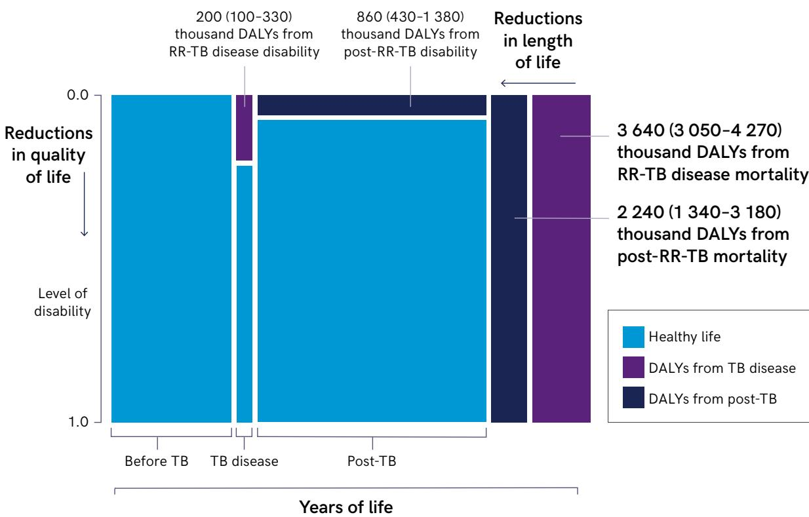  
The area of each green and blue rectangle is proportional to the number of DALYs indicated. Other dimensions are not to scale. Values in parentheses represent 95% uncertainty intervals (UIs). DALYs=disability-adjusted life years. Total DALYs are equal to the sum of these values

## Transmissibility

M. tuberculosis, the bacterium that causes TB, can be transmitted in exhaled aerosols (12), and the droplets may remain airborne for several hours and transmit infection when inhaled by others (13). The likelihood of transmission is influenced by various factors, including the sputum bacillary load, the duration of exposure to the source case, available infection control measures and the vulnerability of the exposed individual (13). Exposure is typically long (years), frequent and repeated in high-burden settings. It is estimated that about one fourth of the world’s population is infected with TB or has latent TB (6). Without treatment, 5–10% of infected people will develop TB disease at some time in their lives, and the risk is 20 times higher in people living with HIV. Without treatment, TB patients may infect another 20 people in their lifetime.

The transmissibility of DR M. tuberculosis has not been shown to differ substantially from that of DS M. tuberculosis, and resistance mutations appear unlikely to confer a significant fitness cost (14). A meta-analysis of studies in which contacts of patients with DR-TB were compared with patients with DS-TB found a higher risk of TB infection (RR 1.24, 95% CI: 0.98 ; 1.44) and a similar prevalence of TB (RR 0.81, 95% CI: 0.64 ; 1.06) among contacts of patients with DR-TB (15). Furthermore, transmission was greater among contacts of patients with additional resistance to the most effective second-line antibiotics than among contacts of patients with MDR-TB (16,17).

While DR-TB can develop during individual treatment, most cases are considered to result from primary transmission, when bacteria are already drug resistant at the time of infection (18,19). More advanced forms of DR infection are also more likely to be transmitted than acquired (20).

## Incidence

In 2021, an estimated 10.6 million people (95% UI: 9.9 ; 11 million) fell ill with TB worldwide, equivalent to 134 cases (95% UI: 125 ; 143) per 100 000 population (1). There were also an estimated 450 000 incident cases (95% UI: 399 000 ; 501 000) of MDR- and RR-TB, comprising both first diagnoses and second or subsequent episodes. Considerable regional variation is observed in the incidence of MDR- and RR-TB. The highest incidence was in the European Region, with 26% (95% UI: 21.0 ; 31.0%) among newly diagnosed cases and 57% (95% UI: 41.0 ; 72.0%) among previously treated cases. The countries with the greatest proportion of incident cases of MDR- and RR-TB in 2021 were India (26% of global cases), the Russian Federation (8.5%) and Pakistan (7.9%).

## Trends of resistance

The estimated 450 000 incident cases of MDR- and RR-TB in 2021 represent an increase of 3% from the 437 000 cases (95% UI: 390 000 ; 483 000) in 2020 (1). This recent reversal of the previous downward trend is attributable primarily to the impact of COVID-19 on TB services. The proportion of new TB cases with MDR- and RR-TB remained similar between 2015 (3.9%, 95% UI: 2.8 ; 5.0%) and 2021 (3.6%, 95% UI: 2.7 ; 4.4%), as did the proportion among previously treated cases (2015: 20%, 95% UI: 9.5 ; 31.0%; 2021: 18%, 95% UI: 11.0 ; 26.0%) (1).

Considerable regional variation is seen in the incidence of MDR- and RR-TB. The WHO region with the highest proportions of MDR- and RR-TB cases was the European Region: 26% (95% UI: 21.0 ; 31.0%) among newly diagnosed cases and 57% (95% UI: 41.0 ; 72.0%) among previously treated cases (1).

## Preventability in the community

DR-TB can be prevented through a combination of strategies to (i) prevent acquired resistance, (ii) reduce primary transmission and (iii) minimize progression from DR-TB infection to disease. Acquired resistance can be avoided by ensuring that patients with DR-TB receive effective therapy with appropriate antibiotics, while restricting access to inappropriate use of antimicrobials before diagnosis.

Primary transmission of M. tuberculosis can be reduced by enhancing early case detection and improving infection control for individuals with known DR-TB. Once DR-TB has been diagnosed, prompt initiation of effective therapy will not only benefit individual patients but also render them non-infectious (21). Use of WHO-recommended rapid molecular diagnostic tests enables prompt detection of rifampicin resistance and early initiation of appropriate second-line therapy. This is particularly important to protect vulnerable populations and people with impaired immunity (14). In health-care facilities and congregate settings, infection prevention and control measures can reduce transmission and protect vulnerable contacts. The measures include administrative controls (such as cough etiquette, respiratory isolation and early effective treatment), environmental controls (such as ventilation systems) and respiratory protection (such as particulate respirators) (22,23). Unfortunately, infection prevention and control measures are generally poorly applied, as they require large investments for administration, engineering control measures and personal protection. In high-prevalence settings, community-wide screening has been shown to reduce community transmission and the incidence of TB (24,25) and may also contribute to reducing transmission of DR-TB.

Preventive antibiotic therapy is recommended to reduce progression from TB infection to TB disease in high-risk populations, such as close contacts of patients with DR-TB (26). Rifamycin-based regimens are considered to be effective against isoniazid-resistant infection (27). Trials of the effectiveness of preventive therapies promise to provide more therapeutic options for infected individuals at risk of developing MDR- and RR-TB (26,27). Preventive therapy may protect about 60% of all treated patients but is dificult to target properly. It will not protect them from repeated infection. Coverage with TB preventive therapy is very low for adult contacts, < 30% for children under 5 years and 50% among people living with HIV.

Vaccination is a promising strategy for both preventing infection and reducing progression from TB infection to disease. The potential societal benefits are far-reaching (28). They could include substantial reductions in TB mortality, reduced AMR and greater health equity and be cost-effective in high-burden countries. Mathematical modelling showed that introduction of effective TB vaccines in 2025 and wide scaling up could reduce the number of cases of TB disease by nearly 66 million and the number of deaths due to TB by nearly 8 million by 2050 (29). No vaccine has, however, been licensed to prevent TB infection in adults. The bacille Calmette-Guérin (BCG) vaccine is a live attenuated vaccine that has a role in preventing all forms of TB disease (18–19% effectiveness) and mortality from TB among children < 5 years; however, neonatal vaccination does not protect adolescents or adults (30). The M72/AS01E vaccine showed promise in preventing progression to pulmonary TB disease (49.7% eficacy, 95% CI: 2.1 ; 74.2%) in a phase-IIb trial conducted in Kenya, South Africa and Zambia (30).

## Diagnosis

Timely detection of DR-TB is essential to ensure access to appropriate treatment and care. While diagnosis of drug-resistance has improved during the past decade, there are significant gaps and inequity in case detection. Globally, only 63% of people diagnosed with pulmonary TB in 2021 received bacteriological confirmation. Of these, 70% were tested for resistance to rifampicin. Among detected cases of RR-TB, 49% were tested for resistance to fluoroquinolones, an important component of standard regimens (1).

New diagnostic tests from several manufacturers are recommended by WHO for diagnosis of M. tuberculosis directly in sputum (31), and a number also allow detection of resistance to rifampicin and fluoroquinolones, the key antibiotics used to treat TB. These rapid molecular tests allow detection of M. tuberculosis with high sensitivity and specificity and are also accurate for detecting resistance to rifampicin and fluoroquinolone. Scaling up of use of these tests at points of diagnosis, with careful adaptation to each context, remains an important priority (32).

Some newer NAATs can detect resistance to both isoniazid and rifampicin, a promising development, as these first-line drugs are the backbone of TB treatment. The NAATs include WHO-endorsed, high-throughput multiplex assays, which have been described as “moderate complexity automated NAATs for detection of TB and rifampicin and isoniazid” (32). Although these tests require the infrastructure of a centralized laboratory, most, if not all, are automated, can be run directly on patient samples and provide results rapidly.

A new, less complex NAAT that can detect resistance to isoniazid, fluoroquinolones, ethionamide and several second-line drugs has been endorsed by WHO (33). Accessible tools should now be developed to detect resistance to bedaquiline, linezolid and pretomanid, second-line drugs recommended for treatment of MDR- and XDR-TB (11). Consensus-based criteria for extended molecular drugsusceptibility testing were outlined in a recently updated target product profile and may eventually be used for deciding on individual treatment regimens (31).

Use of next-generation sequencing (NGS) for sequencing the mycobacterial genome is becoming an important tool for research and surveillance of DR-TB (34). NGS can be adapted to new and future forms of DR-TB, as it can identify new resistance-conferring mutations as they arise (once the relevant mutations have been characterized) (35). Targeted NGS can be used directly on clinical specimens, obviating the need for M. tuberculosis culture isolates; consequently, the results of targeted NGS could be available much sooner than those for other sequencing methods, for individualized, precision clinical care. At present, however, the cost and complexity of NGS and targeted NGS assays and informatics remain barriers to their widespread uptake in most high-burden settings. Evidence on the performance of end-to-end sequencing methods that could be used more widely is lacking (36).

While novel diagnostic tools will be increasingly important, existing tools should be made more readily available and more accessible to patients in high TB-burden countries. Rapid diagnostics that meet the criteria for currently recommended treatment regimens will help to improve patient outcomes, including reducing the development of drug resistance. Point-of-care tests for drug resistance testing are necessary to guide directed antibiotic therapy for RR-TB and other forms of DR-TB.

## Treatability

Only 161 746 people were enrolled on treatment for confirmed MDR- and RR-TB in 2021, which is far below the estimated number of 450 000 incident cases. The number of cases treated for other forms of DR-TB, such as isoniazid-resistant TB, is not routinely reported. Ten countries accounted for 70% of the global gap in reporting of MDR- and RR-TB treatment in 2021: China, India, Indonesia, Nigeria, Pakistan, Philippines, Myanmar, Russian Federation, South Africa and Viet Nam (1) (Fig. A4.2). Of the patients enrolled for treatment in 2021, 5506 (3.4%) were children aged 0–14 years. Closing the gap will require a better rate of bacteriologically confirmed TB disease and better coverage of testing for drug resistance among people with TB. Testing and treatment of MDR- and RR-TB are inextricably linked. Without adequate access to timely testing for drug susceptibility, patients will not be prescribed optimal treatment regimens.

The treatment outcomes for people with DR-TB are significantly worse than those for DS-TB. Only 60% of people with MDR- and RR-TB in a cohort that started treatment in 2019 had a successful treatment outcome, as compared with a rate of 86% for DS-TB (1). The long duration and toxicity of regimens used to treat MDR- and RR-TB until recently contributed to the higher rates of loss to follow-up and death than for DS-TB. New, shorter regimens are more effective and better tolerated, promising better outcomes than those with earlier regimens. Guidelines issued by WHO in 2022 (12) include a 6-month all-oral regimen for both MDR- and RR-TB and pre-XDR-TB. This new approach may substantially improve treatment outcomes.

While these new shorter regimens herald a potential turn in the management of the MDR- and RR-TB, barriers remain to their adoption. There is an urgent need to make these regimens accessible to all patient groups (including pregnant women and children), particularly in LMIC, which are disproportionately affected by high MDR- and RR-TB burdens (1). Moreover, rapid diagnostics to confirm susceptibility to all components of the shorter-course MDRand RR-TB regimen are essential, as well as effective alternative treatments when resistance to this regimen is identified. When possible, treatment for DR-TB should be decentralized, ambulatory and patient-centred to reduce the risk of nosocomial transmission (11).

## The pipeline for new medicines and diagnostics

A wide range of new diagnostics and drugs are currently being evaluated for better detection and treatment of DR-TB.

## New medicines

Shorter, better-tolerated regimens are more likely to optimize adherence to treatment and increase the likelihood of cure (37). Launch of the Tuberculosis Drug Accelerator (38) – a multidisciplinary collaboration among governments and nongovernmental, academic and pharmaceutical stakeholders – has resulted in approval of drugs such as bedaquiline and pretomanid for use by medicinal product regulators during the past 10 years (39,40). Other novel drugs are in phase I–III clinical trials (41,42) (Table A4.1). New drugs in the development pipeline may have one or more targets (41–43), including DNA replication, protein synthesis, energy metabolism and defence against the immune system (proteolysis) or the bacterial cell wall (42,43). WHO target regimen profiles for TB treatment outline priorities and target characteristics for combining new and existing drugs into novel regimens; an updated version was published in 2023 (44). A few new compounds are in the research phase; however, the usual attrition may leave only a few candidates for late-phase research. Most studies are addressing combinations with or without new and repurposed medicines. The regimens in the pipeline are all-oral regimens, with no injectable agents. In the future, long-acting injectables may be developed.

Table A4.1. The global clinical development pipeline for new anti-TB drugs and drug regimens to treat TB disease, September 2022
<table><tr><td colspan="1" rowspan="1">Phase lª</td><td colspan="1" rowspan="1">Phase Ilª</td><td colspan="1" rowspan="1">Phase Illa</td></tr><tr><td colspan="2" rowspan="2">Macozinoneb               BTZ-043b</td><td colspan="1" rowspan="1">Bedaquiline-delamanid-linezolid-levofloxacin-clofazimine (6-month oralregimen for RR-TB) or bedaquiline-delamanid-linezolid-clofazimine (6-9-month</td></tr><tr><td colspan="1" rowspan="1">oral regimen for pre-XDR and XDR-TB)(BEAT TB trial)b</td></tr><tr><td colspan="2" rowspan="1">BVL-GSK098b              GSK-3036656b</td><td colspan="1" rowspan="1">Bedaquiline-pretomanid-moxifloxacin-pyrazinamide (SimpliciTB trial)</td></tr><tr><td colspan="2" rowspan="2">GSK-286 (GSK 2556286)b  OPC-167832b</td><td colspan="1" rowspan="1">Bedaquiline with two OBRs (all-oral, 9</td></tr><tr><td colspan="1" rowspan="1">months; with injectable, 6 months) STREAMStage 2)</td></tr><tr><td colspan="1" rowspan="3">TBAJ-587b</td><td colspan="1" rowspan="3">SPR720 (Fobrepodacin)b</td><td colspan="1" rowspan="1">Bedaquiline and delamanid with various</td></tr><tr><td colspan="1" rowspan="1">existing regimens for MDR-TB and XDR-TB</td></tr><tr><td colspan="1" rowspan="1">(endTB trial)</td></tr><tr><td colspan="1" rowspan="2">TBAJ-876b</td><td colspan="1" rowspan="2">Telacebec-(Q203)b</td><td colspan="1" rowspan="1">Bedaquiline-delamanid-linezolid-</td></tr><tr><td colspan="1" rowspan="1">clofazimine for fluoroquinolone-resistantMDR-TB (endTB-Q)</td></tr><tr><td colspan="2" rowspan="1">TB1-166b</td><td colspan="1" rowspan="1"></td></tr><tr><td colspan="3" rowspan="1">TBI-223b                   Delpazolida                                    Several 2-month regimens for DS-TBDelpazolid in combination with bedaquiline,      (TRUNCATE-TB)delamanid and moxifloxacin (PanACEA-DECODE-01)EBA, Safety and PK of delpazolid</td></tr><tr><td colspan="1" rowspan="1">High-dose isoniazid forisoniazid-resistant or DS-TB (ACTG A5312)</td><td colspan="2" rowspan="1">SQ109a                                        Short intensive treatment for children withTB meningitis (6 months of daily rifampicin,isoniazid, pyrazinamide and levofloxacin(SURE)b,c,d</td></tr><tr><td colspan="1" rowspan="1"></td><td colspan="2" rowspan="1">Sutezolid³                                      Ultra-short treatment for fluoroquinolonesensitive MDR-TB (TB-TRUST)</td></tr><tr><td colspan="1" rowspan="1"></td><td colspan="2" rowspan="1">Sudapyridine (WX-081)ª</td></tr><tr><td colspan="1" rowspan="1"></td><td colspan="2" rowspan="3">BedaquilinePK, safety and tolerability of bedaquiline withOBR in HÍV-infected and uninfected childrenwith MDR-TB (IMPAACT P1108)b,c,dPK and safety of bedaquiline with OBRin HIV-uninfected children with MDR-TB(TMC207-C211)b,c,d</td></tr><tr><td colspan="1" rowspan="1"></td></tr><tr><td colspan="1" rowspan="1"></td></tr><tr><td colspan="1" rowspan="1"></td><td colspan="2" rowspan="2">DelamanidPK, safety and tolerability of delamanid withOBR in HiV-infected and uninfected childrenwith MDR-TB (IMPAACT 2005)b,c,d</td></tr><tr><td colspan="1" rowspan="1"></td></tr><tr><td colspan="3" rowspan="1">RifampicinHigh-dose rifampicin for DS-TB (PanACEA-MAMS-TB-01)High-dose rifampicin for TB meningitis(ReDEFINe)LinezolidEfficacy and tolerability of two doses oflinezolid, combined with bedaquiline,delamanid and clofazimine (Linezolid dosing)</td></tr><tr><td colspan="1" rowspan="1">Phase lª</td><td colspan="1" rowspan="1">Phase Ila</td><td colspan="1" rowspan="1">Phase Illa</td></tr><tr><td colspan="1" rowspan="1"></td><td colspan="1" rowspan="3">ClofaziminePK, safety, tolerability and acceptability ofchild-friendly formulations of clofazimine</td><td colspan="1" rowspan="7"></td></tr><tr><td colspan="1" rowspan="1"></td></tr><tr><td colspan="1" rowspan="1"></td></tr><tr><td colspan="1" rowspan="1"></td><td colspan="1" rowspan="3">and moxifloxacin to treat children with RR-TB(CATALYST)b,c,dPK, safety and acceptability of clofazimine by</td></tr><tr><td colspan="1" rowspan="1"></td></tr><tr><td colspan="1" rowspan="1"></td></tr><tr><td colspan="1" rowspan="1"></td><td colspan="1" rowspan="1">children with RR-TB (Clofazimine Kids Study)b,c,d</td></tr><tr><td colspan="1" rowspan="1"></td><td colspan="1" rowspan="3">Bedaquiline and pretomanid with existing andrepurposed anti-TB drugs for MDR-TB (TBPRACTECAL Phase II/III trial)</td><td colspan="1" rowspan="3"></td></tr><tr><td colspan="1" rowspan="1"></td></tr><tr><td colspan="1" rowspan="1"></td></tr><tr><td colspan="1" rowspan="1"></td><td colspan="1" rowspan="1">Efficacy and tolerability of bedaquiline,delamanid, levofloxacin, linezolid andclofazimine (DRAMATIC)b,d</td><td colspan="1" rowspan="1"></td></tr><tr><td colspan="1" rowspan="1"></td><td colspan="2" rowspan="2">Shorter regimens including clofazimine andrifapentine forDS-TB (CLO-FAST trial/A5362)</td></tr><tr><td colspan="1" rowspan="1"></td></tr><tr><td colspan="1" rowspan="1"></td><td colspan="2" rowspan="1">Pretomanid-containing regimens to shortentreatment for DS-TB (APT trial)</td></tr><tr><td colspan="3" rowspan="1">Delamanid-linezolid-levofloxacin-pyrazinamidefor fluoroquinolone- susceptible MDR-TB(MDR-END trial)</td></tr><tr><td colspan="3" rowspan="1">Levofloxacin with OBR for MDR-TB (Opti-Q)</td></tr><tr><td colspan="3" rowspan="1">4-month treatment for DS-TB (PredicTB trial)</td></tr><tr><td colspan="3" rowspan="1">Pravastatine</td></tr><tr><td colspan="3" rowspan="1">Imatinibe</td></tr><tr><td colspan="3" rowspan="1">Metformine</td></tr><tr><td colspan="3" rowspan="1">Multiple adjunctive host-directed TB therapiesfor DS-TB (TBHDT)c</td></tr></table>

Source: Adapted from Working Group on New TB Drugs (41), which provides more information on these products and other projects.  
New drug compounds are listed first, followed by repurposed drugs, treatment regimens and then host direct therapies.  
OBR, optimized background regimen; PK, pharmacokinetics  
a New chemical entity  
b Includes adolescents aged 10–19 years  
c Includes infants aged < 12 months  
d Includes children aged < 10 years  
e Host-directed therapy

An important priority in TB drug development is child-friendly paediatric formulations, particularly for DR-TB (45). Furthermore, improvement in the supply of quality-assured generic medications will be required to scale-up new regimens in resource-limited settings (45).

## New diagnostics

Development of rapid, accurate point-of-care tests remains a priority for timely detection of M. tuberculosis. Point-of-care tests for identifying drug resistance are also necessary to enable directed antibiotic therapy when starting therapy for DR-TB. Many assays are being developed for detecting drug resistance at points of care and peripheral levels, including isoniazid, fluoroquinolone and bedaquiline. A heat map of the pipeline of novel molecular diagnostics is shown in Fig. A4.3. Several candidate molecules for use on multi-disease testing platforms should produce results within < 1 h. Other kits for detecting TB and drug resistance are being evaluated for regulatory approval and/or WHO endorsement (46,47). Use of alternative specimens is also being investigated, including face masks (48), tongue swabs (49) and saliva (50). These methods should allow people who cannot usually produce sputum, such as children and people living with HIV (50), to access rapid diagnostics and may also contribute to detection of drug resistance. Specimens that are simple to collect combined with point-of-care technologies could greatly improve the reach of diagnostics for TB and for detection of drug resistance.

Table A4.2. RR-TB Prioritization criteria, definitions (criteria used for the independent assessment of RR-TB)
<table><tr><td rowspan=1 colspan=1>Criterion(criteria weretailored for RR-TB)</td><td rowspan=1 colspan=1>Definition</td><td rowspan=1 colspan=1>Sources</td></tr><tr><td rowspan=1 colspan=1>Mortality</td><td rowspan=1 colspan=1>Global rifampicin-resistant tuberculosis (RR-TB)mortality estimates and trends (in the absolute numberof deaths for the most recent year available)</td><td rowspan=1 colspan=1>Statistical work based on reports fromcountries for the Global TB Report 2022(1)</td></tr><tr><td rowspan=1 colspan=1>Non-fatal healthburden</td><td rowspan=1 colspan=1>Number of disability-adjusted life years (DALYs) due toRR-TB</td><td rowspan=1 colspan=1>Statistical work based on a peer-reviewarticle (Z)</td></tr><tr><td rowspan=1 colspan=1>Transmissibility</td><td rowspan=1 colspan=1>Transmissibility of RR-TB</td><td rowspan=1 colspan=1>Summary of existing knowledge on themode of transmission and evidenceavailable from TB transmission modellingstudies. (13,14,15,16,17,18,19)</td></tr><tr><td rowspan=1 colspan=1>Incidence</td><td rowspan=1 colspan=1>Global and regional incidence of RR-TB</td><td rowspan=1 colspan=1>Statistical work based on reports fromcountries for the Global TB Report 2022(1)</td></tr><tr><td rowspan=1 colspan=1>Trend of resistance</td><td rowspan=1 colspan=1>Global population-based trends of estimated RR-TBburden (absolute numbers, global and regional)</td><td rowspan=1 colspan=1>Statistical work based on reports fromcountries for the Global TB Reports 2012-2022 (1)</td></tr><tr><td rowspan=1 colspan=1>Preventability inthe community</td><td rowspan=1 colspan=1>The global burden of latent RR-TB and availability andthe existence and efficacy of preventive measures incontaining the transmission of TB and in reducing theburden of the disease; TB preventive treatment (TPT)of RR-TB infection; community/household measures tolimit transmission and provide TPT; infection preventionand control; and TB vaccines.</td><td rowspan=1 colspan=1>Statistical work based on reports fromcountries for the Global TB Report 2022.Other evidence available on pre-exposurepreventive measures- vaccination,infection control measures, andeffective case detection and treatment.(1,14,21,22,23,24,25,26,28,29,30)</td></tr><tr><td rowspan=1 colspan=1>Treatabilityin community</td><td rowspan=1 colspan=1>Global treatment outcomes of RR-TB treatment,representing both global and regional data, data fromclinical trials and data from high-burden countries.Access to treatment (Number of people with RR-TBenrolled on treatment among all estimated RR-TB cases.)and its main drivers (for example diagnostics) can alsobe discussed.</td><td rowspan=1 colspan=1>Statistical work based on reports fromcountries for the Global TB Report 2022.Evidence from clinical trials and otherstudies. (1,11,12)</td></tr><tr><td rowspan=1 colspan=1>Pipeline</td><td rowspan=1 colspan=1>The pipeline of new medicines and regimensfor the treatment of RR-TB.The pipeline of new diagnostics for thedetection of RR-TB.</td><td rowspan=1 colspan=1>As presented in the Global TB Report2022, and other evidence available(1,37,38,39,40,41,42,43,44)</td></tr><tr><td rowspan=1 colspan=1>Diagnostics</td><td rowspan=1 colspan=1>Number of people with DR-TB diagnosis among allestimated RR-TB cases.</td><td rowspan=1 colspan=1>As presented in the Global TB Report2022, and other evidence available(1,46,47,49,50)</td></tr></table>

## References for Annex 4

1. Global tuberculosis report 2022. Geneva: World Health Organization; 2022 (https://www.who.int/teams/ global-tuberculosis-programme/tb-reports/global-tuberculosis-report-2022).

2. WHO global lists of high burden countries for tuberculosis (TB), TB/HIV and multidrug/rifampicin-resistant TB (MDR/RR-TB), 2021–2025. Geneva: World Health Organization; 2021 (https://www.who.int/news/item/17-06- 2021-who-releases-new-global-lists-of-high-burden-countries-for-tb-hiv-associated-tb-and-drug-resistanttb, accessed 2 December 2022).

3. Dean AS, Zignol M, Cabibbe AM, Falzon D, Glaziou P, Cirillo DM et al. Prevalence and genetic profiles of isoniazid resistance in tuberculosis patients: A multicountry analysis of cross-sectional data. PLoS Med. 2020;17(1):e1003008. Doi: https://doi.org/10.1371%2Fjournal.pmed.1003008.

4. The End TB Strategy. Geneva: World Health Organization; 2015 (https://www.who.int/publications/i/item/ WHO-HTM-TB-2015.19).

5. Agins BD, Ikeda DJ, Reid MJA, Goosby E, Pai M, Cattamanchi A. Improving the cascade of global tuberculosis care: moving from the “what” to the “how” of quality improvement. Lancet Infect Dis. 2019;19(12):e437–43. Doi:10.1016/S1473-3099(19)30420-7.

6. Dheda K, Perumal T, Moultrie H, Perumal R, Esmail A, Scott AJ et al. The intersecting pandemics of tuberculosis and COVID-19: population-level and patient-level impact, clinical presentation, and corrective interventions. The Lancet Respir Med. 2022;10(6): 603–22. Doi:10.1016/S2213-2600(22)00092-3.

7. Menzies NA, Allwood BW, Dean AS, Dodd PJ, Houben RMGJ, James LP et al. Global burden of disease due to rifampicin-resistant tuberculosis: a mathematical modeling analysis. Nat Commun. 2023;14:6182. Doi:10.1038/ s41467-023-41937-9.

8. van Kampen SC, Wanner A, Edwards M, Harries AD, Kirenga BJ, Chakaya J et al. International research and guidelines on post-tuberculosis chronic lung disorders: a systematic scoping review. BMJ Glob Health 2018;3(4):e000745. Doi:10.1136/bmjgh-2018-000745.

9. Allwood BW, Byrne A, Meghji J, Rachow A, van der Zalm MM, Schoch OD. Post-tuberculosis lung disease: clinical review of an under-recognised global challenge. Respiration. 2021;100(8):751–63. Doi:10.1159/000512531.

10. Alene KA, Wangdi K, Colquhoun S, Chani K, Islam T, Rahevar K et al. Tuberculosis related disability: a systematic review and meta-analysis. BMC Med 2021;19(1):203. Doi:10.1186/s12916-021-02063-9.

11. WHO consolidated guidelines on tuberculosis: Module 4: treatment – drug-resistant tuberculosis treatment, 2022 update. Geneva: World Health Organization; 2022 (https://www.who.int/publications/i/item/9789240063129).

12. Dinkele R, Gessner S, McKerry A, Leonard B, Leukes J, Seldon R et al. Aerosolization of Mycobacterium tuberculosis by tidal breathing. Am J Respir Crit Care Med. 2022;206(2):206–16. Doi:10.1164/rccm.202110- 2378OC.

13. Yates TA, Khan PY, Knight GM, Taylor JG, McHugh TD, Lipman M et al. The transmission of Mycobacterium tuberculosis in high burden settings. Lancet Infect Dis. 2016;16:227–38. Doi:10.1016/S1473-3099(15)00499-5.

14. Alame Emane AK, Guo X, Takiff HE, Liu S. Drug resistance, fitness and compensatory mutations in Mycobacterium tuberculosis. Tuberculosis (Edinb). 2021;129:102091. Doi:10.1016/j.tube.2021.102091.

15. Kodama C, Lange B, Olaru ID, Khan P, Lipman M, Seddon JA et al. Mycobacterium tuberculosis transmission from patients with drug-resistant compared to drug-susceptible TB: a systematic review and meta-analysis. Eur Respir J. 2017;50(4):1701044. Doi:10.1183/13993003.01044-2017.

16. Leung EC, Leung CC, Kam KM, Yew WW, Chang KC, Leung WM et al. Transmission of multidrug-resistant and extensively drug-resistant tuberculosis in a metropolitan city. Eur Respir J. 2013;41(4): 901–8. Doi:10.1183/09031936.00071212.

17. Vella V, Racalbuto V, Guerra R, Marra C, Moll A, Mhlanga Z et al. Household contact investigation of multidrugresistant and extensively drug-resistant tuberculosis in a high HIV prevalence setting. Int J Tuberc Lung Dis. 2011;15(9):1170–5. Doi:10.5588/ijtld.10.0781.

18. Kendall EA, Fofana MO, Dowdy DW. Burden of transmitted multidrug resistance in epidemics of tuberculosis: a transmission modelling analysis. Lancet Respir Med. 2015;3(12):963–72. Doi:10.1016/S2213-2600(15)00458-0.

19. Trauer JM, Denholm JT, McBryde ES. Construction of a mathematical model for tuberculosis transmission in highly endemic regions of the Asia-Pacific. J Theor Biol. 2014;358:74–84. Doi:10.1016/j.jtbi.2014.05.023.

20. Andrews JR, Gandhi NR, Moodley P, Shah NS, Bohlken L, Moll AP et al. Exogenous reinfection as a cause of multidrug-resistant and extensively drug-resistant tuberculosis in rural South Africa. J Infect Dis. 2008;198(11):1582–9. Doi:10.1086/592991.

21. Consolidated guidelines on tuberculosis. Module 2: Screening. Systematic screening for tuberculosis disease. Geneva: World Health Organization; 2021 (https://www.who.int/publications/i/item/9789240022676).

22. WHO guidelines on tuberculosis infection prevention and control, 2019 update. Geneva: World Health Organization; 2019 (https://www.tbonline.info/media/uploads/documents/9789241550512-eng.pdf).

23. Fox GJ, Redwood L, Chang V, Ho J. The effectiveness of individual and environmental infection control measures in reducing the transmission of Mycobacterium tuberculosis: a systematic review. Clin Infect Dis. 2021;72(1):15– 26. Doi:10.1093/cid/ciaa719.

24. Burke RM, Nliwasa M, Feasey HRA, Chaisson LH, Golub JE, Naufal F et al. Community-based active case-finding interventions for tuberculosis: a systematic review. Lancet Public Health. 2021;6(5): e283–99. Doi:10.1016/ S2468-2667(21)00033-5.

25. Marks GB, Nguyen NV, Nguyen PTB, Nguyen TA, Nguyen HB, Tran KH et al. Community-wide screening for tuberculosis in a high-prevalence setting. N Engl J Med. 2019;381(14):1347–57. Doi:10.1056/NEJMoa1902129.

26. Latent tuberculosis infection: updated and consolidated guidelines for programmatic management. Geneva: World Health Organization; 2018 (https://www.who.int/publications/i/item/9789241550239).

27. WHO consolidated guidelines on tuberculosis. Module 1: Prevention: tuberculosis preventive treatment. Geneva: World Health Organization; 2020 (https://www.who.int/publications/i/item/9789240001503).

28. An investment case for new tuberculosis vaccines. Geneva: World Health Organization; 2022 (https://www.who. int/publications/i/item/9789240064690).

29. Clark RA, Mukandavire C, Portnoy A, Weerasuriya CK, Deol A, Scarponi D et al. The impact of alternative delivery strategies for novel tuberculosis vaccines in low-income and middle-income countries: a modelling study. Lancet Glob Health. 2023;11(4):e546–55. Doi:10.1016/S2214-109X(23)00045-1.

30. Martinez L, Cords O, Liu Q, Acuna-Villaorduna C, Bonnet M, Fox GJ et al. Infant BCG vaccination and risk of pulmonary and extrapulmonary tuberculosis throughout the life course: a systematic review and individual participant data meta-analysis. Lancet Glob Health. 2022;10(9):e1307–16. Doi:10.1016/S2214- 109X(22)00283-2.

31. Tait DR, Hatherill M, Van Der Meeren O, Ginsberg AM, Van Brakel E, Salaun B et al. Final analysis of a trial of M72:AS01E vaccine to prevent tuberculosis. N Engl J Med. 2019;381(25):2429–39. Doi:10.1056/ NEJMoa1909953.

32. WHO operational handbook on tuberculosis: module 3: diagnosis: rapid diagnostics for tuberculosis detection, 2021 update. Geneva: World Health Organization; 2021 (https://www.who.int/publications/i/ item/9789240030589).

33. Brown S, Leavy JE, Jancey J. Implementation of GeneXpert for TB testing in low- and middle-income countries: a systematic review. Glob Health Sci Pract. 2021;9(3):698–710. Doi:10.9745/GHSP-D-21\_00121.

34. Pillay S, Steingart KR, Davies GR, Chaplin M, De Vos M, Schumacher SG et al. Xpert MTB/XDR for detection of pulmonary tuberculosis and resistance to isoniazid, fluoroquinolones, ethionamide, and amikacin. Cochrane Database Syst Rev. 2022;5(5):CD014841. Doi:10.1002/14651858.CD014841.pub2.

35. Walker TM, Merker M, Kohl TA, Crook DW, Niemann S, Peto TEA. Whole genome sequencing for M/XDR tuberculosis surveillance and for resistance testing. Clin Microbiol Infect. 2017;23:161–6. Doi:10.1016/j. cmi.2016.10.014.

36. Jouet A, Gaudin C, Badalato N, Allix-Béguec C, Duthoy S, Ferré A et al. Deep amplicon sequencing for culturefree prediction of susceptibility or resistance to 13 anti-tuberculous drugs. Eur Respir J. 2021;57(3):2002338. Doi:10.1183/13993003.02338-2020.

37. Abidi S, Achar J, Assao Neino MM, Bang D, Benedetti A, Brode S et al. Standardised shorter regimens versus individualised longer regimens for rifampin- or multidrug-resistant tuberculosis. Eur Respir J. 2020;55(3):1901467. Doi:10.1183/13993003.01467-2019

38. Aldridge BB, Barros-Aguirre D, Barry CE 3rd, Bates RH, Berthel SJ, Boshoff HI et al. The Tuberculosis Drug Accelerator at year 10: what have we learned? Nat Med. 2021;27(8): 1333–7. Doi:10.1038/s41591-021-01442-2.

39. Mahajan R. Bedaquiline: First FDA-approved tuberculosis drug in 40 years. Int J Appl Basic Med Res. 2013;3(1):1– 2. Doi:10.4103/2229-516X.112228.

40. FDA News Release. FDA approves new drug for treatment-resistant forms of tuberculosis that affects the lungs. Rockville (MD): U.S. Food & Drug Administration; 2019 (https://www.fda.gov/news-events/pressannouncements/fda-approves-new-drug-treatment-resistant-forms-tuberculosis-affects-lungs).

41. Clinical pipeline. New York: Working Group on New TB Drugs; 2022 (https://www.newtbdrugs.org/pipeline/ clinical, accessed 9 September 2022).

42. Dartois VA, Rubin EJ. Anti-tuberculosis treatment strategies and drug development: challenges and priorities. Nat Rev Microbiol. 2022;20(11):685–701. Doi:10.1038/s41579-022-00731-y.

43. Shetye GS, Franzblau SG, Cho S. New tuberculosis drug targets, their inhibitors, and potential therapeutic impact. Transl Res. 2020;220:68–97. Doi: https://doi.org/10.1016/j.trsl.2020.03.007.

44. Target regimen profiles for TB treatment: candidates: rifampicin-susceptible, rifampicinresistant and pan-TB treatment regimens. Geneva: World Health Organization; 2023 (https://www.who.int/publications/i/ item/9789241511339).

45. Lifesaving TB medicines still out of reach for children in high-burden countries. Paris: Medicins Sans Frontières; 2021 (https://www.msf.org/lifesaving-tb-medicines-still-out-reach-children-high-burden-countries).

46. Branigan D. Pipeline report 2021: Tuberculosis diagnostics. 2021. New York: Treatment Action Group; 2021 (https://www.treatmentactiongroup.org/wp-content/uploads/2021/11/pipeline\_TB\_diagnostics\_2021\_final. pdf, accessed 5 December 2022).

47. Global Tuberculosis Report 2022. 7. TB research and innovation. Geneva: World Health Organization; 2022 (https://www.who.int/teams/global-tuberculosis-programme/tb-reports/global-tuberculosis-report-2022/tbresearch-and-innovation).

48. Williams CM, Abdulwhhab M, Birring SS, De Kock E, Garton NJ, Townsend E et al. Exhaled Mycobacterium tuberculosis output and detection of subclinical disease by face-mask sampling: prospective observational studies. Lancet Infect Dis. 2020;20(5):607–17. Doi:10.1016/S1473-3099(19)30707-8.

49. Andama A, Whitman GR, Crowder R, Reza TF, Jaganath D, Mulondo J et al. Accuracy of tongue swab testing using Xpert MTB-RIF Ultra for tuberculosis diagnosis. J Clin Microbiol. 2022;60(7):e0042122. Doi:10.1128/ jcm.00421-22.

50. Byanyima P, Kaswabuli S, Musisi E, Nabakiibi C, Zawedde J, Sanyu I et al. Feasibility and sensitivity of saliva GeneXpert MTB/RIF Ultra for tuberculosis diagnosis in adults in Uganda. Microbiol Spectr. 2022;10(5):e0086022. Doi:10.1128/spectrum.00860-22

